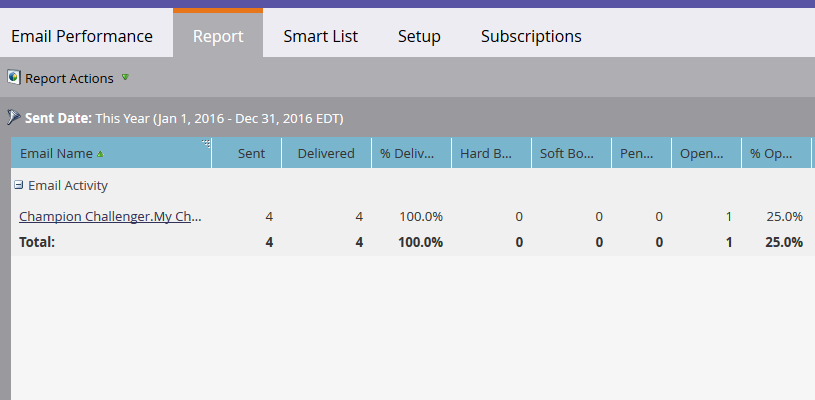

# E-Mail-Leistungsbericht {#email-performance-report}

Erstellen Sie einen E-Mail-Leistungsbericht, um mithilfe von Statistiken zu Zustellungs-, Öffnungs-, Klickraten usw. mehr über die Leistung Ihrer E-Mails zu erfahren.

1. [Erstellen Sie einen Bericht in einem Programm](/help/marketo/product-docs/reporting/basic-reporting/creating-reports/create-a-report-in-a-program.md) und wählen Sie den [Berichtstyp](/help/marketo/product-docs/reporting/basic-reporting/report-types/report-type-overview.md) **[!UICONTROL E-Mail-Leistung]** aus.
1. [Ändern Sie den Zeitrahmen des Berichts](/help/marketo/product-docs/reporting/basic-reporting/editing-reports/change-a-report-time-frame.md) und klicken Sie auf die Registerkarte **[!UICONTROL Bericht]**.
1. Hier sind Sie richtig. Überprüfen Sie nun den Bericht, um mehr über die Leistung Ihrer E-Mails zu erfahren.

   >[!NOTE]
   >
   >Der Filter „Versendedatum“ basiert auf dem ersten Datum, an dem die E-Mail gesendet wurde.

   

   >[!TIP]
   >
   >Klicken Sie auf den Namen einer E-Mail, um sie in der E-Mail-Vorschau zu öffnen.

   >[!NOTE]
   >
   >Ein E-Mail-Leistungsbericht enthält Aktivitäten für alle Personen, einschließlich der Personen, die seit dem Versand der E-Mail gelöscht wurden. Manchmal kann es sein, dass nur die Aktivitäten für aktive Personen von Interesse sind. In diesem Fall müssen Sie gelöschte Personen aus Ihrem Bericht filtern. Verwenden Sie die Registerkarte **[!UICONTROL Intelligente Liste]**, um [eine intelligente Liste für den Bericht zu erstellen](/help/marketo/product-docs/core-marketo-concepts/smart-lists-and-static-lists/creating-a-smart-list/create-a-smart-list.md). Wenn Sie nach keinem bestimmten Feld filtern, legen Sie für den Filter „E-Mail-Adresse“ Folgendes fest: **[!UICONTROL ist nicht leer]**.

   [Ausgewählte Berichtsspalten](/help/marketo/product-docs/reporting/basic-reporting/editing-reports/select-report-columns.md) für einen E-Mail-Leistungsbericht enthalten Folgendes:

   <table><thead>

<tr>
    <th>Spalte</th>
    <th>Beschreibung</th>
  </tr></thead>
<tbody>
  <tr>
    <td>Hard Bounce-Ereignis aufgetreten</td>
    <td>E-Mail wurde aufgrund einer permanenten Bedingung abgelehnt, z. B. einer nicht vorhandenen E-Mail-Adresse.</td>
  </tr>
  <tr>
    <td>Soft Bounce-Ereignis aufgetreten</td>
    <td>E-Mail wurde aufgrund einer temporären Bedingung abgelehnt, z. B. weil ein Server ausgefallen oder der Posteingang voll ist.</td>
  </tr>
  <tr>
    <td>Ausstehend</td>
    <td>Diese Zahl wird berechnet, indem von der Gesamtanzahl der gesendeten E-Mails die Anzahl der zugestellten E-Mails, Bounce-E-Mails und Soft-Bounce-E-Mails abgezogen wird.</td>
  </tr>
  <tr>
    <td>Angeklickter Link</td>
    <td>Die Anzahl aller E-Mail-Empfangenden, die auf einen Link in der E-Mail geklickt haben.</td>
  </tr>
  <tr>
    <td>Abbestellt</td>
    <td>Die Anzahl der E-Mail-Empfangenden, die auf den Abmelde-Link in der E-Mail geklickt und das Formular ausgefüllt haben.</td>
  </tr>
  <tr>
    <td>Abgebrochen</td>
    <td>Die Anzahl der E-Mails, die nicht zugestellt werden konnten und bei denen kein Bounce-Ereignis empfangen wurde. Eine E-Mail wird automatisch als „Abgebrochen“ bezeichnet, wenn innerhalb von drei Tagen nach dem E-Mail-Versand keine Antwort empfangen wird.</td>
  </tr>
</tbody></table>

>[!NOTE]
>
>In einer E-Mail angeklickte Abmelde-Links und E-Mail-Adressen werden nicht unter „Angeklickter Link“ im Bericht erfasst.

Im Allgemeinen wird versucht, beim Erfassen dieser Statistiken gesunden Menschenverstand einzusetzen. Wenn beispielsweise eine Person auf einen Link in einer E-Mail geklickt hat, hat sie offensichtlich davor die E-Mail geöffnet. Für den E-Mail-Leistungsbericht werden diese konkreten Regeln befolgt:

* **Regel 1**: Jeder Eintrag zu einer E-Mail-Aktivität wird nur einem einzigen der folgenden Werte zugeordnet: _Übermittelt_, _Hard Bounce-Ereignis aufgetreten_, _Soft Bounce-Ereignis aufgetreten_ oder _Ausstehend_.

* **Regel 2**: Wenn der E-Mail-Eintrag dem Wert _[!UICONTROL Geöffnet]_ zugeordnet wurde, gilt er als _Übermittelt_.

* **Regel 3**: Wenn der E-Mail-Eintrag dem Wert _[!UICONTROL Angeklickte E-Mail]_ oder _[!UICONTROL Abbestellt]_ zugeordnet wurde, gilt er als _Übermittelt_ und _Geöffnet_.

* **Regel 4**: Wenn die E-Mail dem Wert _[!UICONTROL Geöffnet]_ zugeordnet wurde, werden Bounces ignoriert. Wenn die E-Mail nicht geöffnet wurde, hat der Wert _Hard Bounce-Ereignis aufgetreten_ Vorrang gegenüber _Soft Bounce-Ereignis aufgetreten_ und _Übermittelt_.

* **Regel 5**: Wenn drei Tage nach Versand keine E-Mail-Aktivität empfangen wird, gilt die E-Mail als _Abgebrochen_.

>[!NOTE]
>
>* Mehrere Sendungen von derselben Kampagne an dieselbe Person werden nur einmal erfasst.
>
>* Mehrere Sendungen von verschiedenen Kampagnen an dieselbe Person werden separat erfasst.

>[!MORELIKETHIS]
>
>* [Filtern von Assets in E-Mail-Berichten zu Kampagnen](/help/marketo/product-docs/reporting/basic-reporting/report-activity/filter-assets-in-a-campaign-email-reports.md){target="_blank"}
>* [Filtern gelöschter/zusammengeführter Einträge in einem E-Mail-Leistungsbericht](/help/marketo/product-docs/reporting/basic-reporting/report-activity/filter-deleted-merged-records-email-performance-report.md){target="_blank"}
>* [Leistungsbericht zu E-Mail-Links](/help/marketo/product-docs/email-marketing/email-programs/email-program-data/email-link-performance-report.md){target="_blank"}
