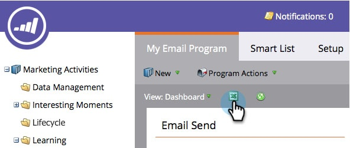

# Exportieren des Dashboards für E-Mail-Programme nach Excel {#export-email-program-dashboard-to-excel}

Sobald Sie ein E-Mail-Programm ausgeführt und einige Daten im Dashboard haben, können Sie diese Rohdaten zur weiteren Analyse nach Excel exportieren. Und so geht das.

1. Navigieren Sie **[!UICONTROL Marketing-Aktivitäten]**.

   

1. Suchen und wählen Sie Ihr E-Mail-Programm.

   

   >[!NOTE]
   >
   >Wenn Ihr E-Mail-Programm noch nicht gestartet wurde, wird kein Dashboard angezeigt, da keine anzuzeigenden Daten vorhanden sind.

1. Klicken Sie einfach auf das Excel-Symbol, und Ihr Export beginnt.

   

   Ziemlich einfach, oder?
