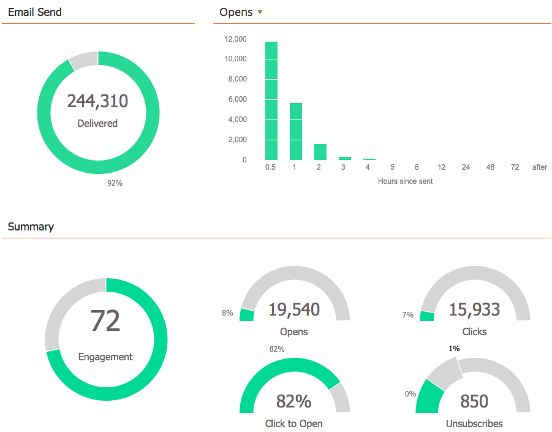

# Verwenden des E-Mail-Programm-Dashboards {#use-the-email-program-dashboard}

Sehen Sie sich mit dieser Dashboard-Ansicht an, wie Ihre E-Mail-Programme funktionieren.

>[!CAUTION]
>
>Um präzise Berichte zu erstellen, vermeiden Sie _Wiederverwendung_ einer E-Mail aus einem E-Mail-Programm, indem Sie entweder in einer Smart-Kampagne darauf verweisen oder das Asset aus dem gestarteten E-Mail-Programm in ein neues verschieben. Dadurch werden alle Daten in jedem Reporting-Dashboard aggregiert, das an diese E-Mail angehängt ist. Wenn Sie eine E-Mail wiederverwenden müssen, [ Sie sie stattdessen ](/help/marketo/product-docs/core-marketo-concepts/programs/working-with-programs/clone-an-asset-in-a-program.md){target="_blank"}, da diese die E-Mail kopiert, aber eine neue mit einer neuen E-Mail-ID erstellt.

>[!NOTE]
>
>Wenn Ihr Programm über einen A/B-Test verfügt, finden Sie weitere Informationen unter [E-Mail-Programm-Dashboard - A/B-Testansicht](/help/marketo/product-docs/email-marketing/email-programs/email-program-actions/email-test-a-b-test/use-the-email-program-dashboard-a-b-test-view.md){target="_blank"}.

>[!NOTE]
>
>Alle Daten in dieser Ansicht sind aggregiert (einschließlich A/B-Test und endgültigem E-Mail-Versand).

## E-Mail gesendet {#email-send}

Hier können Sie sehen, wie viele E-Mails gesendet, zurückgeschickt und zugestellt wurden.

>[!NOTE]
>
>Aufgrund von E-Mail-Zustellbarkeitsstandards, die außerhalb der Kontrolle von Marketo liegen, sind die Statistiken „Bounce“ und „Zugestellt“ Näherungswerte und nicht exakt.

## Öffnungen/Klicks {#opens-clicks}

Dieses Diagramm zeigt die Anzahl der E-Mails, die während bestimmter Zeiträume nach der Ausführung des E-Mail-Programms geöffnet/angeklickt wurden.

>[!TIP]
>
>Beachten Sie, wie die Anzahl der Öffnungen/Klicks mit der Zeit abnimmt.

## Zusammenfassung - Interaktion {#summary-engagement}

Dies zeigt den Gesamtergebnis [Interaktion](/help/marketo/product-docs/email-marketing/drip-nurturing/reports-and-notifications/understanding-the-engagement-score.md){target="_blank"}.

## Zusammenfassung - REST {#summary-rest}

Der Rest der Daten zeigt Öffnungen, Klicks, Klick/Offen-Verhältnis und Abmeldungen an.

>[!TIP]
>
>Die **Abo beenden** im obigen Beispiel war so klein, dass Marketo heranzoomte, um Ihnen ein besseres Aussehen zu geben. Die zweite Zahl innerhalb des Balkens wird lediglich für die Skalierung hinzugefügt.

>[!NOTE]
>
>**Definition**
>
>**[!UICONTROL Öffnungen]** werden gezählt, wenn der E-Mail-Empfänger die Bilder der E-Mail herunterlädt, die ein von Marketo eingefügtes Tracking-Pixel enthalten. Wenn der Empfänger die E-Mail ansieht, aber seine Bilder nicht herunterlädt, gilt dies nicht als Öffnung. Wenn die Bilder im Vorschaufenster des Empfängers geladen werden, gilt dies in der Regel als geöffnete E-Mail, sie variiert jedoch je nach E-Mail-Client.
>
>**[!UICONTROL Zum Öffnen klicken]** misst den Prozentsatz der E-Mails, die sowohl geöffnet wurden als auch auf einen Link in der E-Mail geklickt wurde. Die Anzahl der eindeutigen Klicks dividiert durch die Anzahl der eindeutigen Öffnungen, wird mit 100 multipliziert, um den Prozentsatz anzuzeigen.

## Dashboard aktualisieren {#refresh-dashboard}

Um die aktuellsten Daten anzuzeigen, klicken Sie einfach auf das Aktualisierungssymbol im Dashboard.

>[!MORELIKETHIS]
>
>[Verwenden des E-Mail-Programm-Dashboards - A/B-Testansicht](/help/marketo/product-docs/email-marketing/email-programs/email-program-actions/email-test-a-b-test/use-the-email-program-dashboard-a-b-test-view.md){target="_blank"}
