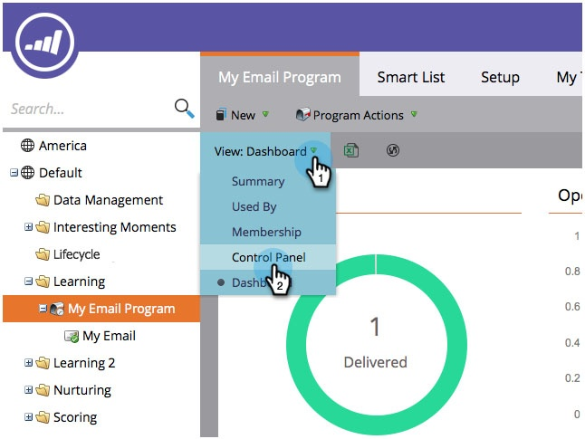

# Anzeigen von E-Mail-Programmergebnissen {#view-email-program-results}

Genau wie die Registerkarte Ergebnisse in Smart-Kampagnen können Sie auch in E-Mail-Programmen dieselben Informationen sehen.

1. Navigieren Sie zu **Marketingaktivitäten**.

   

1. Wählen Sie Ihr E-Mail-Programm aus.

   

   >[!NOTE]
   >
   >Wenn das E-Mail-Programm bereits ausgeführt wurde, gelangen Sie direkt zum Dashboard des E-Mail-Programms.

1. under **Ansicht** auswählen **Control Panel**.

   

1. Unter dem **Zielgruppe** tile, click **Ergebnisse anzeigen**.

   

   Da hast du es!

   
