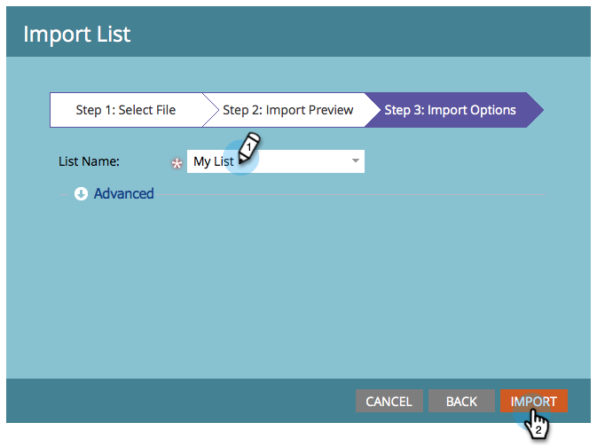

# Definieren einer Audience durch Importieren einer Liste {#define-an-audience-by-importing-a-list}

>[!PREREQUISITES]
>
>[Erstellen einer E-Mail für ein E-Mail-Programm](/help/marketo/product-docs/email-marketing/email-programs/email-program-actions/create-an-email-for-an-email-program.md)

Nachdem Sie ein E-Mail-Programm erstellt haben, sollten Sie ihm mitteilen, an wen Sie die E-Mail senden sollen. Dies können Sie tun, indem Sie [eine Smart-Liste erstellen](/help/marketo/product-docs/core-marketo-concepts/smart-lists-and-static-lists/creating-a-smart-list/create-a-smart-list.md) oder eine Liste importieren. Gehen Sie dazu wie folgt vor, indem Sie eine Liste importieren.

>[!NOTE]
>
>Die Definition Ihrer Audience funktioniert nur, wenn das E-Mail-Programm nicht genehmigt ist.
>
>Alle Datums-/Uhrzeitfelder, die importiert werden, werden als zentrale Zeit behandelt. Wenn Sie Datums-/Zeitfelder in einer anderen Zeitzone haben, können Sie eine Excel-Formel verwenden, um sie in Central Time (America/Chicago) umzuwandeln.

1. Navigieren Sie **Marketing-Aktivitäten**.

   

1. Wählen Sie Ihr E-Mail-Programm aus und klicken Sie dann unter der Kachel Zielgruppe auf Liste importieren .

   

1. Das Listenimportfenster wird geöffnet. Klicken Sie auf **Durchsuchen** und wählen Sie die zu importierende Datei aus. Nachdem Sie Ihre Personenliste ausgewählt haben, klicken Sie auf **Weiter**.

   

   >[!CAUTION]
   >
   >Stellen Sie sicher, dass die Liste UTF-8, UTF-16, Shift-JIS oder EUC-JP kodiert ist und 50 MB an Dateigröße nicht überschreitet.

1. Stellen Sie sicher, dass die Felder in Ihrer Datei korrekt zugeordnet sind, und klicken Sie auf **Weiter**.

   

   >[!TIP]
   >
   >Marketo wird sich die Zuordnungen für zukünftige Importe merken!

1. Geben Sie **Namen** Ihrer Liste ein und klicken Sie auf **Importieren**.

   

1. Nachdem der Import abgeschlossen ist, kehren Sie zur Registerkarte Hauptprogramm zurück. Sie werden sehen, wie viele Leute sich qualifizieren werden.

   

>[!NOTE]
>
>**Definition**
>
>Ist Ihnen die Blockierungsnummer aufgefallen? Diese Zahl ist eine Teilmenge der qualifizierten Personen und stellt Personen dar, die aus folgenden Gründen nicht an diese E-Mail gesendet werden können:
>
>* Abbestellt
>* Marketing eingestellt
>* Auf der Sperrliste
>* E-Mail-Adresse ungültig
>* Leere E-Mail
>
>Klicken Sie auf die Nummer für eine detaillierte Liste der Personen, die vom Versand blockiert sind.
>
>Verwenden Sie die Schaltfläche  auf der Kachel **Audience**, um anzuzeigen, wie viele Personen sich anhand der Smart-List-Kriterien für den Empfang der E-Mail qualifiziert haben. Subtrahieren Sie die Zahl Blockiert von der Zahl Personen , um die Gesamtzahl der Personen abzurufen, die die E-Mail erhalten werden.

>[!TIP]
>
>Sie müssen nicht warten, bis der Import der Liste abgeschlossen ist. Du kannst weiterarbeiten, wenn du möchtest.

Fantastisch! Jetzt ist es an der Zeit, eine bereits vorhandene E-Mail auszuwählen oder eine neue E-Mail zu erstellen, die an diese Personen gesendet werden soll.

>[!MORELIKETHIS]
>
>* [Vorhandene E-Mail auswählen](/help/marketo/product-docs/email-marketing/email-programs/email-program-actions/choose-an-existing-email.md)
>* [Erstellen einer E-Mail für ein E-Mail-Programm](/help/marketo/product-docs/email-marketing/email-programs/email-program-actions/create-an-email-for-an-email-program.md)
