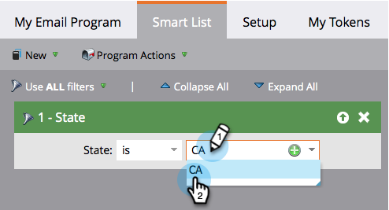

# Definieren einer Zielgruppe mit einer Smart-Liste {#define-an-audience-with-a-smart-list}

Nachdem Sie [E-Mail-Programm erstellen](/help/marketo/product-docs/email-marketing/email-programs/creating-an-email-program/create-an-email-program.md) sollten Sie ihm mitteilen, an wen die E-Mail gesendet werden soll. Sie können dies tun, indem Sie [eine Liste von Personen ](/help/marketo/product-docs/email-marketing/email-programs/managing-people-in-email-programs/define-an-audience-by-importing-a-list.md) oder eine Smart-Liste importieren. So erreichen Sie dies mit einer Smart-Liste.

>[!PREREQUISITES]
>
>[E-Mail-Programm erstellen](/help/marketo/product-docs/email-marketing/email-programs/creating-an-email-program/create-an-email-program.md)

>[!NOTE]
>
>Die Definition Ihrer Audience funktioniert nur, wenn das E-Mail-Programm nicht genehmigt ist.

1. Navigieren Sie **Marketing-Aktivitäten**.

   

1. Wählen Sie Ihr E-Mail-Programm aus und klicken **dann unter der Kachel** Audience **auf „Smart-Liste bearbeiten**.

   

   >[!TIP]
   >
   >Stellen Sie sicher, dass die Ansicht auf **Systemsteuerung** eingestellt ist, um diese Einstellung zu finden.

1. Suchen Sie die gewünschten Filter und ziehen Sie sie auf die Arbeitsfläche.

   

1. Definieren Sie die Filter.

   

1. Wenn Sie mit dem Hinzufügen und Definieren von Filtern fertig sind, gehen Sie zurück zur Registerkarte Hauptprogramm . Sie werden sehen, wie viele Personen sich qualifizieren.

   

   Hervorragende Arbeit! Jetzt ist es an der Zeit, [eine vorhandene E-Mail auszuwählen](/help/marketo/product-docs/email-marketing/email-programs/email-program-actions/choose-an-existing-email.md) oder [eine E-Mail zu erstellen](/help/marketo/product-docs/email-marketing/email-programs/email-program-actions/create-an-email-for-an-email-program.md) an diese Leute zu senden.

>[!NOTE]
>
>**Definition**
>
>Ist Ihnen die Blockierungsnummer aufgefallen? Diese Zahl ist eine Teilmenge der Personen, die sich qualifiziert haben, und steht für Personen, die diese E-Mail nicht senden können, weil sie:
>
>* Abbestellt
>* Marketing eingestellt
>* Auf der Sperrliste
>* E-Mail-Adresse ungültig
>* Leere E-Mail
>
>Klicken Sie auf die Nummer für eine detaillierte Liste der Personen, die vom Versand blockiert sind. **Bitte beachten Sie:** operative E-Mails werden weiterhin an Personen gesendet, die als abgemeldet und Marketing ausgesetzt gekennzeichnet sind.
>
>Verwenden Sie die Schaltfläche  auf der Kachel Zielgruppe , um anzuzeigen, wie viele Personen die E-Mail erhalten werden.

>[!MORELIKETHIS]
>
>* [Vorhandene E-Mail auswählen](/help/marketo/product-docs/email-marketing/email-programs/email-program-actions/choose-an-existing-email.md)
>* [Erstellen einer E-Mail für ein E-Mail-Programm](/help/marketo/product-docs/email-marketing/email-programs/email-program-actions/create-an-email-for-an-email-program.md)
