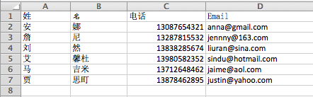
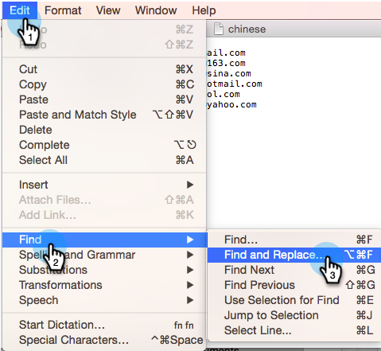

# Importieren einer Liste nicht lateinischer Zeichen {#import-a-non-latin-characters-list}

Versuchen Sie, eine Datei zu importieren, die nicht auf Englisch ist? Die Liste sieht perfekt aus, wenn Sie sie mit Excel öffnen.

Wenn Sie sie jedoch in Marketo importieren, stellen Sie möglicherweise fest, dass die nicht englischen Zeichen nicht korrekt erkannt werden.

Dies liegt daran, dass die Datei nicht ordnungsgemäß gespeichert wird, damit Marketo alle nicht lateinischen Zeichen erkennen kann. Die gute Nachricht ist, es gibt ein paar einfache Schritte, die Sie befolgen können, um es zu beheben.

1. Wählen Sie **[!UICONTROL Speichern unter]…** aus dem Menü **[!UICONTROL Datei]** in Excel.

   

1. Wählen Sie **[!UICONTROL UTF-16 Unicode Text (.txt)]** als **[!UICONTROL Format]** Option. Dadurch wird die Datei so kodiert, wie Marketo sie anzeigen kann.

   

   >[!NOTE]
   >
   >Marketo unterstützt auch UTF-8, Shift-JIS oder EUC-JP.

1. Excel speichert die neue Datei als Textdatei mit der Erweiterung .txt. Es konvertiert aber auch alle Kommas in der Datei in Registerkarten. Wir müssen es wieder ändern.

   >[!TIP]
   >
   >Sie können die Textdatei mithilfe von **[!DNL Notepad]** öffnen, wenn Sie Windows verwenden, oder **[!DNL TextEdit]**, wenn Sie eine Mac verwenden.

   

1. Wählen Sie eine Registerkarte aus dem Dokument aus und kopieren Sie sie.

   

1. Wählen **[!UICONTROL Suchen und Ersetzen]…** aus dem Menü **[!UICONTROL Bearbeiten]** aus.

   

   >[!TIP]
   >
   >Die entsprechende Aktion für Windows-Benutzer lautet: **[!UICONTROL Bearbeiten] > [!UICONTROL Ersetzen]…**

1. Fügen Sie die in Schritt 4 kopierte Registerkarte in das erste (zu ersetzende) Feld ein und geben Sie in das zweite (durch ersetzen) Feld ein Komma ein. und klicken Sie auf **[!UICONTROL Alle]**.

   

1. Und voila, alle Kommas sind zurück und wir sind bereit zu rollen.

   

1. Importieren Sie die neue Datei in Marketo. Die Informationen sollten diesmal korrekt angezeigt werden.

   

   >[!NOTE]
   >
   >Alle Datums-/Uhrzeitfelder, die importiert werden, werden als zentrale Zeit behandelt. Wenn Sie Datums-/Zeitfelder in einer anderen Zeitzone haben, können Sie eine Excel-Formel verwenden, um sie in Central Time (America/Chicago) umzuwandeln.

Wir wissen, dass das seltsam ist, aber es funktioniert. Viel Spaß beim Importieren!
