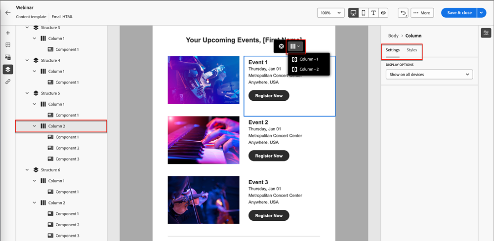

# E-Mail-Vorlagen {#email-templates}

Für einen beschleunigten und verbesserten Designprozess können Sie eigenständige E-Mail-Vorlagen erstellen, um benutzerdefinierte Inhalte einfach wiederzuverwenden.

>[!IMPORTANT]
>
>Dieser Artikel richtet sich nur an Mitglieder der neuen Beta-Marketo Engage-E-Mail-Designer. Bitte nicht verbreiten.

>[!NOTE]
>
>E-Mail-Vorlagen im neuen E-Mail-Designer können nur zum Erstellen von E-Mails im neuen E-Mail-Designer verwendet werden. Sie können im alten E-Mail-Editor nicht referenziert werden.

## E-Mail-Vorlage erstellen {#create-an-email-template}

1. Melden Sie sich über die [Adobe Experience Cloud](https://experiencecloud.adobe.com/){target="_blank"} bei Marketo Engage an.

1. Wählen Sie in My Marketo **Design Studio** aus.

   

1. Wählen Sie im Baum **E-Mail-Vorlagen (neuer Editor)** aus.

   

1. Klicken Sie auf die Schaltfläche **Vorlage erstellen** .

   

1. Geben Sie einen Vorlagennamen und eine optionale Beschreibung ein. Klicken Sie auf **Erstellen**.

   

## Entwerfen einer Vorlage {#design-your-template}

Auf der Seite _Vorlage entwerfen_ können Sie aus einigen Optionen auswählen. [Entwerfen von Grund auf](#design-from-scratch), [Importieren Sie Ihre eigene HTML](#import-html) oder [wählen Sie eine vorhandene Vorlage](#choose-a-template) aus (eine unserer Beispiele oder eine Vorlage, die Sie bereits gespeichert haben).

### Von Grund auf gestalten {#design-from-scratch}

Definieren Sie Ihren Inhalt, indem Sie Strukturelemente mit einfachen Drag &amp; Drop-Aktionen hinzufügen und verschieben.

1. Wählen Sie auf der Seite _Design your template_ die Option **Design von Grund auf neu** aus.

1. Fügen Sie [Struktur und Inhalt](#add-structure-and-content) hinzu.

### HTML importieren {#import-your-html}

Sie können vorhandenen HTML-Inhalt importieren, um E-Mail-Vorlagen zu erstellen. Der Inhalt kann wie folgt lauten:

* Eine HTML-Datei mit integriertem Stylesheet

* Eine ZIP-Datei mit einer HTML-Datei, dem Stylesheet (.css) und Bildern.

>[!NOTE]
>
>Die Dateistruktur des komprimierten Ordners ist freigestellt. Verweise müssen jedoch relativ sein und mit der Baumstruktur des ZIP-Ordners übereinstimmen.

1. Wählen Sie auf der Seite _Design your template_ die Option **Import HTML** aus.

1. Ziehen Sie die gewünschte HTML- oder ZIP-Datei per Drag-and-Drop (oder wählen Sie eine Datei auf Ihrem Computer aus) und klicken Sie auf **Importieren**.

   

   >[!NOTE]
   >
   >Wenn der HTML-Inhalt hochgeladen wird, befindet sich der Inhalt im Kompatibilitätsmodus. In diesem Modus können Sie nur Ihren Text personalisieren, Links hinzufügen oder Assets zu Ihrem Inhalt hinzufügen.

1. Um die Inhaltskomponenten von Email Designer nutzen zu können, klicken Sie auf die Registerkarte **HTML-Converter** und dann auf **Convert**.

   >[!CAUTION]
   >
   >Einen `<table>`-Tag als erste Ebene in einer HTML-Datei zu verwenden kann zum Verlust des Stils führen, einschließlich der Einstellungen für Hintergrund und Breite im Tag der obersten Ebene.

Sie können Ihre importierte Datei jetzt mit dem visuellen E-Mail-Editor nach Bedarf personalisieren.

### Vorlage auswählen {#choose-a-template}

Es gibt zwei Arten von Vorlagen zur Auswahl.

* **Beispielvorlagen**: Marketo Engage bietet vier vordefinierte E-Mail-Vorlagen.

* **Gespeicherte Vorlagen**: Hierbei handelt es sich um Vorlagen, die Sie im Menü &quot;Vorlagen&quot;von Grund auf neu erstellt haben, oder um eine E-Mail, die Sie erstellt und als Vorlage gespeichert haben.

>[!BEGINTABS]

>[!TAB Beispielvorlagen]

Wählen Sie eine der vordefinierten Vorlagen für einen Vorsprung im E-Mail-Vorlagenentwurf.

1. Der Tab Beispielvorlagen ist standardmäßig geöffnet.

1. Wählen Sie die Vorlage aus, die Sie verwenden möchten.

   

1. Klicken Sie auf **Diese Vorlage verwenden**.

   

1. Bearbeiten Sie den Inhalt nach Bedarf mit dem visuellen Inhaltsentwickler.

>[!TAB Gespeicherte Vorlagen]

1. Klicken Sie auf die Registerkarte **Gespeicherte Vorlagen** und wählen Sie die gewünschte Vorlage aus.

   

1. Klicken Sie auf **Diese Vorlage verwenden**.

   

1. Bearbeiten Sie den Inhalt nach Bedarf mit dem visuellen Inhaltsentwickler.

>[!ENDTABS]

## Hinzufügen von Struktur und Inhalt {#add-structure-and-content}

1. Um Inhalte zu erstellen oder zu ändern, ziehen Sie ein Element aus Strukturen auf die Arbeitsfläche. Bearbeiten Sie die Einstellungen im Bereich auf der rechten Seite.

   >[!TIP]
   >
   >Wählen Sie die n:n-Spaltenkomponente aus, um die Anzahl der Spalten Ihrer Wahl zu definieren (zwischen drei und zehn). Sie können auch die Breite jeder Spalte definieren, indem Sie die Pfeile unter die Spalte verschieben.

   

   >[!NOTE]
   >
   >Die Spaltengröße darf nicht weniger als 10 % der Gesamtbreite der Strukturkomponente betragen. Es können nur leere Spalten entfernt werden.

1. Ziehen Sie aus dem Bereich Inhalt die gewünschten Elemente per Drag-and-Drop in eine oder mehrere Strukturkomponenten.

   

1. Jede Komponente kann über die Registerkarten Einstellungen oder Stil angepasst werden. Ändern Sie Schriftart, Textstil, Rand und mehr.

### Assets hinzufügen {#add-assets}

Fügen Sie Bilder hinzu, die im Abschnitt [Bilder und Dateien](/help/marketo/product-docs/demand-generation/images-and-files/add-images-and-files-to-marketo.md){target="_blank"} Ihrer Marketo Engage-Instanz gespeichert sind.

>[!NOTE]
>
>Sie können im neuen Designer nur Bilder hinzufügen, derzeit keine anderen Dateitypen.

1. Um auf Ihre Bilder zuzugreifen, klicken Sie auf das Symbol Asset-Auswahl .

   

1. Ziehen Sie das gewünschte Bild in eine Strukturkomponente.

   

   >[!NOTE]
   >
   >Um ein vorhandenes Bild zu ersetzen, wählen Sie es aus und klicken Sie dann auf der Registerkarte Einstellungen auf der rechten Seite auf **Asset auswählen** .

### Ebenen, Einstellungen und Stile {#layers-settings-styles}

Öffnen Sie die Navigationsstruktur, um auf bestimmte Strukturen und deren Spalten/Komponenten zuzugreifen und so eine detailliertere Bearbeitung zu ermöglichen. Klicken Sie auf das Symbol Navigationsstruktur , um darauf zuzugreifen.

Im folgenden Beispiel werden die Schritte zum Anpassen des Abstands und der vertikalen Ausrichtung innerhalb einer Strukturkomponente beschrieben, die aus Spalten besteht.

1. Wählen Sie die Spalte in der Strukturkomponente direkt auf der Arbeitsfläche aus oder verwenden Sie die links angezeigte _Navigationsstruktur_ .

1. Klicken Sie in der Spaltensymbolleiste auf das Tool _[!UICONTROL Spalte auswählen]_ und wählen Sie das Tool aus, das Sie bearbeiten möchten.

   Sie können sie auch im Strukturbaum auswählen. Die bearbeitbaren Parameter für diese Spalte werden auf den Registerkarten _[!UICONTROL Einstellungen]_ und _[!UICONTROL Stile]_ rechts angezeigt.

   

1. Um die Spalteneigenschaften zu bearbeiten, klicken Sie auf die Registerkarte _[!UICONTROL Stile]_ rechts und ändern Sie sie entsprechend Ihren Anforderungen:

   * Ändern Sie für **[!UICONTROL Hintergrund]** die Hintergrundfarbe nach Bedarf.

     Deaktivieren Sie das Kontrollkästchen für einen transparenten Hintergrund. Aktivieren Sie die Einstellung **[!UICONTROL Hintergrundbild]** , um ein Bild als Hintergrund anstelle einer Vollbildfarbe zu verwenden.

   * Wählen Sie für **[!UICONTROL Ausrichtung]** das Symbol _Oben_, _Mitte_ oder _Unten_ aus.
   * Definieren Sie für **[!UICONTROL Abstand]** den Abstand für alle Seiten.

     Wählen Sie **[!UICONTROL Verschiedene Abstände für jede Seite]** aus, wenn Sie den Abstand anpassen möchten. Klicken Sie auf das Symbol _Sperren_ , um die Synchronisierung zu unterbrechen.

   * Erweitern Sie den Abschnitt **[!UICONTROL Erweitert]** , um Inline-Stile für die Spalte zu definieren.

   

1. Wiederholen Sie diese Schritte nach Bedarf, um die Ausrichtung und den Abstand für die anderen Spalten in der Komponente anzupassen.

1. Speichern Sie Ihre Änderungen.

### Inhalt personalisieren {#personalize-content}

Token funktionieren im neuen Editor genauso wie im alten, aber das Symbol sieht anders aus. Im folgenden Beispiel wird das Hinzufügen eines Vorname-Tokens mit Fallback-Text beschrieben.

1. Wählen Sie die Textkomponente aus. Platzieren Sie den Cursor an die Stelle, an der das Token angezeigt werden soll, und klicken Sie auf das Symbol **Personalisierung hinzufügen** .

   

1. Klicken Sie auf den gewünschten [Token-Typ](/help/marketo/product-docs/demand-generation/landing-pages/personalizing-landing-pages/tokens-overview.md){target="_blank"}.

   

1. Suchen Sie das gewünschte Token und klicken Sie auf das Symbol &quot;**...**&quot;. (Durch Klicken auf das Symbol &quot;+&quot;wird stattdessen ein Token ohne Fallback-Text hinzugefügt.)

   

   >[!NOTE]
   >
   >&quot;Fallback-Text&quot;ist der neue Editor-Begriff für den Standardwert. Beispiel: ``{{lead.First Name:default=Friend}}``. Dies wird empfohlen, falls im von Ihnen ausgewählten Feld kein Wert für die Person vorhanden ist.

1. Legen Sie Ihren Fallback-Text fest und klicken Sie auf **Hinzufügen**.

   

1. Klicken Sie auf **Speichern**.

### URL-Tracking bearbeiten {#edit-url-tracking}

Manchmal möchten Sie die Marketo-Tracking-URL nicht für einen Link in einer E-Mail aktivieren. Dies ist nützlich, wenn die Zielseite URL-Parameter nicht unterstützt und zu einem fehlerhaften Link führen kann.

1. Klicken Sie auf das Symbol Links , um alle URLs in Ihrer E-Mail anzuzeigen.

   

1. Klicken Sie auf das Stiftsymbol, um das Tracking für alle gewünschten Links zu bearbeiten.

1. Klicken Sie auf die Dropdown-Liste **Trackingtyp** und wählen Sie aus.

   

   <table><tbody>
     <tr>
       <td><b>Tracking ohne mkt_tok</b></td>
       <td>Aktiviert das Tracking der URL ohne Verwendung des Abfragezeichenfolgenparameters mkt_tok in der Ziel-URL</td>
     </tr>
     <tr>
       <td><b>Tracking mit mkt_tok</b></td>
       <td>Aktiviert das Tracking der URL mithilfe des Abfragezeichenfolgenparameters mkt_tok in der Ziel-URL</td>
     </tr>
     <tr>
       <td><b>Nicht verfolgen</b></td>
       <td>Deaktiviert das Tracking der URL</td>
     </tr>
   </tbody>
   </table>

1. Optional können Sie der URL einen Titel geben oder Tags hinzufügen.

1. Klicken Sie auf **Speichern**, wenn Sie fertig sind.

### Anzeigeoptionen {#view-options}

Nutzen Sie die im visuellen E-Mail-Editor verfügbaren Ansicht- und Inhaltsvalidierungsoptionen.

* Vergrößern/Verkleinern Sie den Inhalt mithilfe der voreingestellten Zoom-Optionen.

* Zeigen Sie den Inhalt auf Desktop-, Mobil- oder Nur-Text- bzw. Nur-Text-Seiten an.

   * Klicken Sie auf das Live-Ansicht-Symbol (Auge) für die geräteübergreifende Inhaltsvorschau.

   * Wählen Sie eines der nativen Geräte aus oder geben Sie benutzerdefinierte Dimensionen für die Vorschau Ihres Inhalts ein.

### Mehr Optionen {#more-options}

Über die Optionen **Mehr** im Inhaltseditor können Sie die folgenden Aktionen ausführen:

* **Vorlage zurücksetzen**: Wählen Sie diese Option aus, um die Arbeitsfläche des visuellen E-Mail-Designers in eine leere Verspätung zu leeren und die Erstellung von Inhalten neu zu starten.

* **Design ändern**: Kehren Sie zur Seite _Vorlage entwerfen_ zurück. Von hier aus können Sie jede Aktion ausführen, wie im Abschnitt [Vorlage entwerfen](#design-your-template) beschrieben.

* **HTML exportieren**: Laden Sie den Inhalt der visuellen Arbeitsfläche in das lokale HTML-Format herunter, das als ZIP-Datei gepackt ist.

## Vorlagendetails anzeigen {#view-template-details}

Klicken Sie auf der Listenseite _E-Mail-Vorlagen_ auf den Namen einer E-Mail-Vorlage, um deren Details anzuzeigen.

(assets/view-template-details-1.png

Grundlegende Details wie Name und Beschreibung können bearbeitet werden. Klicken Sie außerhalb des bearbeiteten Felds auf , um Ihre Änderungen zu speichern.

Klicken Sie auf **Mehr** , um Ihre Vorlage schnell zu löschen oder zu duplizieren.

Wenn aktive Warnhinweise vorhanden sind (Fehler/Warnungen für die E-Mail-Vorlage), klicken Sie auf Warnhinweise , um die Informationen anzuzeigen.

>[!NOTE]
>
>Diese Warnhinweise verbieten zwar nicht die Verwendung der E-Mail-Vorlage für die Erstellung von E-Mails, doch bieten die Informationen Aufschluss darüber, was möglicherweise nicht funktioniert, und welche Aktualisierungen erforderlich sind, bevor die E-Mail für den Versand verwendet werden kann.

## Von Verweisen verwendete E-Mail-Vorlage anzeigen {#email-template-used-by-references}

Klicken Sie in der Zusammenfassung der E-Mail-Vorlage auf den Tab **Verwendet von** , um Details darüber anzuzeigen, wo diese E-Mail-Vorlage in Marketo Engage verwendet wurde.

## E-Mail-Vorlagen bearbeiten {#edit-email-templates}

Diese Aktion kann wie folgt durchgeführt werden:

* Registerkarte &quot;Details&quot;- Klicken Sie auf **E-Mail-Vorlage bearbeiten**.

Durch diese Aktion gelangen Sie zur Seite &quot;_Design Ihrer Vorlage_&quot;oder zur Seite des visuellen Inhaltseditors, die auf dem zuletzt gespeicherten Status der E-Mail-Vorlage basiert. Hier können Sie nach Bedarf den Inhalt Ihrer E-Mail-Vorlage bearbeiten. Weitere Informationen zu den Bearbeitungsoptionen finden Sie unter E-Mail-Vorlagen erstellen .

## E-Mail-Vorlagen duplizieren {#duplicate-email-templates}

Es gibt zwei Möglichkeiten, eine E-Mail-Vorlage zu duplizieren:

* Klicken Sie rechts in den E-Mail-Vorlagendetails auf **Mehr** und wählen Sie **Duplizieren** aus.

  

* Klicken Sie auf der Listenseite _E-Mail-Vorlagen_ auf das Symbol Mehr Aktionen (drei Punkte) der gewünschten E-Mail-Vorlage und wählen Sie **Duplizieren** aus.

Geben Sie im Dialogfeld einen eindeutigen Namen und eine optionale Beschreibung ein. Klicken Sie abschließend auf **Duplizieren** .

Die duplizierte E-Mail-Vorlage wird dann auf der Listenseite _E-Mail-Vorlagen_ angezeigt.

## E-Mail-Vorlagen löschen {#delete-email-templates}

Es gibt zwei Möglichkeiten, eine E-Mail-Vorlage zu löschen.

>[!CAUTION]
>
>Das Löschen einer E-Mail-Vorlage kann nicht rückgängig gemacht werden.

* Klicken Sie rechts in den E-Mail-Vorlagendetails auf **Mehr** und wählen Sie **Löschen** aus.

  

* Klicken Sie auf der Listenseite _E-Mail-Vorlagen_ auf das Symbol Mehr Aktionen (drei Punkte) der gewünschten E-Mail-Vorlage und wählen Sie **Löschen** aus.

## Massenaktionen {#bulk-actions}

Wählen Sie auf der Listenseite _E-Mail-Vorlagen_ mehrere Vorlagen aus, indem Sie die Kontrollkästchen links aktivieren. Unten wird ein Banner angezeigt.

**Löschen**: Sie können maximal 20 Vorlagen gleichzeitig löschen. In einem Bestätigungsdialogfeld können Sie die Aktion abbrechen oder den Löschvorgang bestätigen.

>[!MORELIKETHIS]
>
>[E-Mail-Authoring](/help/marketo/product-docs/email-marketing/general/beta-new-email-designer/email-authoring.md){target="_blank"}: Erfahren Sie, wie Sie eine E-Mail im neuen Designer erstellen, entwerfen und referenzieren.
