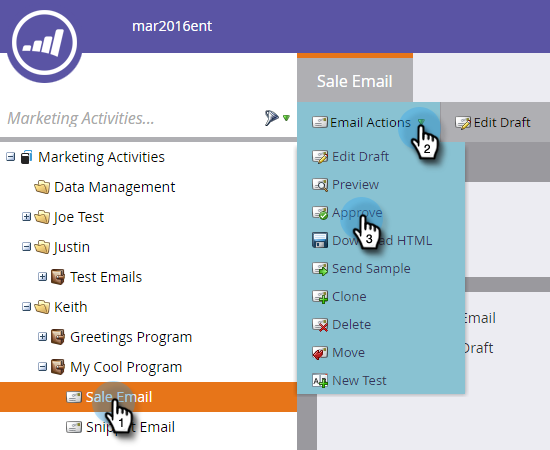
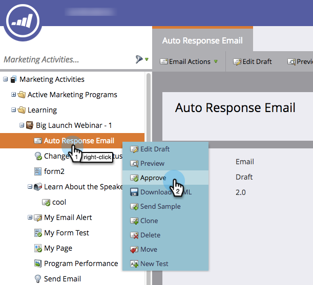

# Genehmigen einer E-Mail {#approve-an-email}

E-Mails beginnen im Entwurfsstatus. Sie sind im Allgemeinen im System erst verfügbar, nachdem Sie sie genehmigt haben. Es gibt mehrere Möglichkeiten, eine E-Mail zu genehmigen.

## Genehmigen mithilfe des Menüs [!UICONTROL E-Mail-Aktionen] {#approve-it-using-the-email-actions-menu}

1. Suchen Sie Ihre E-Mail, wählen Sie sie aus, klicken Sie auf **[!UICONTROL E-Mail]** Aktionen) und wählen Sie **[!UICONTROL Genehmigen]**.

   

## Direkt in der Baumstruktur genehmigen {#approve-it-directly-in-the-tree}

1. Suchen Sie Ihre E-Mail, wählen Sie sie aus, klicken Sie mit der rechten Maustaste darauf und wählen Sie **[!UICONTROL Genehmigen]**.

   

## E-Mail im E-Mail-Editor genehmigen {#approve-your-email-in-the-email-editor}

1. Klicken Sie in Ihrer E-Mail auf **[!UICONTROL E-Mail-Aktionen]** und wählen Sie **[!UICONTROL Genehmigen und schließen]**.

   

Nach der Genehmigung ist Ihre E-Mail einsatzbereit!
