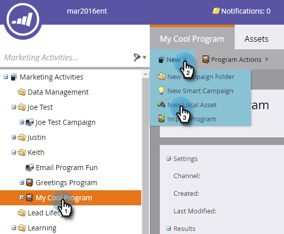
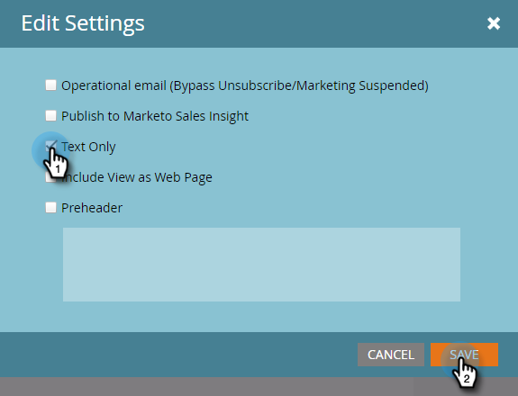
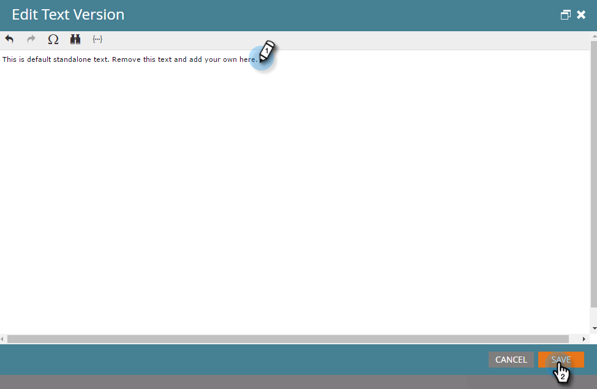

# Erstellen einer Nur-Text-E-Mail {#create-a-text-only-email}

Wenn Sie jemals nur Text-E-Mails senden möchten, finden Sie hier eine E-Mail, die ohne HTML-Inhalte gesendet wird.

>[!NOTE]
>
>Da Öffnungen von dem Empfänger verfolgt werden, der die Bilder der E-Mail herunterlädt (die ein unsichtbares Tracking-Pixel enthalten), können Öffnungen **nicht** für Nur-Text-E-Mails verfolgt werden.

1. Navigieren Sie zum Bereich **[!UICONTROL Marketing-Aktivitäten]**.

   

1. Wählen Sie Ihr Programm aus, klicken Sie auf **[!UICONTROL Neu]** und wählen Sie **[!UICONTROL Neues lokales Asset]**.

   

1. Wählen Sie **[!UICONTROL E-Mail]** aus.

   

1. Geben Sie einen **[!UICONTROL Namen]** ein, wählen Sie eine Vorlage aus und klicken Sie auf **[!UICONTROL Erstellen]**.

   

1. Klicken Sie im E-Mail-Editor auf **[!UICONTROL E-Mail-Einstellungen]**.

   

1. Markieren Sie **[!UICONTROL Nur Text]** und klicken Sie auf **[!UICONTROL Speichern]**.

   

   >[!CAUTION]
   >
   >Links werden nicht automatisch in Nur-Text-E-Mails nachverfolgt. Siehe „Hinzufügen [&#x200B; getrackten Links zu einer Text-E-Mail](/help/marketo/product-docs/email-marketing/general/functions-in-the-editor/add-tracked-links-to-a-text-email.md).

   >[!TIP]
   >
   >Sie können auch eine vorhandene E-Mail bearbeiten und diese Einstellung ändern. Vergiss nicht, den Entwurf zu genehmigen.

1. Deaktivieren Sie das Kontrollkästchen **[!UICONTROL Automatisch aus HTML kopieren]**.

   

   >[!NOTE]
   >
   >Alle Inhalte, die dem Abschnitt HTML der E-Mail hinzugefügt wurden, werden beim Senden ignoriert.

1. Doppelklicken Sie auf den Textbereich.

   

1. Bearbeiten Sie den Text und klicken Sie auf **[!UICONTROL Speichern]**.

   

So einfach ist das.
