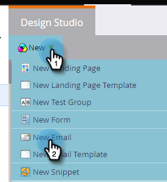

# E-Mail erstellen {#create-an-email}

Es gibt zwei Möglichkeiten, eine E-Mail in Marketo zu erstellen. Schauen wir uns beides an.

## Erstellen einer E-Mail in Design Studio {#create-an-email-in-the-design-studio}

1. Gehen Sie zum **Design Studio**.

   

1. Klicken Sie auf **Neu** und wählen Sie **Neue E-Mail**.

   

   >[!NOTE]
   >
   >Wenn Sie eine E-Mail im Design Studio erstellen, befindet sie sich in der Baumstruktur unter „E-Mails“.

Einfach! Jetzt für den anderen Weg…

## Erstellen einer E-Mail in Marketing-Aktivitäten {#create-an-email-in-marketing-activities}

1. Navigieren Sie **Marketing-Aktivitäten**.

   

1. Wählen Sie das Programm aus, dem Sie die E-Mail hinzufügen möchten, klicken Sie auf die **Neu** und wählen Sie **Neues lokales Asset**.

   

1. Klicken Sie auf **E-Mail**.

   

   Und das war&#39;s!

Die von Ihnen gewählte Methode bringt Sie zur Vorlagenauswahl.

1. Geben Sie Ihrer E-Mail einen Namen, klicken Sie auf die gewünschte Vorlage und dann auf **Erstellen**.

   

   >[!NOTE]
   >
   >Sie können aus einer Sammlung einsatzbereiter responsiver E-Mail-Vorlagen oder einer Vorlage wählen, die Sie gespeichert haben, indem Sie zunächst **Meine Vorlagen** auswählen und die gleichen Schritte ausführen.

1. Geben Sie einen Betreff ein. Die empfohlene Zeichenbeschränkung ist 50.

   

   Je nach ausgewählter Vorlage haben Sie verschiedene Optionen, um Ihre E-Mail zu bearbeiten. E-Mails mit Modulen finden Sie unter [Hinzufügen von Modulen zu Ihrer E-Mail](/help/marketo/product-docs/email-marketing/general/email-editor-2/add-modules-to-your-email.md).

Ihre E-Mail wurde erstellt, also bearbeiten Sie sie!

>[!MORELIKETHIS]
>
>[E-Mail-Kopfzeile bearbeiten](/help/marketo/product-docs/email-marketing/general/creating-an-email/edit-your-email-header.md)
