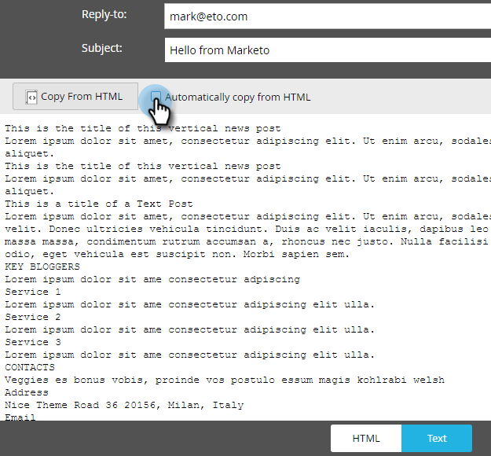

# Bearbeiten der Textversion einer E-Mail {#edit-the-text-version-of-an-email}

Wenn Sie eine E-Mail erstellen, möchten Sie möglicherweise, dass deren Textversion anders formuliert wird als die HTML-Version. Standardmäßig kopiert Marketo den Textinhalt jedes Rich-Text-Elements, das in Ihrer E-Mail enthalten ist, automatisch in die Textversion. Hier ist, wie man es bearbeitet.

>[!NOTE]
>
>Dies ist kein Artikel zum Erstellen einer Nur-Text-E-Mail. Weitere Informationen hierzu finden Sie unter [Eine Nur-Text-E-Mail erstellen](create-a-text-only-email.md).

1. Klicken Sie im E-Mail-Editor auf die Registerkarte **Text** am unteren Rand der E-Mail.

   

1. Deaktivieren Sie** Automatisch aus HTML** kopieren, um Änderungen vorzunehmen.

   

1. Klicken Sie mit der Dublette auf den Textbereich.

   

1. Nehmen Sie Ihre Änderungen vor. Nach Abschluss schließen Sie einfach den Editor oder gehen zurück zur HTML-Version. Die Änderungen werden automatisch gespeichert.

   \
   Wenn Sie nur statischen Inhalt haben, kann der Text in einem großen Block bearbeitet werden (siehe Schritt 3). Wenn Sie dynamischen Inhalt haben, wird der Text wie unten dargestellt in verschiedene bearbeitbare Abschnitte unterteilt.

   

Jetzt weißt du’s!
