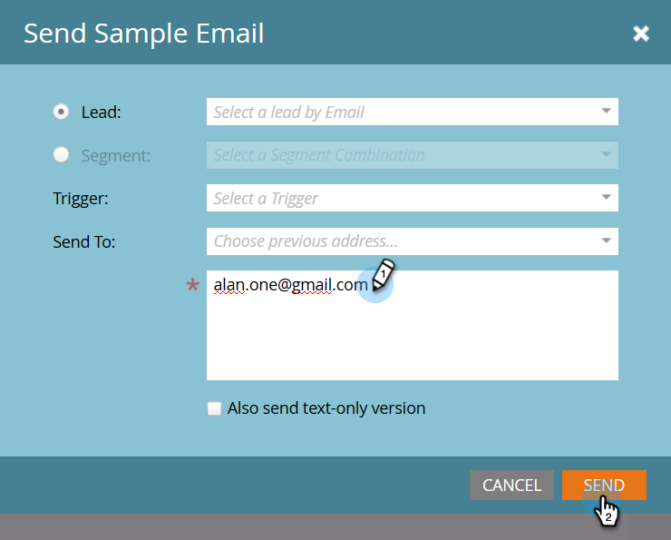

# Senden einer Beispiel-E-Mail {#send-a-sample-email}

Es ist schnell und einfach, Beispiele einer E-Mail zu senden. Informationen zum Senden einer E-Mail mit dynamischem Inhalt finden Sie unter [Vorschau einer E-Mail mit dynamischem Inhalt](/help/marketo/product-docs/email-marketing/general/functions-in-the-editor/preview-an-email-with-dynamic-content.md).

>[!NOTE]
>
>Sie müssen über die Berechtigung **Zugriff auf Datenbank - Einzelflussaktionen ausführen** verfügen, um Beispiel-E-Mails zu senden.

## Senden einer Beispiel-E-Mail {#send-a-sample-email-1}

1. Suchen Sie Ihre E-Mail und wählen Sie sie aus. Klicken Sie auf **[!UICONTROL E-Mail]** Aktionen) und wählen Sie **[!UICONTROL Beispiel senden]**.
   

   >[!NOTE]
   >
   >Meine Token werden in den Wert aufgelöst, der dem Programm der E-Mail entspricht.

1. Geben Sie eine oder mehrere E-Mail-Adressen für den Versand ein. Trennen Sie E-Mail-Adressen bei mehreren Adressen durch Kommas. Klicken Sie abschließend **[!UICONTROL Senden]**.

   

   >[!IMPORTANT]
   >
   >Wenn Sie mehrere E-Mail-Adressen eingeben, sind diese für jeden Empfänger sichtbar. Die erste eingegebene Adresse ist der Hauptempfänger und jede nachfolgende E-Mail-Adresse ist ein CC-Empfänger.

   >[!TIP]
   >
   >Wenn Sie Token als eine bestimmte Person auflösen möchten, wählen Sie diese Person in der **Personen-Dropdown** in Schritt 2 aus.

## Beispiel-E-Mail während der Bearbeitung senden {#send-a-sample-email-while-editing}

1. Suchen Sie Ihre E-Mail, wählen Sie sie aus und klicken Sie auf die Registerkarte **[!UICONTROL Entwurf bearbeiten]**.

   

1. Klicken Sie auf **[!UICONTROL E-Mail]** Aktionen) und wählen Sie **[!UICONTROL Beispiel senden]**.

   

1. Geben Sie eine E-Mail-Adresse für den Versand ein und klicken Sie auf **[!UICONTROL Senden]**.

   

   >[!NOTE]
   >
   >Das Feld Trigger gilt nur für Benutzer, die E-[-Skripte ](https://experienceleague.adobe.com/de/docs/marketo-developer/marketo/email-scripting).

## Senden einer Beispiel-E-Mail basierend auf einem Segment {#send-a-sample-email-based-on-a-segment}

>[!PREREQUISITES]
>
>[Wenden Sie die Segmentierung auf Ihre E-Mail an](/help/marketo/product-docs/email-marketing/general/functions-in-the-editor/using-dynamic-content-in-an-email.md).

1. Suchen Sie Ihre E-Mail, wählen Sie sie aus und klicken Sie auf die Registerkarte **[!UICONTROL Entwurf bearbeiten]**.

   

1. Klicken Sie auf **[!UICONTROL Vorschau]**.

   

1. Klicken Sie auf **[!UICONTROL Dropdown-]** „Anzeigen nach“ und wählen Sie **[!UICONTROL Segmentierung]**.

   

1. Es wird eine Dropdown-Liste mit verfügbaren Segmentierungen angezeigt. Klicken Sie darauf und wählen Sie Ihren gewünschten aus.

   

1. Verwenden Sie die Pfeile, um durch Ihre Optionen zu scrollen (in diesem Fall haben wir die Betreffzeile dynamisch geändert).

   

1. Klicken Sie auf **[!UICONTROL Beispiel senden]**, um eine Test-E-Mail zu Ihrem Segment in Aktion zu erhalten.

   

   >[!TIP]
   >
   >Im Bearbeitungsmodus Ihrer E-Mail können Sie auch eine Beispiel-E-Mail senden, die auf einem Segment basiert. Klicken Sie auf die **[!UICONTROL E]** Mail-Aktionen), wählen Sie **[!UICONTROL Beispiel senden]** und dann Ihr Segment aus.

Das Sampling Ihres Inhalts vor dem Start einer Kampagne ist sehr wichtig. Zweimal messen, einmal schneiden!
