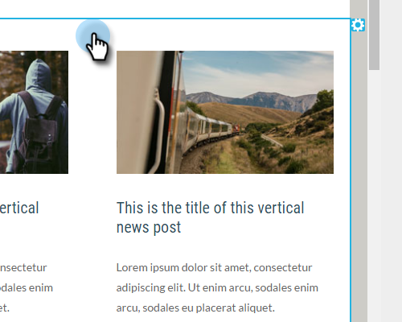

# Hinzufügen von Modulen zu einer E-Mail {#add-modules-to-your-email}

[!DNL Email Editor 2.0] ist ein Modul ein Abschnitt Ihrer E-Mail, der in der Vorlage definiert ist. Module können eine beliebige Kombination aus Elementen, Variablen und anderen HTML-Inhalten enthalten. Sie können sie ganz einfach zu Ihrer E-Mail hinzufügen.

1. Erstellen einer E-Mail. Wählen (oder erstellen) Sie unbedingt eine Vorlage, die Module enthält.

   

   >[!NOTE]
   >
   >Die meisten Marketo [!UICONTROL Starter-Vorlagen] enthalten [!UICONTROL Module]. Sie können auch [eigene erstellen](/help/marketo/product-docs/email-marketing/general/email-editor-2/email-template-syntax.md#modules).

1. Klicken Sie ganz rechts in der E-Mail auf **[!UICONTROL Module]**.

   

1. Wählen Sie das Modul aus, das Sie hinzufügen möchten, und ziehen Sie es auf Ihre E-Mail.

   

1. Wenn Sie das Modul hierher ziehen, wird zwischen den anderen Modulen „Hier ablegen“ angezeigt. Legen Sie Ihr neues Modul dort ab, wo Sie möchten.

   

1. Warten Sie einige Sekunden, und Ihre E-Mail wird automatisch aktualisiert und das hinzugefügte Modul wird angezeigt.

   

## Verschieben eines Moduls innerhalb einer E-Mail {#moving-a-module-within-an-email}

Es gibt zwei Möglichkeiten, ein Modul zu verschieben.

1. Identifizieren Sie das Modul, das Sie verschieben möchten. Wenn Sie sich nicht sicher sind, wie der Name lautet, halten Sie den Mauszeiger darüber, und er wird rechts hervorgehoben.

   

1. Bewegen Sie den Mauszeiger über das Modul auf der rechten Seite, um den Ziehgriff einzublenden. Schnappen…

   

1. …und ziehen Sie das Modul an die gewünschte Position.

   

1. Die andere Methode besteht darin, auf das Modul in der E-Mail zu klicken, um es auszuwählen und das Zahnradsymbol anzuzeigen.

   

1. Klicken Sie auf das Zahnradsymbol und wählen Sie **[!UICONTROL Nach oben]** oder **[!UICONTROL Nach unten]** aus, je nachdem, wohin das Modul wechseln soll.

   

Das ist alles, was dazu gehört.

>[!MORELIKETHIS]
>
>[E-Mail-Vorlagensyntax](/help/marketo/product-docs/email-marketing/general/email-editor-2/email-template-syntax.md)
