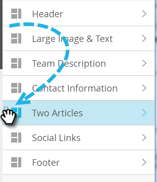

# hinzufügen Module an Ihre E-Mail {#add-modules-to-your-email}

In E-Mail-Editor 2.0 ist ein Modul ein Abschnitt Ihrer E-Mail, der in der Vorlage definiert ist. Module können beliebige Kombinationen aus Elementen, Variablen und anderen HTML-Inhalten enthalten. Sie Ihrer E-Mail hinzuzufügen ist einfach.

1. Erstellen Sie eine E-Mail. Wählen (oder erstellen) Sie eine Vorlage, die Module enthält.

   

   >[!NOTE]
   >
   >Die meisten Vorlagen für Marketo-Starter enthalten Module. Sie können auch [Ihre eigene ](/help/marketo/product-docs/email-marketing/general/email-editor-2/email-template-syntax.md#modules) erstellen.

1. Klicken Sie ganz rechts in der E-Mail auf **Module**.

   

1. Wählen Sie das Modul aus, das Sie hinzufügen möchten, und ziehen Sie es in Ihre E-Mail.

   

1. Wenn Sie das Modul darüber ziehen, sehen Sie &quot;Hier ablegen&quot; zwischen den anderen Modulen. Legen Sie Ihr neues Modul dort ab, wo Sie möchten.

   

1. Warten Sie einige Sekunden, und Ihre E-Mail wird automatisch aktualisiert und zeigt das Modul, das Sie hinzugefügt haben.

   

## Verschieben eines Moduls innerhalb einer E-Mail {#moving-a-module-within-an-email}

Es gibt zwei Möglichkeiten, ein Modul zu verschieben.

1. Identifizieren Sie das Modul, das Sie verschieben möchten. Wenn Sie nicht sicher sind, wie es heißt, halten Sie den Mauszeiger darüber und es wird rechts hervorgehoben.

   

1. Bewegen Sie den Mauszeiger über das Modul auf der rechten Seite, um den Griff anzuzeigen. Nimm es...

   

1. ...und ziehen Sie das Modul an die gewünschte Stelle.

   

1. Die andere Methode besteht darin, auf das Modul in der E-Mail zu klicken, um es auszuwählen und das Zahnradsymbol anzuzeigen.

   

1. Klicken Sie auf das Zahnradsymbol und wählen Sie **Nach oben** oder **Nach unten** aus, je nachdem, wohin das Modul verschoben werden soll.

   

Das ist alles, was dazu da ist.

>[!MORELIKETHIS]
>
>[Syntax der E-Mail-Vorlage](/help/marketo/product-docs/email-marketing/general/email-editor-2/email-template-syntax.md)
