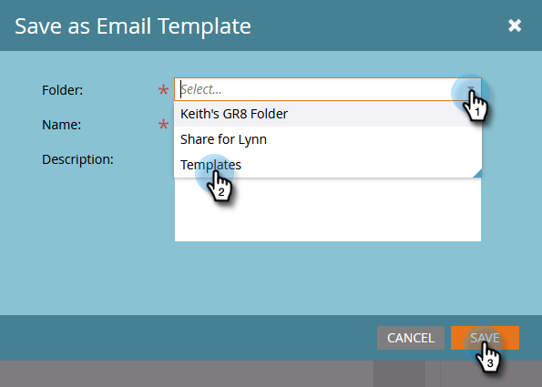

# Erstellen einer E-Mail-Vorlage {#create-an-email-template}

Führen Sie die folgenden Schritte aus, um eine neue E-Mail-Vorlage zu erstellen.

>[!NOTE]
>
>Der Marketo-Support ist nicht für die Fehlerbehebung bei benutzerdefiniertem HTML eingerichtet. Wenden Sie sich an einen Web-Entwickler, um Hilfe beim HTML zu erhalten.

>[!CAUTION]
>
>Der von uns verwendete Editor konvertiert die Werte der CSS-Eigenschaften für Farbe und Hintergrundfarbe in Kleinbuchstaben. Vermeiden Sie daher die Verwendung von Binnenmajuskel-Schreibweise und verwenden Sie stattdessen Namen oder Bindestriche in Kleinbuchstaben.

## Neue E-Mail-Vorlage erstellen {#create-a-new-email-template}

1. Klicks **Design Studio**.

   

1. Klicks **Neu**, wählen Sie **Neue E-Mail-Vorlage**.

   

1. Benennen Sie die neue Vorlage und klicken Sie auf **Erstellen**.

   

1. Um mit der Bearbeitung der neuen Vorlage zu beginnen, klicken Sie auf **Entwurf bearbeiten**.

   

   >[!CAUTION]
   >
   >Wenn eine E-Mail-Vorlage von mehr als 500 E-Mails verwendet wird, gibt es zwar keine feste Begrenzung, aber die erneute Validierung dieser Vorlage nach einer Aktualisierung kann zu Leistungsproblemen führen. Es wird empfohlen, eine neue Vorlage zu erstellen, sobald 500 E-Mails einer E-Mail-Vorlage zugeordnet sind.

## E-Mail als Vorlage speichern {#save-an-email-as-a-template}

Wenn Sie eine E-Mail erstellt haben, die Sie als Vorlage für die zukünftige Verwendung speichern möchten, führen Sie die folgenden einfachen Schritte aus.

1. Klicks **Marketingaktivitäten**.

   

1. Suchen und wählen Sie Ihre E-Mail aus und klicken Sie auf **Entwurf bearbeiten**.

   

1. Klicken Sie auf **E-Mail-Aktionen** und wählen Sie **Als Vorlage speichern**.

   

1. Klicken Sie auf **Ordner** in der Dropdown-Liste auswählen, wo die Vorlage live sein soll, und auf **Speichern**.

   

   Und das ist es!

   >[!CAUTION]
   >
   >Beim Speichern einer E-Mail als Vorlage werden Variablenwerte nicht übernommen. Variablen verwenden weiterhin die in der zugrunde liegenden Vorlage angegebenen Standardwerte. Die in der E-Mail verfügbaren Module werden nur übertragen, wenn sie in den E-Mail-Textkörper eingefügt wurden.

Um Ihre E-Mail-Vorlage anzupassen, sehen Sie sich den unten stehenden Artikel an.

>[!MORELIKETHIS]
>
>[Syntax der E-Mail-Vorlage](/help/marketo/product-docs/email-marketing/general/email-editor-2/email-template-syntax.md)
