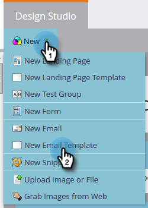

# E-Mail-Vorlage erstellen {#create-an-email-template}

Führen Sie die folgenden Schritte aus, um eine neue E-Mail-Vorlage zu erstellen.

>[!NOTE]
>
>Der Marketing-Support ist nicht so eingerichtet, dass er bei der Fehlerbehebung für benutzerdefiniertes HTML hilft. Für HTML-Hilfe wenden Sie sich bitte an einen Webentwickler.

## Neue E-Mail-Vorlage erstellen {#create-a-new-email-template}

1. Klicken Sie auf **Design Studio**.

   

1. Klicken Sie auf **Neu** und wählen Sie dann **Neue E-Mail-Vorlage**.

   

1. Geben Sie der neuen Vorlage einen Namen und klicken Sie auf **Erstellen**.

   

1. Um mit der Bearbeitung der neuen Vorlage zu beginnen, klicken Sie auf Entwurf **bearbeiten**.

   

   >[!CAUTION]
   >
   >Es gibt zwar keine feste Grenze, aber sobald eine E-Mail-Vorlage von über 500 E-Mails verwendet wird, kann eine erneute Genehmigung dieser Vorlage nach einer Aktualisierung zu Leistungsproblemen führen. Es wird empfohlen, eine neue Vorlage zu erstellen, sobald 500 E-Mails mit einer E-Mail-Vorlage verknüpft sind.

## Speichern einer E-Mail als Vorlage {#save-an-email-as-a-template}

Wenn Sie eine E-Mail erstellt haben, die Sie als Vorlage für die zukünftige Verwendung speichern möchten, führen Sie die folgenden einfachen Schritte aus.

1. Klicken Sie auf **Marketing-Aktivitäten**.

   

1. Suchen und wählen Sie Ihre E-Mail aus und klicken Sie dann auf Entwurf **bearbeiten**.

   

1. Klicken Sie auf die Dropdownliste **E-Mail-Aktionen** und wählen Sie **Als Vorlage** speichern.

   

1. Klicken Sie auf die Dropdownliste **Ordner** , wählen Sie aus, wo die Vorlage gespeichert werden soll, und klicken Sie auf **Speichern**.

   

   Und das ist es!

   >[!CAUTION]
   >
   >Beim Speichern einer E-Mail als Vorlage werden Variablenwerte nicht übernommen. Variablen verwenden weiterhin die in der zugrunde liegenden Vorlage angegebenen Standardwerte. Verfügbare Module in der E-Mail werden auch nicht übertragen, es sei denn, sie wurden in den E-Mail-Textkörper eingefügt.

Um Ihre E-Mail-Vorlage anzupassen, sehen Sie sich den unten stehenden Artikel an.

>[!MORELIKETHIS]
>
>[Syntax der E-Mail-Vorlage](email-template-syntax.md)

