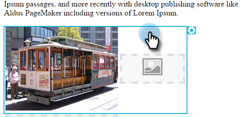
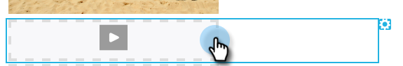

# Bearbeiten von Elementen in einer E-Mail {#edit-elements-in-an-email}

E-Mails können vier verschiedene Elemente enthalten: Rich-Text, Bilder, Snippets und Videos. So bearbeiten Sie jede Datei.

## Bearbeiten des Rich-Text-Elements {#how-to-edit-the-rich-text-element}

1. Suchen Sie Ihre E-Mail, wählen Sie sie aus und klicken Sie auf **[!UICONTROL Entwurf bearbeiten]**.

   

1. Der E-Mail-Editor wird geöffnet. Wählen Sie den Rich-Text aus, klicken Sie auf das Zahnradsymbol und wählen Sie **[!UICONTROL Bearbeiten]** aus.

   

   Sie können auch den Mauszeiger über das Element im rechten Bereich bewegen, wodurch das Zahnradsymbol angezeigt wird.

   

1. Fügen Sie Ihren Text hinzu bzw. bearbeiten Sie ihn und drücken Sie **[!UICONTROL Speichern]**.

   

   >[!NOTE]
   >
   >Sie können auch Bilder, Token, Tabellen und andere Elemente hinzufügen. Siehe [Verwenden des Rich-Text-Editors](/help/marketo/product-docs/email-marketing/general/understanding-the-email-editor/using-the-rich-text-editor.md).

   >[!CAUTION]
   >
   >Vermeiden Sie das Kopieren und Einfügen von Text aus einer Rich-Text-Quelle, z. B. einer Website oder einem Word-Dokument. Fügen Sie Rich-Text stattdessen zuerst in einen Nur-Text-Editor ein, z. B. [!DNL Notepad] (Windows) oder [!DNL TextEdit] (Mac). Sobald er „sauber“ ist, können Sie ihn aus dem Texteditor kopieren und in Ihre E-Mail einfügen.

## Bearbeiten des Bildelements {#how-to-edit-the-image-element}

1. Klicken Sie in das Modul mit dem Element Bild , um es auszuwählen.

   

1. Klicken Sie auf das Bildelement, das Sie bearbeiten möchten, dann auf das Zahnradsymbol und wählen Sie **[!UICONTROL Bearbeiten]** aus.

   

   >[!NOTE]
   >
   >Sie können auch auf das Element doppelklicken, um mit der Bearbeitung zu beginnen.

1. Der Bildeditor wird angezeigt.

   

   Sie haben drei Möglichkeiten, ein Bild einzufügen. Schauen wir uns die an.

   **Externe URL**

   >[!NOTE]
   >
   >Wenn Sie ein Marketo-Token verwenden möchten, verwenden Sie diese Option. Beachten Sie, dass bei Verwendung eines Tokens das Bild im Editor beschädigt aussieht, aber im Vorschaumodus und in der E-Mail „Beispiel senden“ gerendert wird.

   Um eine externe URL zu verwenden, fügen Sie zuerst die URL des Bildes ein. Ändern Sie die Abmessungen entsprechend Ihren Anforderungen und fügen Sie etwas [!UICONTROL ALT-Text] (optional) hinzu. Drücken Sie dann **[!UICONTROL Swap]**.

   

   **Arbeitsplatz**

   Um ein Bild von Ihrem Computer hochzuladen, klicken Sie auf &quot;**[!UICONTROL &quot;]**.

   

   Navigieren Sie zu der Stelle, an der sich das Bild auf Ihrem Computer befindet, und fügen Sie es ein.

   

   Ändern Sie die Abmessungen entsprechend Ihren Anforderungen, ändern Sie den [!UICONTROL Alt-Text] (optional) und drücken Sie dann **[!UICONTROL Austauschen]**.

   

   >[!NOTE]
   >
   >Wenn Sie ein Bild ersetzen, müssen Sie das Kästchen **[!UICONTROL Vorhandenes Bild überschreiben]** aktivieren, das unter der Bild-URL/-name angezeigt wird.

   **Design Studio**

   Um ein Bild aus dem [!UICONTROL Design Studio] einzufügen, suchen Sie es einfach…

   

   …und fügen Sie es ein. Ändern Sie die Abmessungen entsprechend Ihren Anforderungen, ändern Sie den [!UICONTROL Alt-Text] (optional) und drücken Sie dann **[!UICONTROL Austauschen]**.

   

## Bearbeiten des Snippet-Elements {#how-to-edit-the-snippet-element}

1. Klicken Sie in das Modul mit dem Snippet-Element.

   

1. Klicken Sie auf das Snippet-Element, dann auf das Zahnradsymbol und wählen Sie **[!UICONTROL Bearbeiten]**.

   

1. Suchen Sie Ihr Snippet, wählen Sie es aus und klicken Sie auf **[!UICONTROL Speichern]**.

   

1. Ihr Code-Ausschnitt wird dann ausgefüllt.

   

## Anleitung zum Bearbeiten des Videoelements {#how-to-edit-the-video-element}

1. Klicken Sie in das Modul mit dem Videoelement.

   

1. Klicken Sie auf das Videoelement und dann auf das Zahnradsymbol und wählen Sie **[!UICONTROL Bearbeiten]**.

   

1. Fügen Sie die Video-URL aus [!DNL Vimeo] oder YouTube ein. Klicken Sie dann in das URL-Feld, damit die Vorschau geladen wird. Ändern Sie die Abmessungen entsprechend Ihren Anforderungen, fügen Sie [!UICONTROL Alt-Text] (optional) hinzu und drücken Sie dann **[!UICONTROL Einfügen]**.

   

   >[!NOTE]
   >
   >Verwenden Sie für YouTube-Videos die vollständige URL aus der Adressleiste, nicht die Verknüpfungs-URL aus der Freigabeoption.

Viel Spaß beim Entwerfen der perfekten E-Mail!
