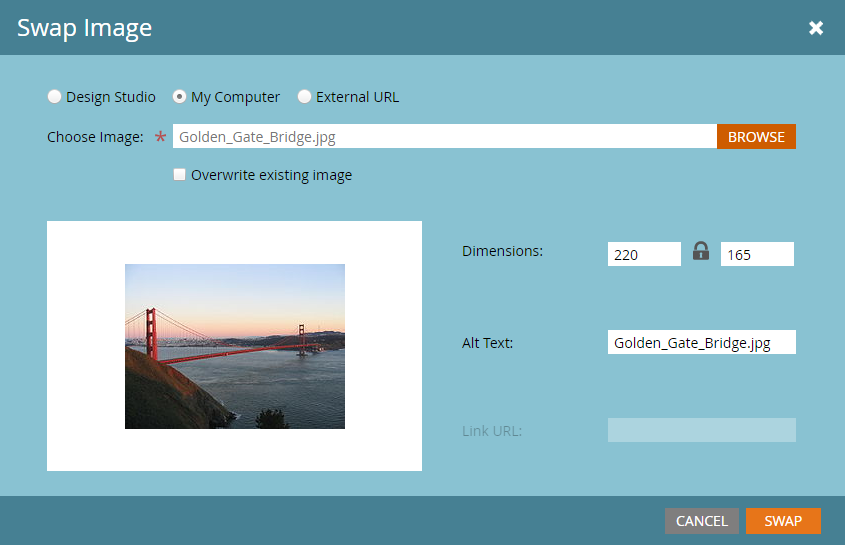

# Elemente in einer E-Mail bearbeiten {#edit-elements-in-an-email}

E-Mails können vier verschiedene Elemente enthalten: Rich Text, Bilder, Snippets und Videos. Hier ist, wie man sie bearbeitet.

## Bearbeiten des Rich-Text-Elements {#how-to-edit-the-rich-text-element}

1. Suchen Sie Ihre E-Mail, wählen Sie sie aus und klicken Sie auf Entwurf **bearbeiten**.

   

1. Der E-Mail-Editor wird geöffnet. Wählen Sie den Rich-Text aus, klicken Sie auf das Zahnradsymbol und wählen Sie **Bearbeiten**.

   

   Sie können auch den Mauszeiger über das Element im rechten Fensterbereich bewegen, wodurch das Zahnradsymbol angezeigt wird.

   

1. hinzufügen/Bearbeiten Sie den Text und drücken Sie **Speichern**.

   

   >[!NOTE]
   >
   >**Erinnerung**
   >
   >
   >Sie können auch Bilder, Token, Tabellen und andere Elemente hinzufügen. Siehe [Verwenden des Rich-Text-Editors](../../../../product-docs/email-marketing/general/understanding-the-email-editor/using-the-rich-text-editor.md).

   >[!CAUTION]
   >
   >Vermeiden Sie das Kopieren und Einfügen von Text aus einer Rich-Text-Quelle, z. B. einer Website oder einem Word-Dokument. Fügen Sie Rich-Text stattdessen zuerst in einen Texteditor ein, z. B. Notepad (Windows) oder TextEdit (Mac). Sobald es &quot;sauber&quot;ist, können Sie es aus dem Texteditor kopieren und in Ihre E-Mail einfügen.

## Bearbeiten des Bildelements {#how-to-edit-the-image-element}

1. Klicken Sie mit dem Bildelement in das Modul, um es auszuwählen.

   

1. Klicken Sie auf das Bild-Element, das Sie bearbeiten möchten, klicken Sie auf das Zahnradsymbol und wählen Sie **Bearbeiten**.

   

   >[!NOTE]
   >
   >Sie können auch mit der Dublette auf das Element klicken, um mit der Bearbeitung zu beginnen.

1. Der Bild-Editor wird angezeigt.

   

   Sie haben drei Optionen zum Einfügen eines Bildes. Schauen wir uns die beiden an.

   **Externe URL**

   >[!NOTE]
   >
   >Wenn Sie ein Marketo-Token verwenden möchten, verwenden Sie diese Option. Denken Sie daran, dass bei Verwendung eines Tokens das Bild im Editor beschädigt angezeigt wird, aber im Vorschau-Modus und in der E-Mail zum Senden eines Beispiels gerendert wird.

   **Tauschen** 

   **Arbeitsplatz**

   Um ein Bild von Ihrem Computer hochzuladen, klicken Sie auf **Durchsuchen**.

   

   Navigieren Sie zu dem Speicherort des Bilds auf Ihrem Computer und fügen Sie es ein.

   

   Ändern Sie die Dimensionen entsprechend Ihren Anforderungen, ändern Sie den Alt-Text (optional) und drücken Sie dann die **Taste Swap**.

   

   >[!NOTE]
   >
   >Wenn Sie ein Bild ersetzen, müssen Sie das Feld &quot;Vorhandenes Bild **** überschreiben&quot;aktivieren, das unter der Bild-URL/dem Namen angezeigt wird.

   **Design** StudioUm ein Bild aus dem Design Studio einzufügen, suchen Sie es einfach...

   

   **Tauschen**
   

Um eine externe URL zu verwenden, fügen Sie zuerst die URL des Bilds ein. Passen Sie die Abmessungen an Ihre Anforderungen an und fügen Sie einen Alternativtext hinzu (optional). Dann drücken Sie .               ...und fügen Sie es ein. Ändern Sie die Dimensionen entsprechend Ihren Anforderungen, ändern Sie den Alt-Text (optional) und drücken Sie dann die Eingabetaste.

## Bearbeiten des Snippet-Elements {#how-to-edit-the-snippet-element}

1. Klicken Sie mit dem Snippet-Element in das Modul.

   

1. Klicken Sie auf das Element &quot;Ausschnitt&quot;, dann auf das Zahnradsymbol und wählen Sie &quot; **Bearbeiten&quot;**.

   

1. Suchen Sie das gewünschte Codefragment, wählen Sie es aus und klicken Sie auf **Speichern**.

   

1. Ihr Snippet wird dann ausgefüllt.

   

## Bearbeiten des Videoelements {#how-to-edit-the-video-element}

1. Klicken Sie mit dem Video-Element in das Modul.

   

1. Klicken Sie auf das Video-Element, dann auf das Zahnradsymbol und wählen Sie **Bearbeiten**.

   

1. Fügen Sie die Video-URL von Vimeo oder YouTube ein. Klicken Sie dann auf das Feld &quot;URL&quot;, damit die Vorschau geladen werden kann. Ändern Sie die Abmessungen entsprechend Ihren Anforderungen, fügen Sie Alternativtext hinzu (optional) und drücken Sie dann die **Einfügetaste**.

   

   >[!NOTE]
   >
   >Für YouTube-Videos verwenden Sie die vollständige URL aus der Adressleiste, nicht die Verknüpfungs-URL aus der Freigabeoption.

Viel Spaß beim Entwerfen der perfekten E-Mail!
