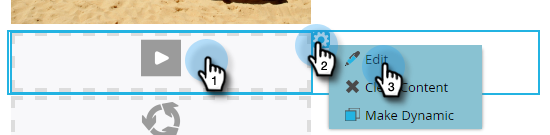

# Elemente in einer E-Mail bearbeiten {#edit-elements-in-an-email}

E-Mails können vier verschiedene Elemente enthalten: Rich-Text, Bilder, Snippets und Video. Hier finden Sie, wie Sie sie bearbeiten können.

## Bearbeiten des Rich-Text-Elements {#how-to-edit-the-rich-text-element}

1. Suchen Sie Ihre E-Mail, wählen Sie sie aus und klicken Sie auf **Entwurf bearbeiten**.

   

1. Der E-Mail-Editor wird geöffnet. Wählen Sie den Text Rich aus, klicken Sie auf das Zahnradsymbol und wählen Sie **Bearbeiten** aus.

   

   Sie können auch den Mauszeiger über das Element im rechten Bereich bewegen, wodurch das Zahnradsymbol angezeigt wird.

   

1. Fügen Sie Ihren Text hinzu/bearbeiten Sie ihn und drücken Sie **Speichern**.

   

   >[!NOTE]
   >
   >Sie können auch Bilder, Token, Tabellen und andere Elemente hinzufügen. Siehe [Verwenden des Rich-Text-Editors](/help/marketo/product-docs/email-marketing/general/understanding-the-email-editor/using-the-rich-text-editor.md).

   >[!CAUTION]
   >
   >Kopieren und Einfügen von Text aus einer Rich-Text-Quelle wie einer Website oder einem Word-Dokument vermeiden. Fügen Sie stattdessen Rich-Text zuerst in einen Nur-Text-Editor ein, z. B. Notepad (Windows) oder TextEdit (Mac). Sobald es &quot;sauber&quot;ist, können Sie es aus dem Texteditor kopieren und in Ihre E-Mail einfügen.

## Bearbeiten des Bildelements {#how-to-edit-the-image-element}

1. Klicken Sie in das Modul mit dem Bildelement, um es auszuwählen.

   

1. Klicken Sie auf das Bildelement, das Sie bearbeiten möchten, klicken Sie auf das Zahnradsymbol und wählen Sie **Bearbeiten** aus.

   

   >[!NOTE]
   >
   >Sie können auch auf das Element doppelklicken, um mit der Bearbeitung zu beginnen.

1. Der Bildeditor wird angezeigt.

   

   Sie haben drei Optionen zum Einfügen eines Bildes. Schauen wir uns jeden an.

   **Externe URL**

   >[!NOTE]
   >
   >Wenn Sie ein Marketo-Token verwenden möchten, verwenden Sie diese Option. Beachten Sie, dass bei Verwendung eines Tokens das Bild im Editor beschädigt erscheint, aber im Vorschaumodus und in der E-Mail zum Senden eines Beispiels gerendert wird.

   Um eine externe URL zu verwenden, fügen Sie zuerst die URL des Bildes ein. Ändern Sie die Dimensionen entsprechend Ihren Anforderungen und fügen Sie einen Alternativtext hinzu (optional). Drücken Sie dann **Swap**.

   

   **Arbeitsplatz**

   Um ein Bild von Ihrem Computer hochzuladen, klicken Sie auf **Durchsuchen**.

   

   Navigieren Sie an die Stelle, an der sich das Bild auf Ihrem Computer befindet, und fügen Sie es ein.

   

   Ändern Sie die Dimensionen entsprechend Ihren Anforderungen, ändern Sie den ALT-Text (optional) und drücken Sie dann **Swap** .

   

   >[!NOTE]
   >
   >Wenn Sie ein Bild ersetzen, müssen Sie das Feld **Vorhandenes Bild überschreiben** aktivieren, das unter der Bild-URL/-Namen angezeigt wird.

   **Design Studio**

   Wenn Sie ein Bild aus der Design Studio-Anwendung einfügen möchten, suchen Sie es einfach..

   

   ... und fügen Sie es ein. Ändern Sie die Dimensionen entsprechend Ihren Anforderungen, ändern Sie den ALT-Text (optional) und drücken Sie dann **Swap** .

   

## Bearbeiten des Snippet-Elements {#how-to-edit-the-snippet-element}

1. Klicken Sie in das Modul mit dem Element Snippet .

   

1. Klicken Sie auf das Element &quot;Ausschnitt&quot;, dann auf das Zahnradsymbol und wählen Sie **Bearbeiten** aus.

   

1. Suchen Sie Ihr Snippet, wählen Sie es aus und klicken Sie auf **Speichern**.

   

1. Ihr Snippet wird dann ausgefüllt.

   

## Bearbeiten des Videoelements {#how-to-edit-the-video-element}

1. Klicken Sie in das Modul mit dem Element Video .

   

1. Klicken Sie auf das Element Video , dann auf das Zahnradsymbol und wählen Sie **Bearbeiten** aus.

   

1. Fügen Sie die Video-URL aus Vimeo oder YouTube ein. Klicken Sie dann in das URL-Feld, damit die Vorschau geladen werden kann. Ändern Sie die Dimensionen entsprechend Ihren Anforderungen, fügen Sie ALT-Text hinzu (optional) und drücken Sie dann **Einfügen**.

   

   >[!NOTE]
   >
   >Für YouTube-Videos verwenden Sie die vollständige URL aus der Adressleiste, nicht die in der Option Freigeben enthaltene URL.

Viel Spaß beim Entwerfen der perfekten E-Mail!
