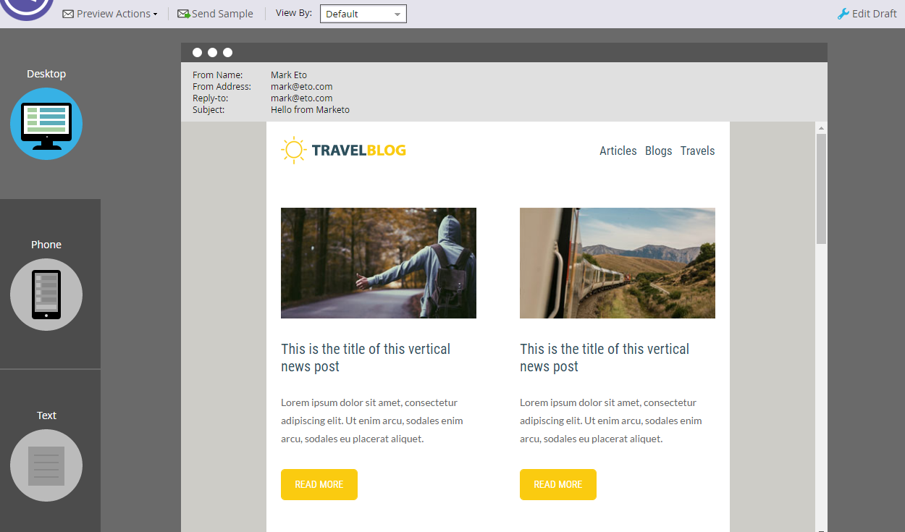

# Übersicht über Email Editor v2.0 {#email-editor-v-overview}

Wenn Sie den E-Mail-Editor v2.0 aktivieren, werden Sie einige neue Funktionen bemerken.

**Auswahl der E-Mail-Vorlage**

Wenn Sie eine neue E-Mail erstellen, gelangen Sie zur Auswahl der [E-Mail-Vorlage](email-template-picker-overview.md).

**Email-Editor**

Wenn Sie Beginn haben, Ihre E-Mail zu bearbeiten, werden Sie feststellen, dass der Editor einen ganz neuen Look hat.

**Module**

Diese Dinge auf der rechten Seite des Editors werden Module genannt. Erfahren Sie, wie Sie Ihrer E-Mail Module [hinzufügen](add-modules-to-your-email.md).

**Textversion**

Der Wechsel zwischen der HTML-Version und der Text-Version Ihrer E-Mail erfolgt jetzt auf einer praktischen Registerkarte unten. Erfahren Sie, wie Sie die Textversion einer E-Mail bearbeiten.

**E-Mail-Kopfzeile**

Möchten Sie mehr Platz im Design? Der E-Mail-Header kann nach der [Bearbeitung](../../../../product-docs/email-marketing/general/creating-an-email/edit-your-email-header.md)ausgeblendet werden. Klicken Sie einfach auf dieses Symbol...

...und die Kopfzeile reduziert.

**Vorschau Ihrer E-Mail**

Standardmäßig zeigt die E-Mail an, wie sie auf einem Desktop aussehen würde, wie durch das hervorgehobene blaue Symbol dargestellt. Wenn Sie auf das Symbol rechts klicken...

...sehen Sie, wie Ihre E-Mail auf einem Mobilgerät dargestellt wird.

Für eine größere Vorschau klicken Sie oben rechts in der E-Mail auf **Vorschau** .

Die Standard-Ansicht ist Desktop...

...aber Sie können auch sehen, wie es auf einem Mobilgerät aussehen wird. Sie können auch die Textversion Vorschau! Klicken Sie einfach oben rechts auf Entwurf **bearbeiten** , um die Bearbeitung fortzusetzen.

**E-Mail-Aktionen**

Unter &quot; **E-Mail-Aktionen**&quot;werden Sie einige neue Funktionen bemerken. **Laden Sie ein Bild oder eine Datei** hoch und **ziehen Sie Bilder aus dem Web**. Sie können die E-Mail auch selbst als neue E-Mail-Vorlage speichern. Sie müssen nur einen Namen und ein Ziel angeben.

>[!CAUTION]
>
>Beim Speichern einer E-Mail als Vorlage werden Variablenwerte nicht übernommen. Variablen verwenden weiterhin die in der zugrunde liegenden Vorlage angegebenen Standardwerte. Verfügbare Module in der E-Mail werden auch nicht übertragen, es sei denn, sie wurden in den E-Mail-Textkörper eingefügt.

>[!NOTE]
>
>** [Grab Images from Web](../../../../product-docs/demand-generation/images-and-files/grab-the-images-from-a-web-page.md)** funktioniert genauso wie im Design Studio.

**Deaktivieren Sie &quot;Verfolgung** öffnen&quot;unter &quot; **E-Mail-Einstellungen**&quot;und deaktivieren Sie bei Bedarf die Option &quot;Verfolgung öffnen&quot;.

**E-Mail-Einstellungen**

Sie haben die Möglichkeit, einen Vorheader hinzuzufügen. Eine Preheader ist der kurze Zusammenfassungstext nach der Betreffzeile, wenn E-Mails in Ihrem Posteingang angezeigt werden.

>[!CAUTION]
>
>Tokens funktionieren nicht im Preheader, wenn der E-Mail-Editor verwendet wird. Um ein Token im Preheader zu verwenden, muss es über Ihren eigenen HTML in einer E-Mail-Vorlage erfolgen.

Viele tolle neue Features! Viel Spaß!

>[!NOTE]
>
>**Tieftauchen**
>
>Wenn Sie noch tiefer gehen möchten, sehen Sie sich dieses [hilfreiche Video](https://nation.marketo.com/videos/1463)an.

>[!MORELIKETHIS]
>
>* [Syntax der E-Mail-Vorlage](email-template-syntax.md)

>

