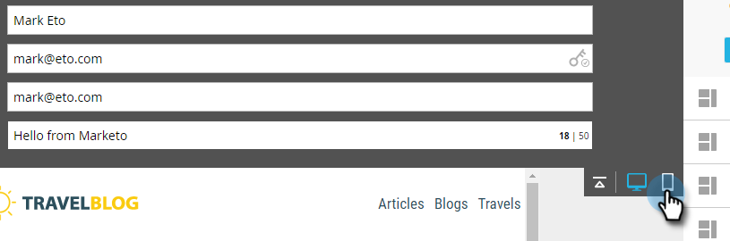
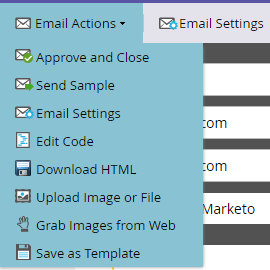
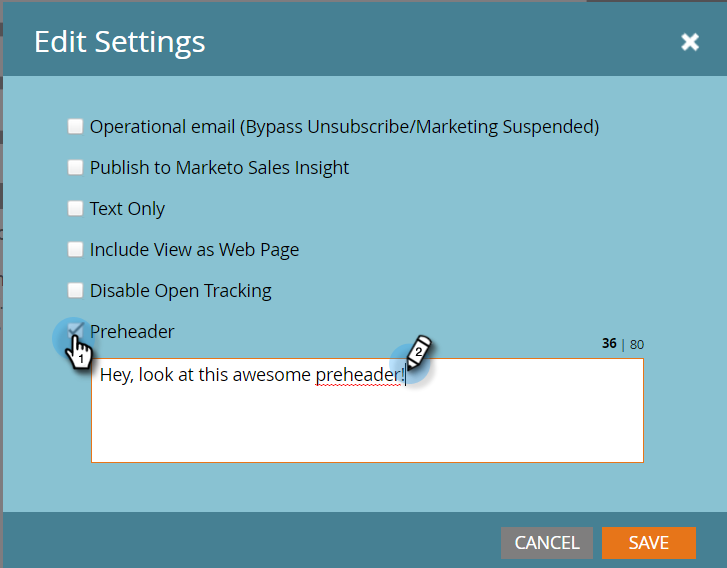

# Überblick über E-Mail-Editor v2.0 {#email-editor-v2-overview}

Überblick über den klassischen E-Mail-Editor.

>[!IMPORTANT]
>
>Es gibt zwar kein genaues Datum, aber der klassische E-Mail-Editor wird letztendlich eingestellt (wir werden ein genaues Datum bekannt geben, wenn wir eines haben). Es wird dringend empfohlen, mit der Einführung der erweiterten [E-Mail-Designer](/help/marketo/product-docs/email-marketing/email-designer/overview.md){target="_blank"} zu beginnen, da sie über viele Funktionen verfügt, die im klassischen Editor nicht verfügbar sind.

**Auswahl der E-Mail-Vorlagen**

Wenn Sie eine neue E-Mail erstellen, gelangen Sie zur [Auswahl von E-Mail-Vorlagen](/help/marketo/product-docs/email-marketing/general/email-editor-2/email-template-picker-overview.md).

**E-Mail-Editor**

Wenn Sie mit der Bearbeitung Ihrer E-Mail beginnen, werden Sie feststellen, dass der Editor ein völlig neues Erscheinungsbild aufweist.

**Module**

Diese Elemente auf der rechten Seite des Editors werden Module genannt. Erfahren Sie, wie Sie [Module zu Ihrer E-Mail hinzufügen](/help/marketo/product-docs/email-marketing/general/email-editor-2/add-modules-to-your-email.md).

**Textversion**

Der Wechsel zwischen der HTML-Version und der Textversion Ihrer E-Mail erfolgt jetzt unten über eine praktische Registerkarte. Erfahren Sie, wie Sie [die Textversion einer E-Mail bearbeiten](/help/marketo/product-docs/email-marketing/general/creating-an-email/edit-the-text-version-of-an-email.md).

**E-Mail-Header**

Benötigen Sie mehr Platz zum Gestalten? Der E-Mail-Header kann ausgeblendet werden, nachdem Sie mit [dessen Bearbeitung](/help/marketo/product-docs/email-marketing/general/creating-an-email/edit-your-email-header.md) fertig sind. Klicken Sie einfach auf dieses Symbol …

… und der Header wird reduziert.

**Vorschau Ihrer E-Mail**

Standardmäßig wird angezeigt, wie die E-Mail auf einem Desktop aussehen würde. Darauf weist das hervorgehobene blaue Symbol hin. Wenn Sie auf das Symbol rechts daneben klicken …

… wird angezeigt, wie Ihre E-Mail auf einem Mobilgerät gerendert wird.

Um eine größere Vorschau anzuzeigen, klicken Sie oben rechts in der E-Mail auf **[!UICONTROL Vorschau]**.

Standardmäßig wird dort die Desktop-Ansicht angezeigt …

… aber Sie können auch anzeigen, wie die E-Mail auf einem Mobilgerät aussieht. Sie können auch eine Vorschau der Textversion anzeigen. Klicken Sie einfach oben rechts auf **[!UICONTROL Entwurf bearbeiten]**, um mit der Bearbeitung fortzufahren.

**[!UICONTROL E-Mail-Aktionen]**

Unter **[!UICONTROL E-Mail-Aktionen]** werden Ihnen einige neue Funktionen auffallen. **[!UICONTROL Bild oder Datei hochladen]** und **[!UICONTROL Bilder aus dem Web abrufen]**. Sie können auch die E-Mail selbst als neue E-Mail-Vorlage speichern. Sie müssen ihr nur einen Namen und ein Ziel geben.

>[!CAUTION]
>
>Beim Speichern einer E-Mail als Vorlage werden die Variablenwerte nicht übernommen. Variablen verwenden weiterhin die in der zugrunde liegenden Vorlage angegebenen Standardwerte. Auch verfügbare Module in der E-Mail werden nur übernommen, wenn sie in den E-Mail-Textkörper eingefügt wurden.

>[!NOTE]
>
>Die Option **[[!UICONTROL Bilder aus dem Web abrufen]](/help/marketo/product-docs/demand-generation/images-and-files/grab-the-images-from-a-web-page.md)** funktioniert genauso wie im [!UICONTROL Design-Studio].

Mit der Option **[!UICONTROL Offenes Tracking deaktivieren]** unter **[!UICONTROL Einstellungen bearbeiten]** können Sie bei Bedarf das Öffnungs-Tracking deaktivieren.

**[!UICONTROL Bearbeiten von Einstellungen]**

Sie haben die Möglichkeit, einen [!UICONTROL Preheader] hinzuzufügen. Ein [!UICONTROL Preheader] ist der kurze Zusammenfassungstext nach der Betreffzeile, der für E-Mails in Ihrem Posteingang angezeigt wird.

>[!CAUTION]
>
>Token funktionieren im [!UICONTROL Preheader] nicht, wenn der E-Mail-Editor verwendet wird. Um ein Token im [!UICONTROL Preheader] zu verwenden, muss es über Ihre eigene HTML in einer E-Mail-Vorlage konfiguriert werden.

>[!MORELIKETHIS]
>
>[Syntax von E-Mail-Vorlagen](/help/marketo/product-docs/email-marketing/general/email-editor-2/email-template-syntax.md)
