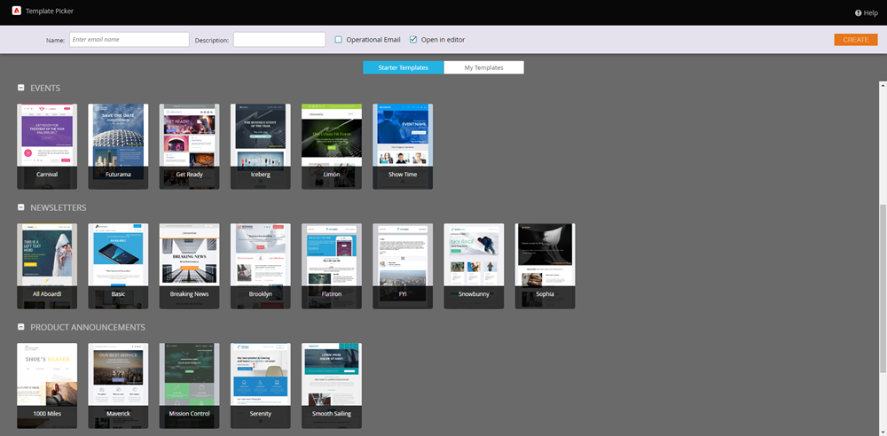
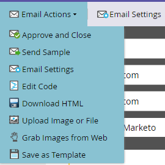

# E-Mail-Editor v2.0 – Übersicht {#email-editor-v2-overview}

Übersicht über den klassischen E-Mail-Editor.

>[!IMPORTANT]
>
>Obwohl es kein genaues Datum gibt, wird der klassische E-Mail-Editor wahrscheinlich irgendwann im Jahr 2026 eingestellt (wir werden ein genaues Datum bekannt geben, wenn wir es haben). Es wird dringend empfohlen, mit der Einführung der erweiterten [E-Mail-Designer](/help/marketo/product-docs/email-marketing/email-designer/overview.md){target="_blank"} zu beginnen, da sie über viele Funktionen verfügt, die im klassischen Editor nicht verfügbar sind.

**Auswahl der E-Mail-Vorlagen**

Wenn Sie eine neue E-Mail erstellen, gelangen Sie zur [E-Mail-Vorlagenauswahl](/help/marketo/product-docs/email-marketing/general/email-editor-2/email-template-picker-overview.md).

**Email Editor**

Wenn Sie mit der Bearbeitung Ihrer E-Mail beginnen, werden Sie feststellen, dass der Editor ein völlig neues Aussehen hat.

**Module**

Diese Dinge auf der rechten Seite des Editors werden Module genannt. Erfahren Sie, wie Sie [Module zu Ihrer E-Mail hinzufügen](/help/marketo/product-docs/email-marketing/general/email-editor-2/add-modules-to-your-email.md).

**Textversion**

Der Wechsel zwischen der HTML- und der Textversion Ihrer E-Mail erfolgt jetzt unten in einer praktischen Registerkarte. Erfahren Sie, wie [ die Textversion einer E-Mail bearbeiten ](/help/marketo/product-docs/email-marketing/general/creating-an-email/edit-the-text-version-of-an-email.md).

**E-Mail-Kopfzeile**

Möchten Sie mehr Platz im Design? Die E-Mail-Kopfzeile kann ausgeblendet werden, nachdem Sie fertig sind [sie bearbeiten](/help/marketo/product-docs/email-marketing/general/creating-an-email/edit-your-email-header.md). Klicken Sie einfach auf dieses Symbol…

…und die Kopfzeile wird reduziert.

**Vorschau Ihrer E-Mail**

Standardmäßig zeigt die E-Mail an, wie sie auf einem Desktop aussehen würde, wie durch das hervorgehobene blaue Symbol gekennzeichnet. Wenn Sie auf das Symbol rechts daneben klicken…

…Sie sehen, wie Ihre E-Mail auf einem Mobilgerät gerendert wird.

Um eine größere Vorschau anzuzeigen, klicken **[!UICONTROL oben]** in der E-Mail auf „Vorschau“.

Die Standardansicht dort ist Desktop…

…aber Sie können auch sehen, wie es auf einem Mobilgerät aussieht. Sie können auch eine Vorschau der Textversion anzeigen! Klicken Sie einfach **[!UICONTROL Entwurf bearbeiten]** oben rechts, um mit der Bearbeitung fortzufahren.

**[!UICONTROL E-Mail-Aktionen]**

Unter **[!UICONTROL E-Mail]** Aktionen) werden Sie einige neue Funktionen bemerken. **[!UICONTROL Laden Sie ein Bild oder eine Datei hoch]** und **[!UICONTROL erfassen Sie Bilder aus dem Web]**. Sie können die E-Mail auch selbst als neue E-Mail-Vorlage speichern. Sie müssen ihm nur einen Namen und ein Ziel geben.

>[!CAUTION]
>
>Beim Speichern einer E-Mail als Vorlage werden die Variablenwerte nicht übernommen. Variablen verwenden weiterhin die in der zugrunde liegenden Vorlage angegebenen Standardwerte. Verfügbare Module in der E-Mail werden ebenfalls nur übernommen, wenn sie in den E-Mail-Textkörper eingefügt wurden.

>[!NOTE]
>
>**[[!UICONTROL Bilder aus dem Web]](/help/marketo/product-docs/demand-generation/images-and-files/grab-the-images-from-a-web-page.md)**, funktioniert genauso wie im [!UICONTROL Design Studio].

**[!UICONTROL Öffnungs-Tracking deaktivieren]** Unter **[!UICONTROL Einstellungen bearbeiten]** können Sie bei Bedarf das Öffnungs-Tracking deaktivieren.

**[!UICONTROL Einstellungen bearbeiten]**

Sie haben die Möglichkeit, einen &quot;[!UICONTROL &quot; ]. Ein [!UICONTROL Preheader] ist der kurze Zusammenfassungstext nach der Betreffzeile, wenn E-Mails in Ihrem Posteingang angezeigt werden.

>[!CAUTION]
>
>Token funktionieren nicht im [!UICONTROL Preheader] wenn der E-Mail-Editor verwendet wird. Um ein Token im [!UICONTROL Preheader] zu verwenden, muss es über Ihre eigene HTML in einer E-Mail-Vorlage konfiguriert werden.

Viele tolle neue Funktionen! Viel Spaß!

>[!NOTE]
>
>Wenn Sie noch tiefer eintauchen möchten, sehen Sie sich dieses [Video](https://nation.marketo.com/videos/1463) an.

>[!MORELIKETHIS]
>
>[E-Mail-Vorlagensyntax](/help/marketo/product-docs/email-marketing/general/email-editor-2/email-template-syntax.md)
