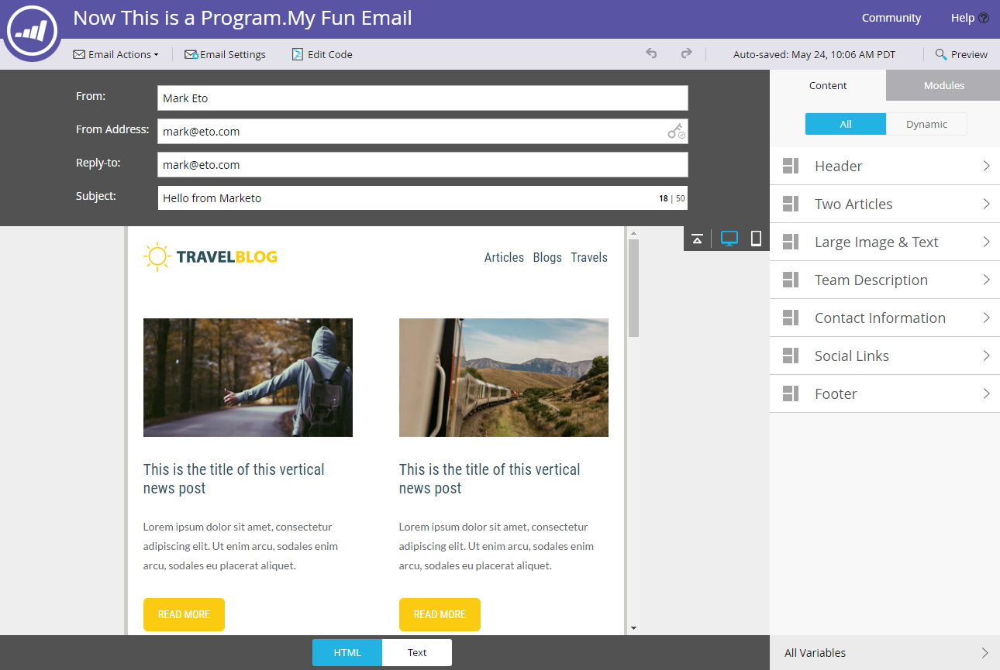
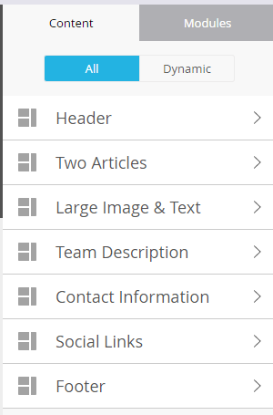

# Übersicht über Email Editor v2.0 {#email-editor-v2-overview}

Wenn Sie sich für die Aktivierung des E-Mail-Editors 2.0 entscheiden, werden Sie mehrere neue Funktionen feststellen.

**Auswahl der E-Mail-Vorlagen**

Wenn Sie eine neue E-Mail erstellen, gelangen Sie zur [E-Mail-Vorlagenauswahl](/help/marketo/product-docs/email-marketing/general/email-editor-2/email-template-picker-overview.md).

**Email Editor**

Wenn Sie mit der Bearbeitung Ihrer E-Mail beginnen, werden Sie feststellen, dass der Editor ein völlig neues Aussehen hat.

**Module**

Diese Dinge auf der rechten Seite des Editors werden Module genannt. Erfahren Sie, wie Sie [Module zu Ihrer E-Mail hinzufügen](/help/marketo/product-docs/email-marketing/general/email-editor-2/add-modules-to-your-email.md).

**Textversion**

Der Wechsel zwischen der HTML- und der Textversion Ihrer E-Mail erfolgt jetzt auf einer praktischen Registerkarte am unteren Rand. Erfahren Sie, wie [ die Textversion einer E-Mail bearbeiten ](/help/marketo/product-docs/email-marketing/general/creating-an-email/edit-the-text-version-of-an-email.md).

**E-Mail-Kopfzeile**

Möchten Sie mehr Platz im Design? Die E-Mail-Kopfzeile kann ausgeblendet werden, nachdem Sie fertig sind [sie bearbeiten](/help/marketo/product-docs/email-marketing/general/creating-an-email/edit-your-email-header.md). Klicken Sie einfach auf dieses Symbol…

…und die Kopfzeile wird reduziert.

**Vorschau Ihrer E-Mail**

Standardmäßig zeigt die E-Mail an, wie sie auf einem Desktop aussehen würde, wie durch das hervorgehobene blaue Symbol gekennzeichnet. Wenn Sie auf das Symbol rechts daneben klicken…

…Sie sehen, wie Ihre E-Mail auf einem Mobilgerät gerendert wird.

Um eine größere Vorschau anzuzeigen, klicken **oben** in der E-Mail auf „Vorschau“.

Die Standardansicht dort ist Desktop…

…aber Sie können auch sehen, wie es auf einem Mobilgerät aussieht. Sie können auch eine Vorschau der Textversion anzeigen! Klicken Sie einfach **Entwurf bearbeiten** oben rechts, um mit der Bearbeitung fortzufahren.

**E-Mail-Aktionen**

Unter **E-Mail** Aktionen) werden Sie einige neue Funktionen bemerken. **Laden Sie ein Bild oder eine Datei hoch** und **erfassen Sie Bilder aus dem Web**. Sie können die E-Mail auch selbst als neue E-Mail-Vorlage speichern. Sie müssen ihm nur einen Namen und ein Ziel geben.

>[!CAUTION]
>
>Beim Speichern einer E-Mail als Vorlage werden die Variablenwerte nicht übernommen. Variablen verwenden weiterhin die in der zugrunde liegenden Vorlage angegebenen Standardwerte. Verfügbare Module in der E-Mail werden ebenfalls nur übernommen, wenn sie in den E-Mail-Textkörper eingefügt wurden.

>[!NOTE]
>
>**[Bilder aus dem Web](/help/marketo/product-docs/demand-generation/images-and-files/grab-the-images-from-a-web-page.md)**, funktioniert genauso wie im Design Studio.

**Öffnungs-Tracking deaktivieren** Unter **E-Mail-Einstellungen** können Sie das Öffnungs-Tracking bei Bedarf deaktivieren.

**E-Mail-Einstellungen**

Sie haben die Möglichkeit, einen Preheader hinzuzufügen. Ein Preheader ist der kurze Zusammenfassungstext nach der Betreffzeile, wenn E-Mails in Ihrem Posteingang angezeigt werden.

>[!CAUTION]
>
>Token funktionieren nicht im Preheader, wenn Sie den E-Mail-Editor verwenden. Um ein Token im Preheader zu verwenden, muss dies über Ihren eigenen HTML in einer E-Mail-Vorlage erfolgen.

Viele tolle neue Funktionen! Viel Spaß!

>[!NOTE]
>
>Wenn Sie noch tiefer eintauchen möchten, sehen Sie sich dieses [Video](https://nation.marketo.com/videos/1463) an.

>[!MORELIKETHIS]
>
>[E-Mail-Vorlagensyntax](/help/marketo/product-docs/email-marketing/general/email-editor-2/email-template-syntax.md)
