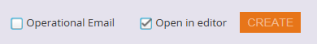

# Übersicht über die E-Mail-Vorlagenauswahl {#email-template-picker-overview}

Wenn Sie [E-Mail erstellen](/help/marketo/product-docs/email-marketing/general/creating-an-email/create-an-email.md) haben Sie mehrere kostenlose Vorlagen zur Auswahl. Sie können auch Ihre eigene Vorlage erstellen und sie für die zukünftige Verwendung speichern.

**[!UICONTROL Name]** ist der Name der E-Mail, die Sie basierend auf der Vorlage erstellen, nicht die Vorlage selbst. **[!UICONTROL Beschreibung]** gilt auch für die E-Mail und ist optional.

Wenn Ihre E-Mail wichtig ist und Sie Kommunikationsbeschränkungen umgehen möchten, aktivieren [ das Kontrollkästchen, um ](/help/marketo/product-docs/email-marketing/general/functions-in-the-editor/make-an-email-operational.md) E-Mail funktionsfähig zu machen. **[!UICONTROL Im Editor öffnen]** ist standardmäßig ausgewählt und bedeutet, dass Sie Ihre neue E-Mail sofort bearbeiten möchten. **[!UICONTROL Erstellen]** bedeutet, erstellen!

**[!UICONTROL Starter-Vorlagen]** enthält eine Sammlung einsatzbereiter responsiver E-Mail-Vorlagen. Sie können sie unverändert verwenden oder nach Ihren Wünschen anpassen.

**[!UICONTROL Meine Vorlagen]** besteht aus allen von Ihnen erstellten Vorlagen. Möglicherweise sind auch Ordner vorhanden.

Alle Ordner, die unter **[!UICONTROL E]** > **[!UICONTROL Vorlagen]** in Ihrer [!UICONTROL Design Studio]-Struktur angezeigt werden, sind in **[!UICONTROL Meine Vorlagen]** verfügbar.

Um eine Vorlage in der Vorschau anzuzeigen, bewegen Sie den Mauszeiger über die Miniaturansicht und klicken Sie auf **[!UICONTROL Vorschau]**. Sie können auch einfach doppelt darauf klicken.

Die Vorschau zeigt an, wie die Vorlage auf einem Desktop-Computer gerendert wird.

…und ein mobiles Gerät.

Wenn Ihnen diese Vorlage gefällt, wählen Sie sie aus, indem **[!UICONTROL rechts unten auf]** Auswählen“ klicken. Willst du weiter suchen? Klicken Sie auf **X** oben rechts. Verwenden Sie die Pfeile nach links und rechts, um durch Vorlagen zu scrollen.

Sie können auch mit der rechten Maustaste auf eine Vorlagenminiatur klicken, um weitere Optionen anzuzeigen.

>[!NOTE]
>
>Ein cooles an Vorlagenminiaturen ist, sie sind live. Wenn Sie also eine Änderung an einer Vorlage vornehmen, wird auch die Miniaturansicht geändert.

Ziemlich ordentlich!

>[!MORELIKETHIS]
>
>* [E-Mail-Vorlagensyntax](/help/marketo/product-docs/email-marketing/general/email-editor-2/email-template-syntax.md)
>* [E-Mail erstellen](/help/marketo/product-docs/email-marketing/general/creating-an-email/create-an-email.md)
