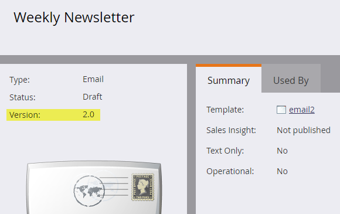

# Wechsel zu [!DNL Email Editor 2.0] {#transitioning-to-email-editor}

Ab der Version vom 19. Juni wurden alle Marketo-Abonnements auf [!DNL Email Editor 2.0] umgestellt. [Weitere Informationen](https://nation.marketo.com/docs/DOC-7038) zur Einstellung von [!DNL Email Editor 1.0].

E-Mails und E-Mail-Vorlagen innerhalb Ihres Abonnements sollten eine Versionsnummer haben. Die Version ist auf der Zusammenfassungsseite des Assets zu finden.

Standardmäßig werden alle Ihre vorhandenen E-Mails und E-Mail-Vorlagen als v1.0 gekennzeichnet, wenn sie entweder vor der Version vom Frühjahr 16 oder nach der Veröffentlichung erstellt wurden, wenn der E-Mail-Editor 2.0 deaktiviert ist. Wenn der E-Mail-Editor 2.0 jetzt automatisch aktiviert ist, wird das folgende Verhalten angezeigt:

* Wenn Sie eine neue E-Mail erstellen, wird [E-Mail](email-template-picker-overview.md)Vorlagenauswahl) angezeigt und Sie können eine E-Mail-Vorlage der Version 2.0 auswählen.
* Wenn Sie eine E-Mail mit [!DNL Email Editor 2.0] erstellen oder bearbeiten, wird die resultierende E-Mail **immer** als v2.0 gekennzeichnet (auch wenn Sie eine E-Mail-Vorlage der Version 1.0 verwendet haben).

Wenn Ihr Abonnement vor dem Wechsel zu [!DNL Email Editor 2.0] über E-Mails der Version 1.0 verfügt, tritt je nach aktuellem Status des Assets folgendes Verhalten auf:

**Genehmigt** - Wenn Sie auf „Entwurf bearbeiten“ klicken, wird ein v2.0-Entwurf der genehmigten E-Mail erstellt. Wenn Sie dann den Entwurf der Version 2.0 genehmigen, wird der genehmigte Status der E-Mail zu v2.0, und es gibt keine Möglichkeit, zu v1.0 zurückzukehren.
**Entwurf** - Wenn Sie auf „Entwurf bearbeiten“ klicken, wird dieser Entwurf automatisch als v2.0 markiert. Zu diesem Zeitpunkt ist es nicht möglich, v1.0 zu verwerfen und wiederherzustellen, da es keine genehmigte Version des Assets gibt.
**Mit Entwurf genehmigt** - Wenn Sie auf „Entwurf bearbeiten“ klicken, wird dieser Entwurf automatisch als v2.0 markiert. Aus diesem Grund gibt es auch keine Möglichkeit, den Entwurf wieder auf Version 1.0 zurückzusetzen.

Wenn Ihr Abonnement vor dem Wechsel zu [!DNL Email Editor 2.0] über E-Mail-Vorlagen der Version 1.0 verfügt, tritt das folgende Verhalten auf:

**Genehmigt** - Wenn Sie auf „Entwurf bearbeiten“ klicken, wird ein Entwurf der vorhandenen E-Mail-Vorlage in Version 2.0 erstellt.
**Entwurf** - Wenn Sie auf „Entwurf bearbeiten“ klicken, wird dieser Entwurf automatisch als v2.0 markiert. Zu diesem Zeitpunkt ist es nicht möglich, v1.0 zu verwerfen und wiederherzustellen, da es keine genehmigte Version des Assets gibt.
**Mit Entwurf genehmigt** - Wenn Sie auf „Entwurf bearbeiten“ klicken, wird dieser Entwurf automatisch als Version 2.0 markiert. Aus diesem Grund gibt es auch keine Möglichkeit, den Entwurf wieder auf Version 1.0 zurückzusetzen.

Wenn Sie eine E-Mail-Vorlage genehmigen, die zuvor Version 1.0 war (in einem der oben genannten Status), wird das folgende Verhalten angezeigt:

Für bestehende E-Mails der Version 1.0, die die Vorlage (früher Version 1.0) verwendeten:
**E-Mail v1.0 genehmigt** - Für diese E-Mail wird ein v2.0-Entwurf erstellt, wobei weiterhin die neu genehmigte v2.0-Vorlage verwendet wird. Sie erhält auch alle Vorlagenänderungen.
**E-Mail-Entwurf v1.0** - Der Entwurf bleibt v1.0, bis Sie auf „Entwurf bearbeiten“ klicken. Danach wird es automatisch als v2.0 markiert und erhält alle Vorlagenänderungen.
**Mit E-Mail-Adresse Entwurf v1.0 genehmigt** - Der Entwurf bleibt v1.0, bis Sie auf „Entwurf bearbeiten“ klicken. Danach wird es automatisch als v2.0 markiert und erhält alle Vorlagenänderungen.

Für bestehende E-Mails der Version 2.0, die die Vorlage (früher Version 1.0) verwendeten:
**Genehmigte E-Mail v2.0** - Für diese E-Mail wird ein v2.0-Entwurf erstellt, wobei die neu genehmigte Vorlage weiterhin „verwendet“ wird, und es werden alle Vorlagenänderungen empfangen.
**E-Mail-Entwurf v2.0** - Der Entwurf bleibt unverändert (v2.0) und erhält alle Vorlagenänderungen.
**Mit E-Mail-Adresse Entwurf v2.0 genehmigt** - Der Entwurf bleibt unverändert (v2.0) und erhält alle Vorlagenänderungen.

>[!CAUTION]
>
>Wenn Sie jemals den Entwurf der Version 2.0 einer E-Mail-Vorlage der Version 1.0 genehmigen, wird die Vorlage zu Version 2.0. Es **keine Möglichkeit** sie wieder auf Version 1.0 zurückzusetzen.

Zu beachtende Punkte

* Genehmigte E-Mails **nie** geändert.

* Genehmigte E-Mail-Vorlagen werden **nie** geändert.

* In einigen **seltenen** kann eine v1.0-E-Mail nicht in [!DNL Email Editor 2.0] geöffnet werden. In diesem Fall verwerfen Sie den Entwurf und wenden sich an den Marketo-Support.

>[!MORELIKETHIS]
>
>* [[!DNL Email Editor 2.0] Übersicht](/help/marketo/product-docs/email-marketing/general/email-editor-2/email-editor-v2-0-overview.md)
>* [E-Mail-Vorlagensyntax](/help/marketo/product-docs/email-marketing/general/email-editor-2/email-template-syntax.md)
