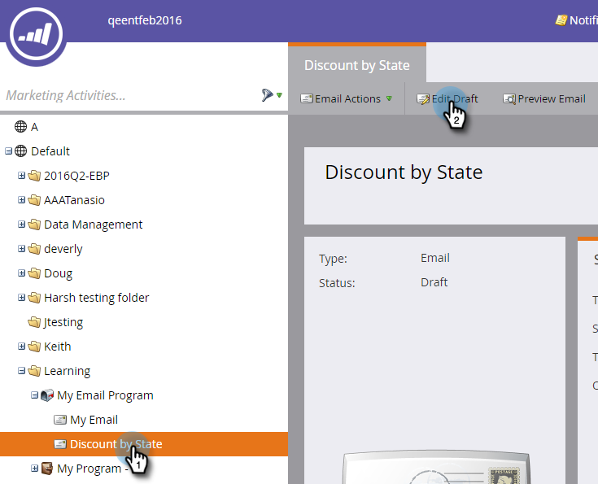
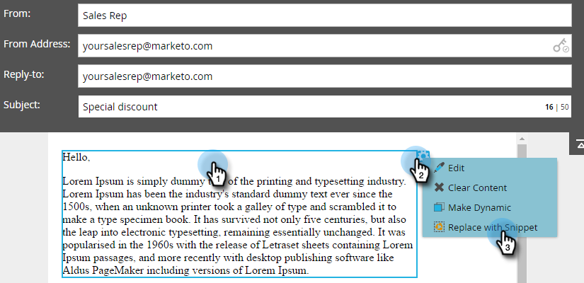

# Hinzufügen eines Ausschnitts zu einer E-Mail {#add-a-snippet-to-an-email}

Snippets sind wiederverwendbare Blöcke aus Rich-Text und Grafiken, die Sie in E-Mails und Landingpages verwenden können.

>[!PREREQUISITES]
>
>[Erstellen eines Snippets](/help/marketo/product-docs/personalization/segmentation-and-snippets/snippets/create-a-snippet.md)

>[!NOTE]
>
>Sie können keine [Marketo-E-Mail](/help/marketo/product-docs/email-marketing/general/email-editor-2/email-template-syntax.md)Syntax-Ausschnitte einbetten. Dies funktioniert **nicht** in einer E-Mail. Snippets sollten nur Textinhalte sein (HTML + TEXT).

1. Suchen Sie Ihre E-Mail, wählen Sie sie aus und klicken Sie auf **[!UICONTROL Entwurf bearbeiten]**.

   

1. Wählen Sie den bearbeitbaren Bereich aus, den Sie in einen Ausschnitt konvertieren möchten, klicken Sie auf das Zahnradsymbol und wählen Sie **[!UICONTROL Ersetzen durch Ausschnitt]**.

   

1. Wählen Sie den gewünschten Ausschnitt aus und klicken Sie auf **[!UICONTROL Speichern]**.

   

   >[!NOTE]
   >
   >In der Dropdown-Liste werden nur genehmigte Snippets angezeigt.

   

   >[!NOTE]
   >
   >Jedes Mal, wenn Sie Ihr Snippet aktualisieren und genehmigen, werden die Änderungen in der E-Mail angezeigt. Die E-Mail wird entworfen, es sei denn, Sie genehmigen den Ausschnitt mit [Kein Entwurf](/help/marketo/product-docs/administration/users-and-roles/enable-no-draft-for-snippets.md).

Dies ist eine schnelle und einfache Möglichkeit, dynamische Inhalte wiederzuverwenden.
