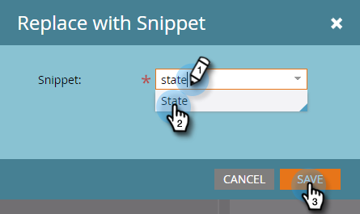

# Hinzufügen eines Snippets zu einer E-Mail {#add-a-snippet-to-an-email}

Snippets sind wiederverwendbare Blöcke von Rich-Text und Grafiken, die Sie in E-Mails und Landingpages verwenden können.

>[!PREREQUISITES]
>
>[Snippet erstellen](/help/marketo/product-docs/personalization/segmentation-and-snippets/snippets/create-a-snippet.md)

>[!NOTE]
>
>Sie können keine [Marketo-E-Mail-Syntax](/help/marketo/product-docs/email-marketing/general/email-editor-2/email-template-syntax.md)in Snippets; wird **not** in einer E-Mail arbeiten. Snippets sollten nur Textinhalt sein (HTML + TEXT).

1. Suchen Sie Ihre E-Mail, wählen Sie sie aus und klicken Sie auf **Entwurf bearbeiten**.

   

1. Wählen Sie den bearbeitbaren Bereich aus, den Sie in einen Snippet konvertieren möchten, klicken Sie auf das Zahnradsymbol und wählen Sie **Ersetzen durch Snippet**.

   

1. Wählen Sie das gewünschte Snippet aus und klicken Sie auf **Speichern**.

   

   >[!NOTE]
   >
   >In der Dropdown-Liste werden nur genehmigte Snippets angezeigt.

   

   >[!NOTE]
   >
   >Jedes Mal, wenn Sie Ihr Snippet aktualisieren und genehmigen, werden die Änderungen in der E-Mail angezeigt. Die E-Mail wird erstellt, es sei denn, Sie genehmigen das Ausschnitt mit [No-Draft](/help/marketo/product-docs/administration/users-and-roles/enable-no-draft-for-snippets.md).

So können Sie dynamische Inhalte schnell und einfach wiederverwenden.
