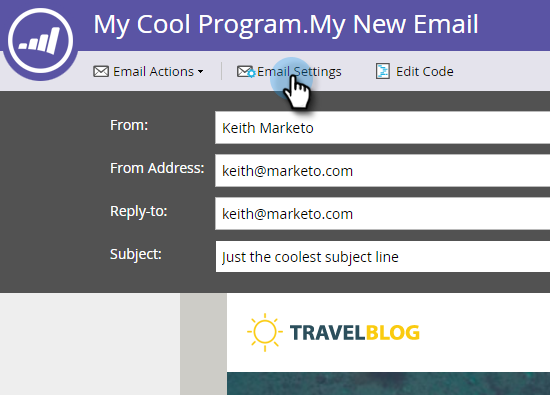

# Hinzufügen eines Links „Als Web-Seite anzeigen“ zu einer E-Mail {#add-a-view-as-web-page-link-to-an-email}

E-Mails verfügen über eingeschränkte Funktionen (eingeschränktes CSS und keine JavaScript oder Formulare). Verwenden Sie Als Web-Seite anzeigen , um einen Link bereitzustellen, über den Ihre E-Mail in einem Browser angezeigt werden kann. Dadurch wird der Empfänger mithilfe der [!DNL Munchkin] Cookies gesetzt.

>[!NOTE]
>
>* Beim Erstellen einer neuen E-Mail ist „Als Web-Seite anzeigen“ nicht aktiviert. Wenn Sie sie aktivieren und die E-Mail klonen, wird diese Einstellung kopiert.
>
>* Links des Typs „Als Web-Seite anzeigen“ laufen nach sechs Monaten ab.

1. Wählen Sie Ihre E-Mail aus und klicken Sie **[!UICONTROL Entwurf bearbeiten]**.

   

1. Klicken Sie im E-Mail-Editor auf **[!UICONTROL E-Mail-Einstellungen]**.

   

1. Aktivieren Sie das Kontrollkästchen **[!UICONTROL Als Webseitenlink anzeigen]** und klicken Sie auf **[!UICONTROL Speichern]**.

   

Im Folgenden finden Sie ein Beispiel dafür, wie sie aussieht:

>[!TIP]
>
>Der Link Als Web-Seite anzeigen wird erst angezeigt, wenn Sie die E-Mail senden. Senden Sie sich einen Test, um ihn anzuzeigen.

Um den Standardtext zu ändern, siehe [Bearbeiten der Nachricht „Als Web-Seite anzeigen“](/help/marketo/product-docs/administration/email-setup/edit-the-view-as-web-page-message.md).
