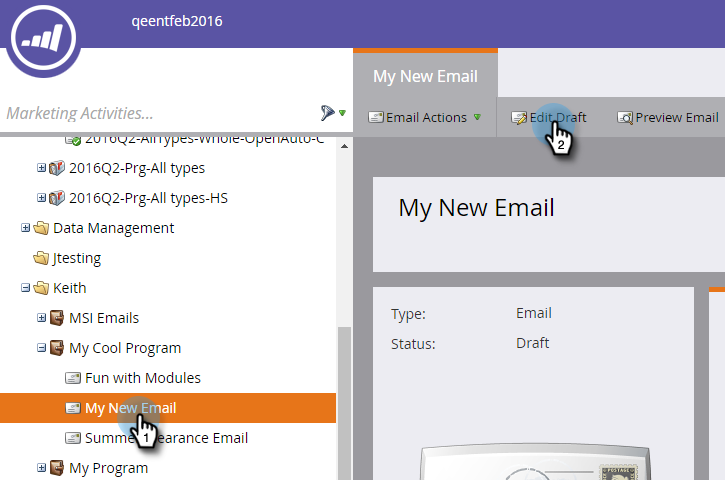

# Hinzufügen einer E-Mail als Webseitenlink anzeigen {#add-a-view-as-web-page-link-to-an-email}

E-Mails verfügen über eingeschränkte Funktionen (eingeschränktes CSS und keine JavaScript oder Formulare). Verwenden Sie Als Webseite anzeigen , um einen Link zur Anzeige Ihrer E-Mail in einem Browser bereitzustellen. Dadurch wird der Empfänger mit dem Munchkin Cookie gesetzt.

>[!NOTE]
>
>Beim Erstellen einer neuen E-Mail ist Als Webseite anzeigen nicht aktiviert. Wenn Sie sie aktivieren und die E-Mail klonen, wird diese Einstellung kopiert.

1. Wählen Sie Ihre E-Mail aus und klicken Sie auf **Entwurf bearbeiten**.

   

1. Klicken Sie im E-Mail-Editor auf **E-Mail-Einstellungen**.

   

1. Aktivieren Sie das Feld **Ansicht als Webseite einschließen** und klicken Sie auf **Speichern**.

   

Hier ist ein Beispiel dafür, wie es aussieht:

>[!TIP]
>
>Der Link Als Webseite anzeigen wird erst angezeigt, wenn Sie die E-Mail gesendet haben. Senden Sie sich einen Test zur Ansicht.

Informationen zum Ändern des Standardtexts finden Sie unter [Bearbeiten der Meldung &quot;Als Webseite anzeigen&quot;](/help/marketo/product-docs/administration/email-setup/edit-the-view-as-web-page-message.md).
