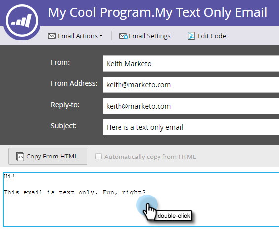
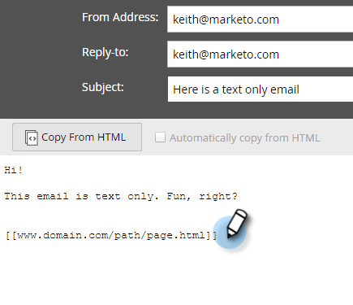
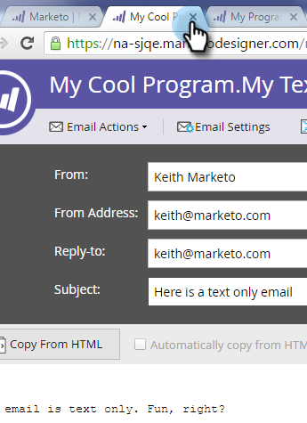

# Hinzufügen getrackter Links zu einer Text-E-Mail {#add-tracked-links-to-a-text-email}

>[!PREREQUISITES]
>
>* [Erstellen einer reinen Text-E-Mail](/help/marketo/product-docs/email-marketing/general/creating-an-email/create-a-text-only-email.md)
>* [Elemente in einer E-Mail bearbeiten](/help/marketo/product-docs/email-marketing/general/email-editor-2/edit-elements-in-an-email.md)

E-Mail-Links in Textform können in Marketo nachverfolgt werden. Sehen wir uns an, wie das funktioniert.

1. Wählen Sie Ihre E-Mail aus und klicken Sie **Entwurf bearbeiten**.

1. Wählen Sie Ihre E-Mail aus und klicken Sie **[!UICONTROL Entwurf bearbeiten]**.

   

1. Doppelklicken Sie auf den bearbeitbaren Bereich, dem Sie den Link hinzufügen möchten.

   

1. Geben Sie die URL mit doppelten Klammern wie folgt ein: `[[www.domain.com/path/page.html]]`.

   

   >[!CAUTION]
   >
   >Wenn eine E-Mail vor mehr als 365 Tagen gesendet wurde **und** niemand in den letzten 180 Tagen auf einen ihrer Links geklickt hat, bereinigt Marketo Engage die Route zur URL aus unserer Datenbank, was dazu führt, dass der Link unterbrochen wird. Wenn der Link dauerhaft sein soll, verwenden Sie kein Tracking.

1. Schließen Sie den Editor und vergessen Sie nicht, den Entwurf zu genehmigen.

   

>[!NOTE]
>
>Die mktNoTok-Klassenfunktionalität funktioniert nicht mit verfolgbaren Links in Text-E-Mails. Nur für HTML-E-Mails.
