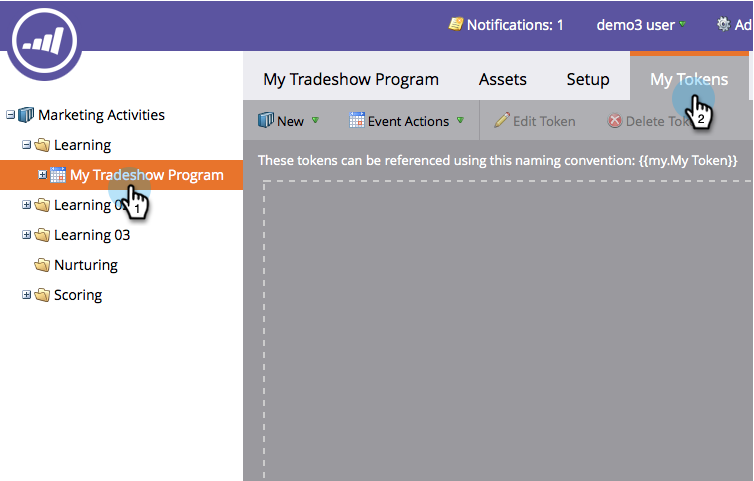

# Erstellen einer Kalenderdatei (.ics) für Ereignisse {#create-a-calendar-event-ics-file}

Mit einem Kalenderdatei-Token können Sie Ihren Marketing-E-Mails und -Landingpages einen Kalenderlink (.ics) hinzufügen.

1. Wechseln Sie in Ihrem Programm zur Registerkarte &quot; **Meine Token** &quot;.

   

1. Ziehen Sie ein **Kalenderdatei** -Token auf die Arbeitsfläche.

   

1. Geben Sie einen **Token-Namen** ein und **bearbeiten Sie**.

   

1. Geben Sie Details ein und klicken Sie auf **Speichern**.

   

Auftrag erfüllt! Stellen Sie sicher, dass Sie es testen.

>[!NOTE]
>
>**Verwandte Artikel**
>
>* [Einbeziehen eines Kalenderinhalts (.ics) in eine E-Mail](include-a-calendar-event-ics-in-an-email.md)
>* [Einbeziehen einer ICS-Datei des KalenderEreignisses in eine Landingpage](../../../../product-docs/demand-generation/landing-pages/personalizing-landing-pages/include-a-calendar-event-ics-file-in-a-landing-page.md)

>

