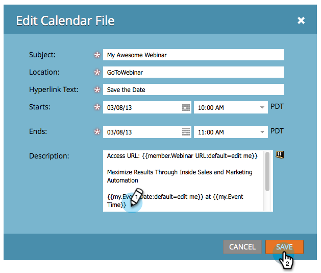

# Erstellen einer Kalenderereignisdatei (.ics) {#create-a-calendar-event-ics-file}

Mit einem Kalenderdatei-Token können Sie einen Kalenderereignis-Link (.ics) zu Ihren Marketo-E-Mails und -Landingpages hinzufügen.

1. Wechseln Sie in Ihrem Programm zur Registerkarte **Meine Token** .

   

1. Ziehen Sie ein **Kalenderdatei“-** auf die Arbeitsfläche.

   

1. Geben Sie einen **Token-Namen** und **Bearbeiten** ein.

   

1. Geben Sie Details ein und klicken Sie auf **Speichern**.

   

Mission erfüllt! Achten Sie darauf, es zu testen.

>[!MORELIKETHIS]
>
>* [Kalenderereignis (.ics) in eine E-Mail einschließen](/help/marketo/product-docs/email-marketing/general/functions-in-the-editor/include-a-calendar-event-ics-in-an-email.md)
>* [Fügen Sie eine ICS-Datei für Kalenderereignisse in eine Landingpage ein](/help/marketo/product-docs/demand-generation/landing-pages/personalizing-landing-pages/include-a-calendar-event-ics-file-in-a-landing-page.md)
