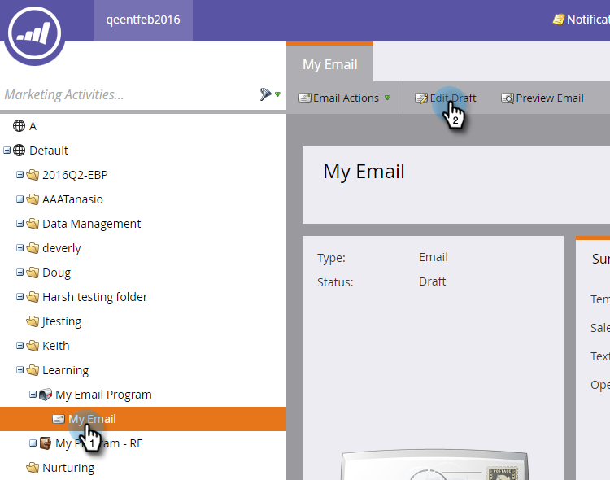

# Tracking für einen E-Mail-Link deaktivieren {#disable-tracking-for-an-email-link}

Manchmal möchten Sie die **Marketo-Tracking-URL** für einen Link in einer E-Mail nicht aktivieren. Dies ist nützlich, wenn die Zielseite URL-Parameter nicht unterstützt und zu einem fehlerhaften Link führen kann.

1. Wählen Sie Ihre E-Mail aus und klicken Sie auf **Entwurf bearbeiten**.

   

1. Doppelklicken Sie auf den bearbeitbaren Abschnitt, der den Link enthält.

   

1. Klicken Sie auf den betreffenden Link und dann auf die Schaltfläche **Link einfügen/bearbeiten** .

   

1. Deaktivieren Sie im Popup Link bearbeiten das Kontrollkästchen **Link verfolgen** .

   

1. Sie werden feststellen, dass das Feld **mkt_tok einschließen** verschwindet. Klicken Sie auf **Anwenden**.

   

   >[!TIP]
   >
   >Wenn Sie nur die Option **mkt_tok einschließen** deaktivieren, kann der Link weiterhin verfolgt werden. Nach der Umleitung enthält die Ziel-URL jedoch nicht den Abfragezeichenfolgenparameter mkt_tok . Dieser Parameter wird von Marketo-Einstiegsseiten und Munchkin verwendet, um eine ordnungsgemäße Verfolgung der Personenaktivitäten sicherzustellen (z. B. wenn sich eine Person von einer E-Mail abmeldet). Sie sollten die Verwendung dieser Funktion vermeiden, es sei denn, Sie sehen auf Ihrer Website ein seltsames Verhalten aufgrund des vorhandenen Parameters.

1. Klicken Sie auf **Speichern**.

   

   >[!TIP]
   >
   >Möchten Sie das Klick-Tracking für einen Link in einer E-Mail deaktivieren **template**? Verwenden Sie dieses Format:
   >`<a class="mktNoTrack" href="https://www.mywebsite.com">This link does not have tracking</a>`\
   >Wenden Sie sich an Ihren Web-Entwickler, wenn Sie Hilfe bei der Implementierung benötigen.

Gut! Sie haben nun das Tracking für einen Link deaktiviert.
