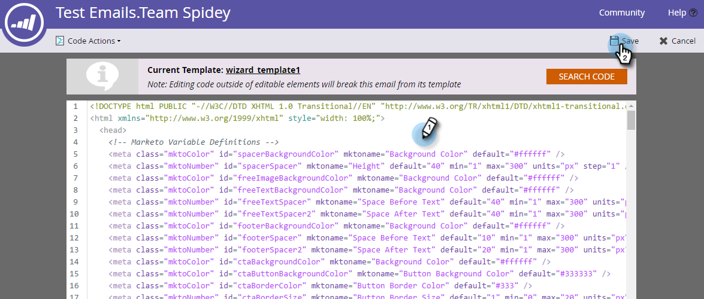

# HTML einer E-Mail bearbeiten {#edit-an-emails-html}

Manchmal müssen Sie die zugrunde liegende HTML einer E-Mail ändern. Manchmal können Sie ein externes System verwenden, um den Code Ihrer E-Mail zu entwerfen und zu erstellen. Auf beide Arten können Sie Code einfach aus dem E-Mail-Editor importieren und/oder bearbeiten.

## HTML bearbeiten {#edit-html}

1. Wählen Sie Ihre E-Mail aus und klicken Sie auf **Entwurf bearbeiten**.

   

1. Klicken Sie auf **Code bearbeiten**.

   

1. Nehmen Sie alle Änderungen vor. Klicken Sie auf **Speichern**, wenn Sie fertig sind.

   

   >[!NOTE]
   >
   >Ändern Sie, was Sie wollen. Sie können die gesamte HTML ersetzen oder kleinere Anpassungen vornehmen.

1. Klicken Sie auf das Dropdown-Menü **Code-Aktionen** , um den Code als HTML-Datei herunterzuladen, CSS inline zu referenzieren oder den HTML zu validieren.

   

   >[!NOTE]
   >
   >Die Best Practice für E-Mails besteht darin, alle Stile inline zu gestalten. Mehrere E-Mail-Clients unterstützen CSS im Abschnitt `<head>` nicht.

## Aufheben einer E-Mail von ihrer Vorlage {#breaking-an-email-from-its-template}

Diese Codeänderungen **unterbrechen eine E-Mail nicht** aus ihrer Vorlage:

* Bearbeiten des Inhalts eines Moduls (einschließlich des Hinzufügens neuer Elemente innerhalb des Moduls)
* Hinzufügen eines neuen Moduls zum Container
* Löschen eines Moduls aus dem Container

* Ändern von kto-spezifischen Attributen (z. B. &quot;mktoName&quot;oder &quot;mktoImgUrl&quot;) eines Elements außerhalb eines Moduls
* Bearbeiten des Inhalts eines Elements (Rich-Text, Bild, Video usw.) außerhalb eines Moduls

Diese Aktionen, die Sie im Code-Editor ausführen können, **werden** die E-Mail von der Vorlage unterbrechen:

* Ändern von Elementen im Code außerhalb eines Elements oder Moduls
* Hinzufügen oder Ändern von Nicht-MKTO-Attributen (z. B. &quot;id&quot;oder &quot;style&quot;) eines Elements außerhalb eines Moduls
* Löschen eines Elements außerhalb eines Moduls

## Code suchen {#search-code}

Verwenden Sie die Suchcode-Funktion, um effizient Inhalte im HTML-Code Ihrer E-Mail zu finden und zu ersetzen.

1. Klicken Sie im Code Ihrer E-Mail auf **Suchcode**.

   

1. Geben Sie ein, was Sie suchen möchten, und klicken Sie auf **Weitersuchen** , um vorwärts zu suchen, oder auf **Vorherige suchen** , um rückwärts zu suchen. Sie können auch **Ersetzen** und **Alle ersetzen** auswählen.

   

1. Klicken Sie abschließend auf **Schließen** .

   

   >[!NOTE]
   >
   >Der Suchcode ist auch im Editor [E-Mail-Vorlage](/help/marketo/product-docs/email-marketing/general/email-editor-2/create-an-email-template.md) verfügbar.

Es wird empfohlen, E-Mails weiterhin mit der integrierten Funktionalität von Marketo zu bearbeiten. Dieser Code-Editor bietet jedoch bei Bedarf Flexibilität.
