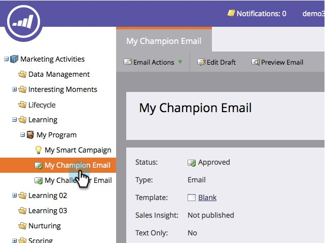

# E-Mail-Champion/Challenger hinzufügen {#add-an-email-champion-challenger}

Es empfiehlt sich, häufig verwendete E-Mails auf ihre Funktionsfähigkeit zu testen. Eine Möglichkeit besteht darin, die Effektivität einer E-Mail mit anderen Versionen oder Challengern zu vergleichen. Bei einem Champion-/Challenger-Test können Sie die gesamte E-Mail, die Betreffzeile oder die Absenderadresse testen.

Die vorhandene E-Mail, die Sie testen, wird als Champion betrachtet. Alle Varianten, die Sie in einem Test erstellen, werden als Challenger betrachtet. Sie bestimmen den Prozentsatz der Personen, die entweder den Champion-Inhalt oder den Challenger-Inhalt erhalten. Wenn Sie mehrere Challenger definiert haben, werden diese gleichmäßig auf die Challenger-Gruppe verteilt.

So fängt man an.

>[!PREREQUISITES]
>
>* [Erstellen eines Programms](/help/marketo/product-docs/core-marketo-concepts/programs/creating-programs/create-a-program.md)
>* [E-Mail erstellen](/help/marketo/product-docs/email-marketing/general/creating-an-email/create-an-email.md)

>[!CAUTION]
>
>Champion-/Challenger-E-Mails funktionieren nur mit Trigger-Kampagnen und Interaktionsprogrammströmen. Verwenden Sie für Batch-Mailings die A/B[Testfunktion ](/help/marketo/product-docs/email-marketing/email-programs/email-program-actions/email-test-a-b-test/add-an-a-b-test.md) E-Mail-Programms.

1. Navigieren Sie **[!UICONTROL Marketing-Aktivitäten]**.

   

1. E-Mail suchen und auswählen.

   

   >[!NOTE]
   >
   >Erfahren Sie bei einmaligen E-Mail-Sendungen mehr über [E-Mail-Programme](/help/marketo/product-docs/email-marketing/email-programs/creating-an-email-program/create-an-email-program.md).

1. Klicken **[!UICONTROL unter „E]** Mail-Aktionen“ auf **[!UICONTROL Neuer Test]**.

   

1. Ein neues Fenster mit verschiedenen Optionen für den Testtyp wird geöffnet. Lesen Sie die entsprechenden Artikel unten, um mehr über jeden zu erfahren.

   >[!MORELIKETHIS]
   >
   >* [Champion/Challenger: ganze E-Mails](/help/marketo/product-docs/email-marketing/general/functions-in-the-editor/email-tests-champion-challenger/champion-challenger-whole-emails.md)
   >* [Champion/Challenger: Betreffzeile](/help/marketo/product-docs/email-marketing/general/functions-in-the-editor/email-tests-champion-challenger/champion-challenger-subject-line.md)
   >* [Champion/Challenger: Von Adresse](/help/marketo/product-docs/email-marketing/general/functions-in-the-editor/email-tests-champion-challenger/champion-challenger-from-address.md)
