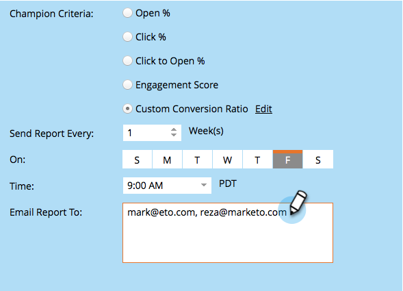

# Champion/Challenger: Analyse {#champion-challenger-analytics}

Erhalten Sie Warnhinweise zu Berichten und/oder prüfen Sie das Champion/Challenger-Dashboard auf hilfreiche Analysen.

>[!PREREQUISITES]
>
>[Champion/Challenger: Definieren Sie Champion-Kriterien](/help/marketo/product-docs/email-marketing/general/functions-in-the-editor/email-tests-champion-challenger/champion-challenger-define-champion-criteria.md)

## Konfigurieren von Berichtswarnhinweisen {#configure-report-alerts}

Marketo sendet Ihnen Berichte über den Verlauf des E-Mail-Tests. So sieht der Zeitplan aus:

1. Planen wir den Versand des Berichts einmal wöchentlich am Freitag um 9 Uhr morgens.

   

   >[!TIP]
   >
   >Sie können bei Bedarf mehrere Wochentage auswählen. Zum Auswählen klicken, zum Aufheben der Auswahl erneut klicken.

1. Geben Sie die E-Mail-Adresse(n) ein, an die die Berichte gesendet werden sollen.

   

1. Klicken Sie auf **Weiter**.

   

1. Überprüfen Sie, ob alle Informationen korrekt sind, und klicken Sie auf **Schließen**.

   

   Der Bericht enthält Details wie: Testtyp, Gewinnerkriterien, Anzahl der E-Mail-Öffnungen und mehr. Es gibt auch einen direkten Link zum Test selbst, sodass Sie den Gewinner bestimmen können! Cooles Zeug.

## Champion/Challenger Dashboard {#champion-challenger-dashboard}

Das Champion/Challenger-Dashboard bietet detaillierte Analysen zur Leistung der Kontrolle und Varianten in Ihrem Champion/Challenger-Experiment (Öffnungen, Klicks, Abmeldeprozentsatz und andere Variablen, die während der Konfiguration des E-Mail-Tests verwendet werden). Das Dashboard bietet außerdem Verteilungsdetails zur Zielgruppe für verschiedene E-Mail-Varianten sowie einen aggregierten Anteil an Öffnungen, Klicks, Klick-zu-Öffnen-Verhältnis und Abmeldungen für alle Varianten.

