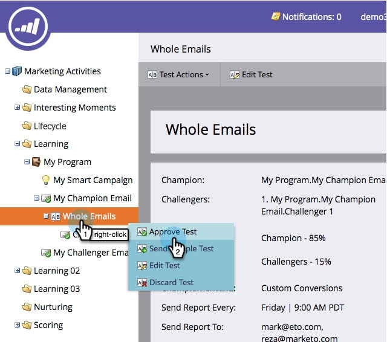

# Champion/Challenger: Genehmigen Ihres E-Mail-Tests {#champion-challenger-approve-your-email-test}

Der letzte Schritt beim Einrichten des E-Mail-Tests zur Genehmigung. Und so geht das.

>[!PREREQUISITES]
>
>[Konfigurieren von Berichtswarnungen](/help/marketo/product-docs/email-marketing/general/functions-in-the-editor/email-tests-champion-challenger/champion-challenger-analytics.md#configure-report-alerts)

1. Navigieren Sie zu **[!UICONTROL Marketing-Aktivitäten]**.

   

1. Suchen Sie nach E-**[!UICONTROL -Test, klicken Sie mit der rechten Maustaste darauf]** klicken Sie dann auf **[!UICONTROL Test genehmigen]**.

   

   >[!NOTE]
   >
   >Genehmigen Sie beim Genehmigen eines **gesamten E-Mail**-Tests zuerst die Herausforderer-E-Mail.

   >[!NOTE]
   >
   >Um den Test zu senden, wählen Sie im Flussschritt **E-Mail senden** Ihrer Testkampagne die E-Mail aus, der Sie den Test hinzugefügt haben. Sie haben außerdem die Möglichkeit, diese E-Mail in einen Stream eines Interaktionsprogramms einzufügen. Champion-/Challenger-E-Mails funktionieren nicht in Batch-Kampagnen.

   War das nicht einfach? Sobald Sie einige Berichte erhalten haben, werden Sie einen Champion ernennen wollen.

   >[!MORELIKETHIS]
   >
   >* [Champion/Challenger: Zum Champion erklären](/help/marketo/product-docs/email-marketing/general/functions-in-the-editor/email-tests-champion-challenger/champion-challenger-declare-a-champion.md)
   >* [Champion/Challenger: Verwerfen Sie einen E-Mail-Test](/help/marketo/product-docs/email-marketing/general/functions-in-the-editor/email-tests-champion-challenger/champion-challenger-discard-an-email-test.md)
