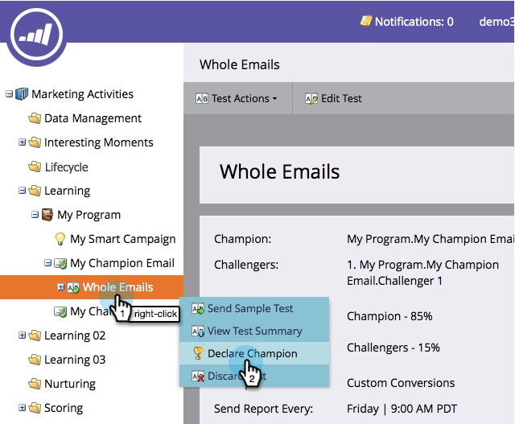

# Champion/Challenger: Zum Champion erklären {#champion-challenger-declare-a-champion}

Wenn Sie bereit sind, können Sie einen Champion für Ihren E-Mail-Test erklären.

>[!MORELIKETHIS]
>
>[Champion/Challenger: Genehmigen Sie Ihren E-Mail-Test](/help/marketo/product-docs/email-marketing/general/functions-in-the-editor/email-tests-champion-challenger/champion-challenger-approve-your-email-test.md)

1. Navigieren Sie **Marketing-Aktivitäten**.

   

1. Suchen Sie Ihren E-Mail-Test, klicken Sie mit der rechten Maustaste darauf und klicken Sie dann auf **Declare Champion**.

   

1. Wählen Sie **Gewinner** Ihrer Wahl aus.

   

1. Legen Sie die **Datum deklarieren** fest.

   >[!NOTE]
   >
   >Bis zum **Declare Date** wird Marketo weiterhin den alten Champion und den oder die alten Herausforderer senden. Sobald Datum/Uhrzeit erreicht ist, wird nur der neue Champion gesendet.

   

   >[!CAUTION]
   >
   >Beachten Sie, dass **Standardeinstellung „Datum**&quot; morgen ist, nicht heute.

1. Wählen Sie eine Uhrzeit aus und klicken Sie auf **Speichern**.

   

   Rad! Jetzt wissen Sie, wie Sie ganz einfach einen E-Mail-Test durchführen können, um Ihre Inhalte ohne Unterbrechung Ihrer Kampagne zu verbessern.
