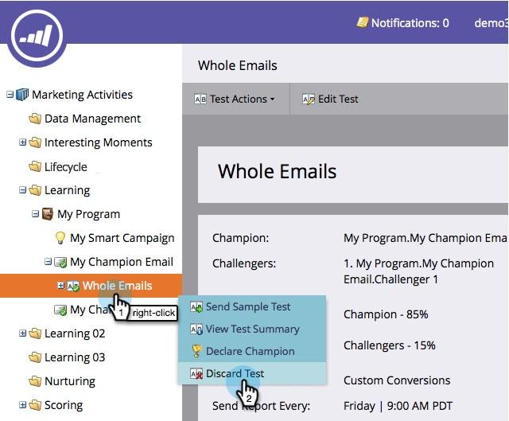

# Champion/Challenger: Verwerfen eines E-Mail-Tests {#champion-challenger-discard-an-email-test}

Wenn Sie zu irgendeinem Zeitpunkt entscheiden, dass Sie den E-Mail-Test nicht fortsetzen möchten, können Sie ihn verwerfen. Und so geht das.

>[!PREREQUISITES]
>
>[Champion/Challenger: Genehmigen Sie Ihren E-Mail-Test](/help/marketo/product-docs/email-marketing/general/functions-in-the-editor/email-tests-champion-challenger/champion-challenger-approve-your-email-test.md)

1. Navigieren Sie **[!UICONTROL Marketing-Aktivitäten]**.

   

1. Suchen Sie Ihren E-Mail-Test, klicken Sie mit der rechten Maustaste darauf und klicken Sie dann auf **[!UICONTROL Test verwerfen]**.

   

1. Klicken Sie **[!UICONTROL Löschen]** zur Bestätigung.

   

   Du bist fertig! Wenn Sie sich jemals entscheiden, einen Test erneut einzurichten, fahren Sie fort und [fügen Sie einen E-Mail-Champion/Challenger hinzu](/help/marketo/product-docs/email-marketing/general/functions-in-the-editor/email-tests-champion-challenger/add-an-email-champion-challenger.md).
