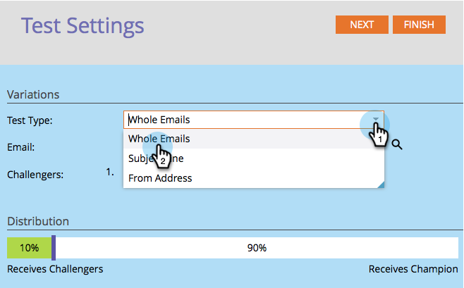
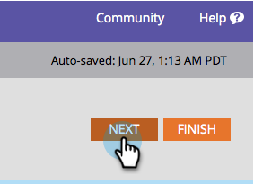

# Champion/Challenger: Ganze E-Mails {#champion-challenger-whole-emails}

Testen ganzer E-Mails gegeneinander. Wenn der Test vorbei ist, senden Sie den besten Spieler aus.

>[!PREREQUISITES]
>
>[E-Mail-Champion/Challenger hinzufügen](/help/marketo/product-docs/email-marketing/general/functions-in-the-editor/email-tests-champion-challenger/add-an-email-champion-challenger.md)

1. Wählen Sie im E-Mail **Testeditor in der Dropdown** Liste **Testtyp** die Option „Ganze E-Mails“ aus.

   

   >[!NOTE]
   >
   >Denken Sie daran: Die ursprüngliche E-Mail ist der Champion. Die Herausforderer treten dagegen an.

1. Suchen Sie die E **Mail(s** Challengers), wählen Sie sie aus und klicken Sie auf **Klonen**.

   

   >[!TIP]
   >
   >Beim Klonen wird eine Kopie der Challenger-E-Mail unter dem E-Mail-Test erstellt.

1. Ziehen Sie den Regler, um die prozentuale Aufteilung der Personen zu bestimmen, die die E-Mails des Herausforderers und des Champions erhalten.

   

   >[!NOTE]
   >
   >**Beispiel**
   >
   >In der oben gezeigten Verteilung erhalten 15 % der gesamten in der Smart List angegebenen Audience eine der Challenger-E-Mails und 85 % erhalten die Champion-E-Mail. Mehrere Challenger-E-Mails teilen sich die 15 % gleichmäßig. Wenn der Test vorbei ist, können Sie manuell einen Gewinner bestimmen. Von da an erhalten alle zukünftigen Personen die leistungsfähigeren Inhalte. In Trigger-Kampagnen kann der realisierte Prozentsatz von dem ausgewählten Prozentsatz abweichen, da die Verteilung möglicherweise nicht genau mit den ausgewählten Prozentsätzen übereinstimmt. Dies kann vorkommen, wenn eine Variante eine erhebliche Anzahl abgemeldeter Personen verarbeitet oder wenn eine Variante eine operative E-Mail ist, die anderen jedoch nicht.

   Um statistische Konfidenz zu gewinnen, stellen Sie sicher, dass der Prozentsatz, den Sie Challengers zuweisen, genügend Personen enthält, dass Ihr Test gültig ist. Lassen Sie sich nicht von nicht eindeutigen Ergebnissen täuschen.

1. Klicken Sie auf **Weiter**.

   

1. Fortschritt! Lass uns weitermachen.

   >[!MORELIKETHIS]
   >
   >[Champion/Challenger: Definieren Sie Champion-Kriterien](/help/marketo/product-docs/email-marketing/general/functions-in-the-editor/email-tests-champion-challenger/champion-challenger-define-champion-criteria.md)
