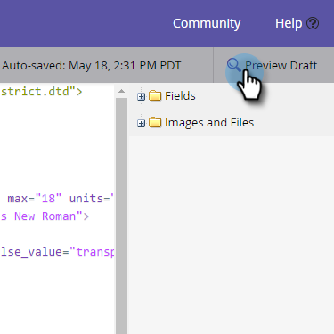

# Weiterleiten zu einem Freund-Link in E-Mails {#forward-to-a-friend-link-in-emails}

Wenn Sie den Link &quot;Weiterleiten an Freunde&quot;zu Ihren E-Mails hinzufügen, können Sie Personen verfolgen, die über diesen Link eine weitergeleitete E-Mail erhalten haben, und diese automatisch als neue Person hinzufügen, wenn sie sich nicht bereits in der Datenbank befinden.

Angenommen, Keith verwendet den Link &quot;Weiterleiten an Freunde&quot;, um die E-Mail an eine unbekannte Person, Mark, zu senden. Mark wird automatisch als neue Person hinzugefügt, erhält sein eigenes Cookie zugewiesen und jede seiner E-Mail- und Web-Aktivitäten ist mit ihm verknüpft. Wenn Keith jedoch die Weiterleitungsschaltfläche in seinem E-Mail-Client verwendet, wird Mark fälschlicherweise als Keith gekocht und seine Aktivität wird als Keith protokolliert.

## Link zu einer E-Mail-Vorlage Hinzufügen {#add-the-link-to-an-email-template}

1. Wechseln Sie zu **Design Studio**.

   

1. Suchen und wählen Sie die E-Mail-Vorlage aus, der Sie den Link hinzufügen möchten. Klicken Sie auf **Entwurf bearbeiten**.

   

1. Fügen Sie den folgenden HTML-Code an der Stelle ein, an der der Link &quot;Weiterleiten an Freunde&quot;angezeigt werden soll (wenn Sie Hilfe zu diesem Teil benötigen, wenden Sie sich bitte an Ihren Webentwickler):

   `<pre data-theme="Confluence"><a href="{{system.forwardToFriendLink}}">Forward to Friend</a></pre>`

   

   >[!TIP]
   >
   >
   >Sie können dem Link Stile hinzufügen, damit er schöner aussieht. Beispiel:
   >
   >`<a href="{{system.forwardToFriendLink}}" style="font-family:arial, sans-serif; padding:10px; position:absolute; right:0px;">Forward to Friend</a>`

   >[!CAUTION]
   >
   >Es wird nicht empfohlen, die Formatierung **position:relative** in Ihrer E-Mail-Vorlage zu verwenden. Es kann Probleme mit der Position und Anzeige des Feldes &quot;An Freunde weiterleiten&quot;verursachen.

1. Klicken Sie auf **Vorschau-Entwurf**, um sicherzustellen, dass die Vorlage wie gewünscht aussieht.

   

   >[!NOTE]
   >
   >Denken Sie daran, den Vorlagenentwurf zu genehmigen, um die Änderungen anzuwenden.

   Jetzt haben alle E-Mails, die diese Vorlage verwenden, den Link &quot;Weiterleiten an Freunde&quot;. Wenn der E-Mail-Empfänger darauf klickt, wird er mit dem Feld &quot;An einen Freund weiterleiten&quot;zu einer Webversion der E-Mail weitergeleitet:

   

## hinzufügen des Links zu einer einzelnen E-Mail {#add-the-link-to-an-individual-email}

Sie können den Link &quot;Weiterleiten an Freunde&quot;auch direkt in eine E-Mail einfügen.

1. Öffnen Sie die E-Mail, in die Sie den Link einfügen möchten, und klicken Sie mit der Dublette auf den bearbeitbaren Bereich.

   

1. Platzieren Sie den Cursor an der Stelle, an der der Link angezeigt werden soll, und klicken Sie auf die Schaltfläche **Token einfügen**.

   

1. Wählen Sie das Token **`{{system.forwardToFriendLink}}`** aus.

   

   >[!NOTE]
   >
   >Dieses Token ist die URL der Webversion der E-Mail mit dem Feld &quot;Weiterleiten an Freunde&quot;.

1. Schreiben Sie, was der Anzeigentext des Links sein soll (z. B. &quot;Weiterleiten an einen Freund&quot;).

   

1. Ausschneiden des Tokens **`{{system.forwardToFriendLink}}`** mit Strg+X (Windows) oder Cmd+X (Mac). Markieren Sie &quot;Weiterleiten an einen Freund&quot;und klicken Sie auf die Schaltfläche **Link einfügen/bearbeiten**.

   

1. Fügen Sie das Token **`{{system.forwardToFriendLink}}`** mithilfe von Strg/Cmd+V in das Feld **URL** ein und klicken Sie dann auf **Einfügen**.

   

1. Speichern Sie die Bearbeitung und Vorschau Ihres neuen Links!

   

   >[!NOTE]
   >
   >Neue Personen, die durch Erhalt einer &quot;Weiterleitung an einen Freund&quot;hinzugefügt werden, werden standardmäßig nicht abonniert.

## Ansicht Weiterleiten der Aktivität {#view-forwarding-activity}

Sie können sehen, wer die E-Mails weitergeleitet und empfangen hat, im Benutzerprotokoll.

1. Gehen Sie zum Ordner **`Database`**.

   

1. Klicken Sie mit der Dublette auf die Person, für die Sie die Aktivität Ansicht durchführen möchten.

   

1. Gehen Sie zur Registerkarte **Aktivität Log**. Klicken Sie mit der Dublette auf **An Freunde weitergeleitete E-Mail** oder **An Freunde weiterleiten**, um Details anzuzeigen.

   

   >[!NOTE]
   >
   >**Definition**
   >
   >Bei &quot;An Freunde weitergeleitete E-Mail&quot;ist die Person, die die E-Mail weitergeleitet hat, die ID der Person.
   >
   >Für &quot;Weitergeleitet an Freunde-E-Mail&quot;ist die Personen-ID die Person, die die E-Mail erhalten hat.

   

1. Um eine Person nach ID Ansicht, kopieren Sie die **Personen-ID** und fügen Sie sie an das Ende der URL ein (der Anfang der URL hängt von Ihrer Marketing-Instanz ab):

   `<pre data-theme="Confluence">...marketo.com/Database/loadPersonDetail?personId=</pre>`

   >[!NOTE]
   >
   >Wir werden die **Personen-ID** anklickbar machen und direkt mit der Person in einem kommenden Patch verknüpfen.

   

   >[!NOTE]
   >
   >Ist der Freund, der den Vorlauf erhält, eine unbekannte Person, wird eine neue Person mit der Kennzeichnung &quot;Weiterleitung an Freunde&quot;als **Quelle** der Person erstellt.
   >Wenn die E-Mail ein lokales Asset eines Programms ist, wird das Programm als **Akquise-Programm** des Benutzers markiert.

## Trigger oder Filter mit Weiterleiten der Aktivität {#trigger-or-filter-using-forwarding-activity}

Es gibt sechs Trigger/Filter, mit denen Sie Trigger-Flow-Aktionen durchführen oder Personen nach Versand und Erhalt der Aktivität &quot;Weiterleiten an Freunde&quot;filtern können.

In einer intelligenten Kampagne, wenn Sie nach &quot;forward&quot; suchen, finden Sie die verfügbaren Trigger und Filter.

## An Freunde weiterleiten {#test-forward-to-friend}

Um &quot;Weiterleiten an Freunde&quot;zu testen, senden Sie sich eine E-Mail mit dem Weiterleitungslink. Vergewissern Sie sich, dass Sie es über den Fluss **E-Mail senden**, *nicht* durch **Test-E-Mail senden** senden senden.
