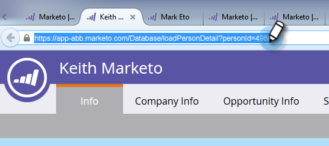

# Link zum Weiterleiten an einen Freund in E-Mails {#forward-to-a-friend-link-in-emails}

Wenn Sie den Link „An Freunde weiterleiten“ zu Ihren E-Mails hinzufügen, können Sie Personen verfolgen, die eine weitergeleitete E-Mail über diesen Link erhalten haben, und sie automatisch als neue Person hinzufügen, wenn sie sich noch nicht in der Datenbank befinden.

Angenommen, Keith verwendet den Link „An Freund weiterleiten“, um die E-Mail an eine unbekannte Person, Mark, weiterzuleiten. Mark wird automatisch als neue Person hinzugefügt, bekommt ein eigenes Cookie zugewiesen und jede seiner E-Mail- und Web-Aktivitäten wird mit ihm verknüpft. Wenn Keith jedoch die Weiterleitungs-Schaltfläche in seinem E-Mail-Client verwendet, wird Mark fälschlicherweise als Keith Cookies gesetzt und seine Aktivität wird als Keith&#39;s protokolliert.

## Link zu einer E-Mail-Vorlage hinzufügen {#add-the-link-to-an-email-template}

1. Gehen Sie zum **[!UICONTROL Design Studio]**.

   

1. Suchen Sie die E-Mail-Vorlage, der Sie den Link hinzufügen möchten, und wählen Sie sie aus. Klicken Sie **[!UICONTROL Entwurf bearbeiten]**.

   

1. Fügen Sie den folgenden HTML-Code ein, in dem der Link „An Freund weiterleiten“ angezeigt werden soll (wenn Sie Hilfe zu diesem Teil benötigen, wenden Sie sich bitte an Ihren Web-Entwickler):

   `<a href="{{system.forwardToFriendLink}}">Forward to Friend</a>`

   

   >[!TIP]
   >
   >
   >Sie können dem Link Stile hinzufügen, damit er schöner aussieht. Beispiel:
   >
   >`<a href="{{system.forwardToFriendLink}}" style="font-family:arial, sans-serif; padding:10px; position:absolute; right:0px;">Forward to Friend</a>`

   >[!CAUTION]
   >
   >Es wird davon abgeraten, den Stil **Position:relative** in Ihrer E-Mail-Vorlage zu verwenden. Dies kann zu Problemen mit der Position und Anzeige des Feldes „An Freund weiterleiten“ führen.

1. Klicken Sie **[!UICONTROL Vorschau des Entwurfs]**, um sicherzustellen, dass die Vorlage Ihren Vorstellungen entspricht.

   

   >[!NOTE]
   >
   >Denken Sie daran, den Vorlagenentwurf zu genehmigen, um die Änderungen anzuwenden.

   Jetzt haben alle E-Mails, die diese Vorlage verwenden, den Link „An Freund weiterleiten“. Wenn der E-Mail-Empfänger darauf klickt, wird er zu einer Web-Version der E-Mail mit dem Feld „An einen Freund weiterleiten“ weitergeleitet:

   

## Hinzufügen des Links zu einer einzelnen E-Mail {#add-the-link-to-an-individual-email}

Sie können den Link „An Freund weiterleiten“ auch direkt in eine E-Mail einfügen.

1. Öffnen Sie die E-Mail, in die Sie den Link einfügen möchten, und doppelklicken Sie in den bearbeitbaren Bereich.

   

1. Platzieren Sie den Cursor an der gewünschten Stelle, und klicken Sie auf die Schaltfläche **Token einfügen**.

   

1. Wählen Sie das **`{{system.forwardToFriendLink}}`** Token aus.

   

   >[!NOTE]
   >
   >Dieses Token ist die URL der Web-Version der E-Mail mit dem Feld „An Freund weiterleiten“.

1. Schreiben Sie auf, was der Anzeigetext des Links sein soll (z. B. „An einen Freund weiterleiten„).

   

1. Ausschneiden des **`{{system.forwardToFriendLink}}`**-Tokens mithilfe von Strg+X (Windows) oder Befehl+X (Mac). Markieren Sie „An einen Freund weiterleiten“ und klicken Sie auf die Schaltfläche **Link einfügen/bearbeiten**.

   

1. Fügen Sie das **`{{system.forwardToFriendLink}}`**-Token mithilfe von Strg **/Befehlstaste+V in das Feld URL** ein und klicken Sie dann auf **[!UICONTROL Einfügen]**.

   

1. Speichern Sie die Änderungen und zeigen Sie eine Vorschau Ihres neuen Links an!

   

   >[!NOTE]
   >
   >Neue Personen, die durch den Erhalt einer „Weiterleiten an einen Freund“-E-Mail hinzugefügt werden, werden standardmäßig von Marketing-E-Mails abgemeldet.

## Aktivität „Weiterleitung anzeigen“ {#view-forwarding-activity}

Sie können sehen, wer die E-Mails im Aktivitätsprotokoll der Person weitergeleitet und erhalten hat.

1. Navigieren Sie zur **[!UICONTROL Datenbank]**.

   

1. Doppelklicken Sie auf die Person, für die Sie eine Aktivität anzeigen möchten.

   

1. Navigieren Sie zur Registerkarte **[!UICONTROL Aktivitätsprotokoll]** . Doppelklicken Sie auf **[!UICONTROL E-Mail an Freund weiterleiten]** oder **[!UICONTROL E-Mail an Freund weiterleiten]**, um die Details anzuzeigen.

   

   >[!NOTE]
   >
   >**Definition**
   >
   >Bei empfangenen Weiterleitungs-E-Mails an Freunde ist die Personen-ID die Person, die die E-Mail weitergeleitet hat.
   >
   >Bei E-Mails von „An Freund weiterleiten“ ist die Personen-ID die Person, die die E-Mail erhalten hat.

   

1. Um eine Person nach ID anzuzeigen, kopieren Sie die **Personen-ID** und fügen Sie sie am Ende der URL ein (der Anfang der URL hängt von Ihrer Marketo-Instanz ab):

   `...marketo.com/Database/loadPersonDetail?personId=`

   >[!NOTE]
   >
   >Wir machen die **[!UICONTROL Personen-ID]** klickbar und verknüpfen sie in einem kommenden Patch direkt mit der Person.

   

   >[!NOTE]
   >
   >Wenn der Freund, der die Weiterleitung erhält, eine unbekannte Person ist, wird eine neue Person erstellt, bei der „An Freund weiterleiten“ als **Source der Person markiert**.
   >Wenn es sich bei der E-Mail um ein lokales Asset eines Programms handelt, wird das Programm als &quot;**&quot; der Person**.

## Trigger oder Filter mit der Aktivität „Weiterleitung“ {#trigger-or-filter-using-forwarding-activity}

Es gibt sechs Trigger/Filter, mit denen Sie Flussaktionen in Triggern erstellen oder Personen nach der gesendeten und empfangenen Aktivität „An Freund weiterleiten“ filtern können.

Wenn Sie in der Smart-Liste einer Smart-Kampagne nach „Weiterleiten“ suchen, finden Sie die verfügbaren Trigger und Filter.

## Test an Freund weiterleiten {#test-forward-to-friend}

Um „Weiterleiten an Freund“ zu testen, senden Sie sich selbst eine E-Mail mit dem Weiterleitungs-Link. Vergewissern Sie sich, dass Sie sie über den **E-Mail senden** Flussschritt *nicht* über **Test-E-Mail senden** senden.
