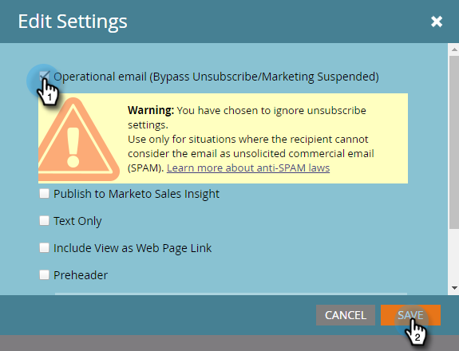

# Einsetzbarmachen einer E-Mail {#make-an-email-operational}

Operative E-Mails ignorieren den Status Abgemeldet und Marketing ausgesetzt . Sie unterliegen auch keinen Kommunikationsbeschränkungen. Sie senden, egal was kommt.

>[!NOTE]
>
>Operative E-Mails zählen nicht zu den Kommunikationsbeschränkungen. Wenn jemand beispielsweise nur eine E-Mail pro Woche erhalten kann und Sie ihm bereits eine Marketing-E-Mail gesendet haben, können Sie ihm bei Bedarf trotzdem eine operative E-Mail senden.

1. Suchen Sie Ihre E-Mail, wählen Sie sie aus und klicken Sie auf **[!UICONTROL Entwurf bearbeiten]**.

>[!NOTE]
>
>Sie sollten nur operative E-Mails für kritische E-Mails und automatische Antworten verwenden. Sie sind nicht für Marketing-E-Mails vorgesehen.

1. Klicken Sie nach dem Öffnen des Editors auf **[!UICONTROL E-Mail-Einstellungen]**.

   

1. Markieren Sie **[!UICONTROL Operative E-Mail]** und klicken Sie auf **[!UICONTROL Speichern]**.

   

>[!CAUTION]
>
>Operative E-Mails wurden nicht für Interaktionsprogramme entwickelt. Daher ignoriert ein Interaktionsprogramm den Betriebsstatus einer E-Mail. Bitte denken Sie daran, wenn Sie mit ihnen arbeiten.

Vergessen Sie nicht, diese E-Mail zu genehmigen, damit die Änderungen wirksam werden. Erfahren Sie, wie Sie [E-Mail genehmigen](/help/marketo/product-docs/email-marketing/general/creating-an-email/approve-an-email.md).
