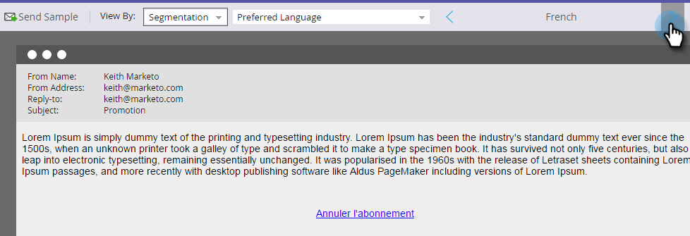

# Vorschau einer E-Mail mit dynamischem Inhalt {#preview-an-email-with-dynamic-content}

Zeigen Sie Ihre E-Mail nach dem Hinzufügen dynamischer Inhalte in der Vorschau an, um sie zu überprüfen.

1. Wählen Sie Ihre E-Mail aus und klicken Sie auf **[!UICONTROL Vorschau der E-Mail]**.

   

1. Klicken Sie auf **[!UICONTROL Dropdown-]** „Anzeigen nach“ und wählen Sie den Typ des dynamischen Inhalts aus, den Sie in der Vorschau anzeigen möchten.

   

1. Eine neue Dropdown-Liste wird angezeigt. Klicken Sie darauf und wählen Sie den spezifischen Inhalt aus.

   

1. Verwenden Sie die Pfeile, um durch die Optionen zu scrollen.

   

Sie können dynamische Inhalte auch direkt im E-Mail-Editor in der Vorschau anzeigen.

1. Klicken **[!UICONTROL unter &quot;]**&quot; auf die Registerkarte **[!UICONTROL Dynamisch]**.

   

1. Klicken Sie auf den Inhalt, den Sie in der Vorschau anzeigen möchten.

   

Sehr gut! Zeigen Sie eine Vorschau Ihrer E-Mails an, um sicherzustellen, dass der Inhalt Ihren Vorstellungen entspricht.
