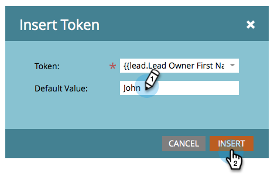

# Senden von E-Mails von der Lead-Inhaberin bzw. dem Lead-Inhaber {#send-emails-from-the-lead-owner}

Was passiert, wenn Sie eine E-Mail an einen Lead im Namen des Lead-Inhabers senden möchten?  Und so geht das.

1. Suchen Sie Ihre E-Mail, wählen Sie sie aus und klicken Sie auf **[!UICONTROL Entwurf bearbeiten]**.

   

1. Klicken Sie in das Feld **[!UICONTROL Von]** (Löschen eines vorhandenen Namens) und klicken Sie auf die Schaltfläche **Token einfügen**.

   

1. Beginnen Sie mit der Eingabe von &quot;`{{lead.Lead Owner`&quot; und wählen Sie das **`{{lead.Lead Owner First Name}}`** Token aus.

   

1. Geben Sie einen Standardwert ein, falls der Lead noch keinen Lead-Inhaber hat, und klicken Sie auf **[!UICONTROL Einfügen]**.

   

1. Klicken Sie nach dem ersten Token, fügen Sie ein Leerzeichen hinzu und klicken Sie dann auf die Schaltfläche **Token einfügen**.

   

1. Beginnen Sie mit der Eingabe von &quot;`{{lead.Lead Owner`&quot; und wählen Sie das **`{{lead.Lead Owner Last Name}}`** Token aus.

   

1. Geben Sie einen Standardwert ein, falls der Lead noch keinen Lead-Inhaber hat, und klicken Sie auf **[!UICONTROL Einfügen]**.

   

   >[!TIP]
   >
   >Stellen Sie sicher, dass Sie ein Leerzeichen zwischen dem Vor- und Nachnamen-Token hinzugefügt haben.

1. Klicken Sie in das Feld **[!UICONTROL Absenderadresse]** (löschen Sie eine vorhandene E-Mail-Adresse) und klicken Sie auf die Schaltfläche **Token einfügen**.

   

1. Beginnen Sie mit der Eingabe von &quot;`{{lead.Lead Owner`&quot; und wählen Sie das **`{{lead.Lead Owner Email Address}}`** Token aus.

   

1. Geben Sie einen Standardwert ein, falls der Lead noch keinen Lead-Inhaber hat, und klicken Sie auf **[!UICONTROL Einfügen]**.

   

1. Stellen Sie sicher **[!UICONTROL dass die Felder]** Antwort an **[!UICONTROL und]** Betreff“ ausgefüllt sind und Sie fertig sind!

   
