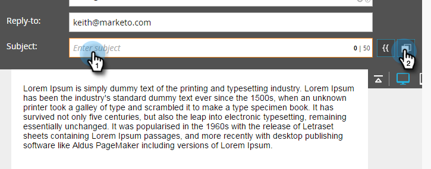

# Verwenden dynamischer Inhalte in einer E-Mail {#using-dynamic-content-in-an-email}

>[!PREREQUISITES]
>
>[Segmentierung erstellen](/help/marketo/product-docs/personalization/segmentation-and-snippets/segmentation/create-a-segmentation.md)

Verwenden Sie dynamische Inhalte in E-Mails, um Ihre Leads zielgerichtete Informationen zu senden.

>[!NOTE]
>
>Die Verwendung von Variablen in dynamischen Inhalten in einer E-Mail wird nur bei Verwendung von Trigger-Kampagnen unterstützt. Sie wird **nicht** bei der Verwendung von Batch-Kampagnen unterstützt.

## Segmentierung hinzufügen {#add-segmentation}

1. Navigieren Sie **[!UICONTROL Marketing-Aktivitäten]**.

   

1. Wählen Sie Ihre E-Mail aus und klicken Sie **[!UICONTROL Entwurf bearbeiten]**.

   

1. In diesem Beispiel machen wir die Betreffzeile dynamisch. Klicken Sie in das Feld [!UICONTROL Betreff] und dann auf die Schaltfläche **Dynamisch machen**.

   

   >[!NOTE]
   >
   >Sie können auch ein -Element innerhalb der E-Mail dynamisch machen. Wählen Sie dazu den Bereich aus, klicken Sie auf das Zahnradsymbol und wählen Sie **Dynamisch erstellen** (oder [Ersetzen durch Snippet](/help/marketo/product-docs/personalization/segmentation-and-snippets/snippets/create-a-snippet.md), je nachdem, was Sie gerade tun).

1. Geben Sie den Namen der Segmentierung ein, wählen Sie ihn aus und klicken Sie auf **[!UICONTROL Speichern]**.

   

   Die Segmentierung und die zugehörigen Segmente werden auf der rechten Seite [!UICONTROL &#x200B; Registerkarte &#x200B;]Dynamisch“ angezeigt.

   

## Anwenden dynamischer Inhalte {#apply-dynamic-content}

>[!CAUTION]
>
>Die Anzahl der zulässigen dynamischen Inhaltselemente ist nicht unbegrenzt. Es gibt zwar keine bestimmte Anzahl von Beschränkungen (diese können je nach Inhaltskombination variieren), aber die übermäßige Nutzung dynamischer Inhalte kann sich negativ auf die E-Mail-Leistung auswirken. Es wird empfohlen, die Anzahl der verwendeten dynamischen Inhaltselemente pro E-Mail auf unter 20 zu begrenzen.

1. Klicken Sie auf Ihre Segmente und fügen Sie Ihre Betreffzeile hinzu.

1. Wiederholen Sie diesen Vorgang für jedes Segment.

   

>[!TIP]
>
>Erstellen Sie eine Standard-E-Mail, bevor Sie Inhalte auf die verschiedenen Segmente anwenden.

>[!CAUTION]
>
>Änderungen am standardmäßigen Segmentinhaltsblock werden auf alle Segmente angewendet.

Süß! Jetzt können Sie flexible E-Mails an Ihre Zielgruppe senden.

>[!MORELIKETHIS]
>
>* [Vorschau einer E-Mail mit dynamischem Inhalt](/help/marketo/product-docs/email-marketing/general/functions-in-the-editor/preview-an-email-with-dynamic-content.md)
>* [Verwenden dynamischer Inhalte in einer Landingpage](/help/marketo/product-docs/demand-generation/landing-pages/free-form-landing-pages/use-dynamic-content-in-a-free-form-landing-page.md)
