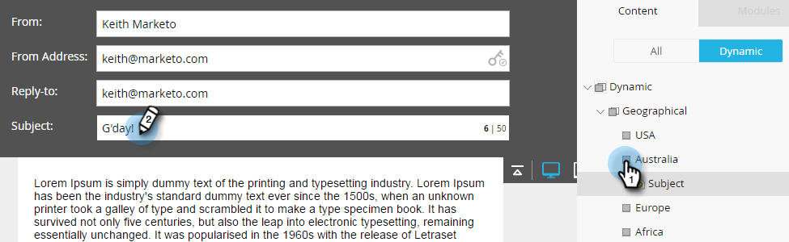

# Dynamische Inhalte in einer E-Mail verwenden {#using-dynamic-content-in-an-email}

>[!NOTE]
>
>**Voraussetzungen**
>
>* [Eine Segmentierung erstellen](../../../../product-docs/personalization/segmentation-and-snippets/segmentation/create-a-segmentation.md)

>

Verwenden Sie dynamische Inhalte in E-Mails, um Ihre Interessenten zielgerichtete Informationen zu senden.

## hinzufügen {#add-segmentation}

1. Gehen Sie zu Marketing-Aktivitäten.

   

1. Wählen Sie Ihre E-Mail aus und klicken Sie auf Entwurf bearbeiten.

   

1. In diesem Beispiel machen wir die Betreffzeile dynamisch. Klicken Sie im Feld Betreff auf die Schaltfläche **Dynamisch** .

   

   >[!NOTE]
   >
   >Sie können auch ein Element innerhalb der E-Mail dynamisch gestalten. Wählen Sie dazu den Bereich aus, klicken Sie auf das Zahnradsymbol und wählen Sie &quot;Dynamisch **** machen&quot;(bzw. &quot;Dynamisch [&quot;(bzw. &quot;Mit Snippet](../../../../product-docs/personalization/segmentation-and-snippets/snippets/create-a-snippet.md)ersetzen&quot;).

   Geben Sie den Segmentierungsnamen ein, wählen Sie ihn aus und klicken Sie auf Speichern.

   

   Ihre Segmentierung und ihre Segmente werden rechts auf der Registerkarte &quot;Dynamisch&quot;angezeigt.

   

## Dynamische Inhalte anwenden {#apply-dynamic-content}

>[!CAUTION]
>
>Die Anzahl der zulässigen dynamischen Inhaltselemente ist nicht unbegrenzt. Es gibt zwar keine bestimmte Anzahl von Benutzern (sie kann je nach Inhaltskombination variieren), aber eine Überbelegung des dynamischen Inhalts kann sich negativ auf die Leistung der E-Mail auswirken. Es wird empfohlen, die Anzahl der dynamischen Inhaltselemente, die pro E-Mail verwendet werden, unter 20 zu halten.

1. Klicken Sie auf Ihre Segmente und fügen Sie Ihre Betreffzeile hinzu.

1. Wiederholen Sie diese Schritte für jedes Segment.

   

>[!TIP]
>
>Erstellen Sie eine Standard-E-Mail, bevor Sie Inhalte auf die verschiedenen Segmente anwenden.

>[!CAUTION]
>
>Änderungen am Standard-Segmentinhaltsblock werden auf alle Segmente angewendet.

Süß! Jetzt können Sie flexible E-Mails an Ihre Zielgruppe Audience senden.

>[!NOTE]
>
>**Verwandte Artikel**
>
>* [Vorschau einer E-Mail mit dynamischem Inhalt](preview-an-email-with-dynamic-content.md)
>* [Dynamische Inhalte in einer Landingpage verwenden](../../../../product-docs/demand-generation/landing-pages/free-form-landing-pages/use-dynamic-content-in-a-free-form-landing-page.md)

>

