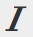

# Verwenden des Rich-Text-Editors {#using-the-rich-text-editor}

Der Rich-Text-Editor (RTE) wird überall in Marketo angezeigt und ist immer verfügbar, wenn Sie Inhalte hinzufügen oder bearbeiten möchten. Eine Version davon wird auf Landingpages, Programmen, E-Mails, Formularen und Snippets angezeigt. Klicken Sie einfach **Entwurf bearbeiten** und es wird angezeigt, um Ihnen zu helfen.

## Editor-Einstellungen {#editor-settings}

Die Einstellung „Stammblockelement“ definiert, welche Tags Ihren Inhalt umschließen. Standardmäßig verwendet das E-Mail-Stammblockelement `
` Tags. Sie haben die Möglichkeit, dies zu ändern, indem Sie die folgenden Schritte ausführen.

>[!TIP]
>
>Sie haben zwar die Möglichkeit, Ihr Stammblockelement auszuwählen, wir empfehlen jedoch immer die Verwendung von Standardeinstellungen, um das Benutzererlebnis zu verbessern.

1. Klicken Sie auf **Admin**.

   

1. Klicken Sie auf **E-Mail**.

   

1. Klicken Sie **Einstellungen für Texteditor bearbeiten**.

   

1. Wählen Sie in der Dropdown **Liste „E-Mail**/Snippet-Editor“ die Option `
` oder Ohne und klicken Sie auf **Speichern**. `
` wird in diesem Beispiel verwendet.

   

   Wenn Sie in einer E-Mail-Vorlage `

` haben, sehen Sie das folgende Verhalten von HTML Source, wenn Sie den Abschnitt öffnen und im Editor „Text geht hierhin“ eingeben:

<table> 
 <tbody> 
  <tr> 
   <th>&lt;p&gt;</th> 
   <th>&lt;div&gt;</th> 
   <th>Keine</th> 
  </tr> 
  <tr> 
   <td>
&lt;div class=„mktEditable“&gt; &lt;p&gt;Text hier&lt;/p&gt; &lt;/div&gt;
</td> 
   <td>
&lt;div class=„mktEditable“&gt; &lt;div&gt;Text hier&lt;/div&gt; &lt;/div&gt;
</td> 
   <td>
&lt;div class=„mktEditable“&gt; Text hier  &lt;/div&gt;
</td> 
  </tr> 
 </tbody> 
</table>

>[!TIP]
>
>Sie können auch das Stammblockelement des Landingpage-Editors ändern, indem Sie die gleichen Schritte ausführen, aber auf die Dropdown-Liste **Landingpage-Editor** in Schritt 4 anstelle des E-Mail-/Snippet-Editors klicken.

>[!NOTE]
>
>Das -Stammblockelement wird immer für Rich-Text-Programm-Token `
`.

## Funktionen {#features}

Im Folgenden finden Sie die Funktionen, die Sie in einem RTE finden.

| Symbol | Name | Funktion |
|---|---|---|
|  | Schriftart | Wählen Sie Ihren Stil - wir haben jede Menge! |
|  | Schriftgroesse | Wie groß wollen Sie es? 25 Wahlmöglichkeiten, von 8 bis 90 Pixel. |
|  | Stil | Wählen Sie Absatz oder sechs Überschriftenstile (für Landingpages). |
|  | Zeilenabstand | Pick deinen Abstand zwischen den Linien. |
|  | Textfarbe | Schwarz, Rot oder was immer Sie wollen. |
|  | Hintergrundfarbe | Zur Hervorhebung markieren. |
|  | kühn | **Dunkler und dicker**. |
|  | Kursiv | *Abgewinkelt, für Hervorhebung oder*. |
|  | Unterstreichen | Setzt eine Zeile unter den Text. |
|  | Ausrichtung | Verwenden Sie dieses Dropdown-Menü, um Ihren Text und Ihre Bilder anzuordnen. Zentrieren Sie sie, wählen Sie die linke oder rechte Ausrichtung aus oder verteilen Sie sie mit der vollständigen Ausrichtung von Kante zu Kante. |  |  | Liste | Wählen Sie Aufzählungszeichen oder Zahlen aus dem Dropdown-Menü aus. Aufzählungszeichen eignen sich gut für Listen und Zahlen mit Schritten. |
|  | Einrücken | Wählen Sie mehr oder weniger Einzug. Verwenden Sie für Absätze oder Text, den Sie hervorheben möchten. |
|  | Link einfügen/bearbeiten | Fügen Sie einen Link zu einer Website oder anderen Inhalten ein. Nehmen Sie einfach Änderungen daran vor. |
|  | Bild einfügen/bearbeiten | Ein Bild sagt mehr als tausend Worte. Komm rein. Klicken Sie auf das Kamerasymbol, um Ihr Design Studio zu durchsuchen. Sie können Bilder nebeneinander ablegen. |
|  | Token einfügen | Ein leistungsstarkes Tool, ideal für E-Mail-Personalisierung und Daten-Tracking. Stellen Sie sicher, dass Sie einen Standardwert eingeben. |
|  | Rückgängig | Entschuldigung! Gehen wir einen Schritt zurück und versuchen es erneut. |
|  | Wiederholen | Wenn es wirklich in Ordnung ist, wie es ist, kehren Sie zum Original zurück. |
|  | Tabelle | Eigene bauen, wie diese hier. Ein Dropdown-Menü ermöglicht die Konfiguration. |
|  | Anker einfügen | Anker fallen lassen! |
|  | Horizontale Linie | Viele Anwendungen - Ideal für Teilungsabschnitte. |
|  | HTML bearbeiten | Öffnet den HTML-Source-Editor, damit Sie Ihren Code anpassen können. |
|  | Tiefgestellt | Tief hängende Buchstaben (wie in O`2`). |
|  | Hochgestellt | Du hast die Macht! (2`6`) |
|  | Durchstreichen | `<s>Put a line through text, like this</s>`. |
|  | Sonderzeichen | Möchten Sie über Euros sprechen? Mathematik? Sie haben 243 Möglichkeiten. |
|  | Suchen und Ersetzen | Suchen und ändern Sie Dinge viel schneller, als selbst nach jeder Instanz zu suchen. |
|  | Formatierung löschen | Bringen Sie die Dinge zum Standard zurück. |
|  | Abbrechen | Drücke den Knopf, um zu sagen: „Macht nichts.“ |
|  | Speichern Sie. | Drücken Sie den Knopf um zu sagen, „OK, ich mag es.“ |

>[!TIP]
>
>HTML und Text werden auf separaten Bildschirmen bearbeitet. Klicken Sie unbedingt auf **Von HTML kopieren** auf der Registerkarte **Text** und dann auf **Speichern**, damit Ihr Text mit Ihrem HTML übereinstimmt.

>[!NOTE]
>
>Sie sind nicht auf die Schriftarten in der Dropdown-Liste beschränkt. Sie können eine nicht aufgeführte verwenden, indem Sie auf den HTML-Code zugreifen. Alle Web-Schriftarten werden in Marketo unterstützt, aber Web-Schriftarten funktionieren nicht universell in allen E-Mail-Clients.

## Landing Page {#landing-pages}

Die Einstellung „Stammblockelement“ definiert, welche Tags Ihren Inhalt umschließen. Standardmäßig verwendet das Stammblockelement der Landingpage `
` Tags. Sie haben die Möglichkeit, dies zu ändern, indem Sie die folgenden Schritte ausführen.

>[!TIP]
>
>Sie haben zwar die Möglichkeit, Ihr Stammblockelement auszuwählen, wir empfehlen jedoch immer die Verwendung von Standardeinstellungen, um das Benutzererlebnis zu verbessern.

1. Klicken Sie auf **Admin**.

   

1. Klicken Sie auf **E-Mail**.

   

1. Klicken Sie **Einstellungen für Texteditor bearbeiten**.

   

1. Wählen Sie **Dropdown-Menü** Landingpage-Editor“ die Option `
` oder Ohne und klicken Sie auf **Speichern**. `
` wird in diesem Beispiel verwendet.

   

   Und das war&#39;s!
