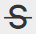

# Verwenden des Rich-Text-Editors {#using-the-rich-text-editor}

Der Rich-Text-Editor (RTE) wird überall in Marketing angezeigt und steht jederzeit zur Verfügung, wenn Sie Inhalte hinzufügen oder bearbeiten möchten. Sie sehen eine Version davon auf Landingpages, Programmen, E-Mails, Formularen und Snippets. Klicken Sie einfach auf **Entwurf bearbeiten** und es erscheint ein Popup, um Ihnen zu helfen.

## Editoreinstellungen {#editor-settings}

Die Einstellung für das Stammblock-Element definiert, welche Tags Ihren Inhalt umschließen. Standardmäßig verwendet das Element E-Mail-Stammblock 
 Tags. Sie haben die Möglichkeit, dies zu ändern, indem Sie die folgenden Schritte ausführen.

>[!TIP]
>
>Sie haben zwar die Möglichkeit, Ihr Stammblock-Element auszuwählen, es wird jedoch empfohlen, die Standardeinstellungen für eine optimale Benutzererfahrung zu verwenden.

1. Klicken Sie auf **Admin**.

   

1. Klicken Sie auf **E-Mail**.

   

1. Klicken Sie auf **Texteditoreinstellungen bearbeiten**.

   

1. Wählen Sie in der Dropdownliste **E-Mail/Snippet-Editor** die Option 
 oder Keine und klicken Sie auf **Speichern**. 
 in diesem Beispiel verwendet.

   

   Wenn Sie 

 in einer E-Mail-Vorlage sehen Sie das folgende Verhalten der HTML-Quelle, wenn Sie den Abschnitt öffnen und im Editor &quot;Text geht hierher&quot; eingeben:

<table> 
 <tbody> 
  <tr> 
   <th>&lt;p&gt;</th> 
   <th>&lt;div&gt;</th> 
   <th>Keines</th> 
  </tr> 
  <tr> 
   <td>
&lt;div class="“mktEditable”"&gt; &lt;p&gt;Text kommt hier&lt;/p&gt; &lt;/div&gt;
</td> 
   <td>
&lt;div class="“mktEditable”"&gt; &lt;div&gt;Text kommt hier&lt;/div&gt; &lt;/div&gt;
</td> 
   <td>
&lt;div class="“mktEditable”"&gt; Text kommt hier &lt;/div&gt;
</td> 
  </tr> 
 </tbody> 
</table>

>[!TIP]
>
>Sie können auch das Stammblock-Element des Landingpage-Editors ändern, indem Sie die gleichen Schritte ausführen, aber in Schritt 4 auf die Dropdownliste **Landingpage-Editor** statt E-Mail/Snippet-Editor klicken.

>[!NOTE]
>
>Das Stammblock-Element ist immer 
 für Rich-Text-Programm-Token.

## Funktionen {#features}

Hier finden Sie die Funktionen, die Sie in einer RTE finden.

| Symbol | Name | Funktionsweise |
|---|---|---|
|  | Schriftfamilie | Wählen Sie Ihren Stil - wir haben jede Menge! |
|  | Schriftgröße | Wie groß willst du es? 25 Auswahlmöglichkeiten, von 8 px bis 90 px. |
|  | Stile | Wählen Sie &quot;Absatz&quot;oder &quot;sechs Überschriftenstile&quot;(für Landingpages). |
|  | Zeilenabstand | Nimm deinen Abstand zwischen den Zeilen. |
|  | Textfarbe | Schwarz, Rot oder was immer Sie wollen. |
|  | Hintergrundfarbe | Hervorhebung. |
|  | Fett | **Dunkler und dicker**. |
|  | Kursiv | *Gezinkt, für Hervorhebung oder* Zitate. |
|  | Unterstreichen | Legt eine Zeile unter den Text. |
|  | Ausrichtung | Verwenden Sie dieses Dropdownmenü, um Ihren Text und Ihre Bilder zu gestalten. Zentrieren Sie sie, wählen Sie die linke oder rechte Ausrichtung oder legen Sie mit voller Ausrichtung eine Kante an eine Kante fest. |  |  | Liste | Wählen Sie Aufzählungszeichen oder Zahlen aus der Dropdownliste. Aufzählungszeichen eignen sich gut für Listen und Zahlen mit Stufen. |
|  | Einzug | Wählen Sie mehr oder weniger Einzug. Verwenden Sie diese Option für Absätze oder Text, der hervorgehoben werden soll. |
|  | Link einfügen/bearbeiten | einen Link zu einer Website oder anderen Inhalten einfügen; einfach Änderungen daran vorzunehmen. |
|  | Bild einfügen/bearbeiten | Ein Bild sagt mehr als tausend Worte. Legen Sie eins ein. Klicken Sie auf das Kamerasymbol, um Ihr Design Studio zu durchsuchen. Sie können Bilder nebeneinander ablegen. |
|  | Token einfügen | Ein leistungsstarkes Tool, ideal für die Personalisierung von E-Mails und die Datenverfolgung. Achten Sie darauf, einen Standardwert einzugeben. |
|  | Rückgängig | Ups! Lass uns einen Schritt zurückgehen und es noch einmal versuchen. |
|  | Wiederholen | Wenn es wirklich in Ordnung ist, so wie es ist, kehren Sie zum Original zurück. |
|  | Verzeichnis | Baue deine eigene, so wie diese. Über ein Dropdown-Menü können Sie es konfigurieren. |
|  | Anker einfügen | Legen Sie Anker ab! |
|  | Horizontale Linie | Viele Verwendungen - Ideal zum Teilen von Abschnitten. |
|  | HTML bearbeiten | Blendet den HTML-Quelleditor ein, damit Sie Ihren Code anpassen können. |
|  | Tiefgestellt | Hängende Buchstaben (wie in O`2`). |
|  | Hochgestellt | Du hast die Macht! (2`6`). |
|  | Durchstreichen | `<s>Put a line through text, like this</s>`. |
|  | Sonderzeichen | Willst du über Euro reden? Mathe? Sie haben 243 Auswahlmöglichkeiten. |
|  | Suchen und Ersetzen | Suchen und ändern Sie Dinge viel schneller, als nach jeder Instanz selbst zu suchen. |
|  | Formatierung löschen | Bringen Sie Dinge wieder in den Standard. |
|  | Abbrechen | Drücken Sie die Taste, um zu sagen: &quot;Macht nichts.&quot; |
|  | Speichern | Drücken Sie die Taste, um zu sagen: &quot;OK, ich mag es.&quot; |

>[!TIP]
>
>Sie bearbeiten HTML und Text auf separaten Bildschirmen. Klicken Sie auf der Registerkarte **Text** aus HTML **kopieren und** Speichern **, damit Ihr Text mit Ihrem HTML übereinstimmt.**

>[!NOTE]
>
>Sie sind nicht auf die Schriftarten in der Dropdown-Liste beschränkt. Sie können eine nicht aufgeführte verwenden, indem Sie auf den HTML-Code zugreifen. Alle Webschriftarten werden in Marketo unterstützt, aber Webschriftarten funktionieren nicht in allen E-Mail-Clients.

## Landingpages {#landing-pages}

Die Einstellung für das Stammblock-Element definiert, welche Tags Ihren Inhalt umschließen. Standardmäßig verwendet das Stammblock-Element der Landingpage 
 Tags. Sie haben die Möglichkeit, dies zu ändern, indem Sie die folgenden Schritte ausführen.

>[!TIP]
>
>Sie haben zwar die Möglichkeit, Ihr Stammblock-Element auszuwählen, es wird jedoch empfohlen, die Standardeinstellungen für eine optimale Benutzererfahrung zu verwenden.

1. Klicken Sie auf **Admin**.

   

1. Klicken Sie auf **E-Mail**.

   

1. Klicken Sie auf **Texteditoreinstellungen bearbeiten**.

   

1. Wählen Sie in der Dropdownliste **Landingpage-Editor** die Option 
 oder Keine und klicken Sie auf **Speichern**. 
 in diesem Beispiel verwendet.

   

   Und das ist es!

